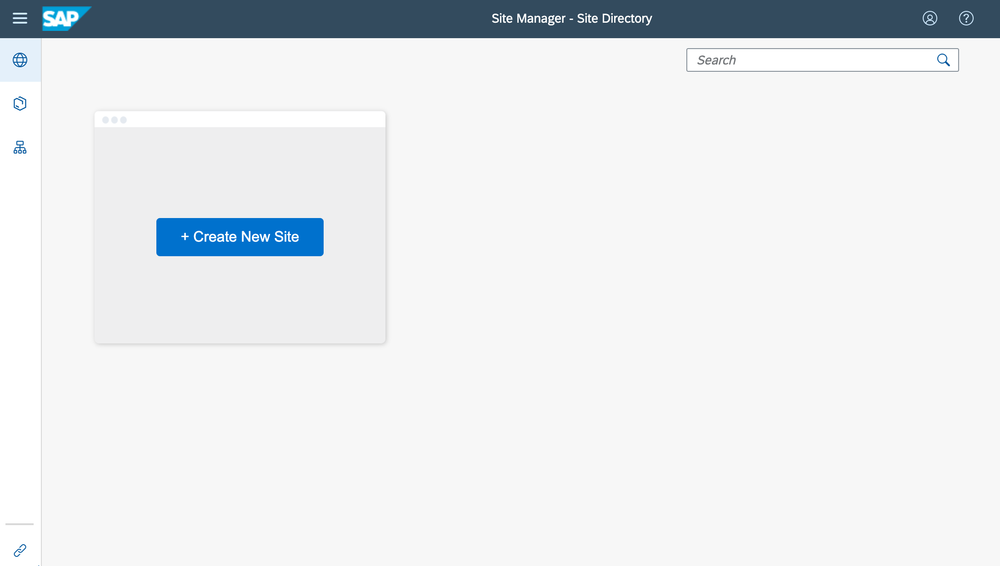
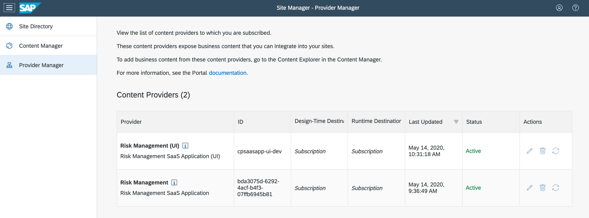
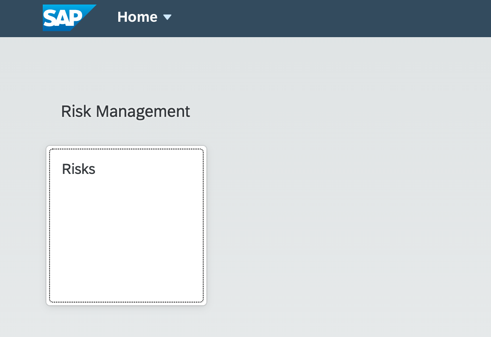

# Add Your Application to the Central SAP Fiori Launchpad

Instead of starting the application directly with the URL, you can also add the application to the central SAP Fiori launchpad (cFLP).

??? warning "Prerequisite for this module is that you have completed the optional step "Update Portal Content Deployer" in the module [Make Your Application Subscribable by Other Subaccounts](SaaS.md)."

To continue, you need an entitlement for the *Portal Application*, create a portal site and add the content from the SaaS application to it as described below.

## Subscribe Portal Application

To use the Portal, you first have to get the Portal entitlement and then subscribe to the Portal service. To to that, follow these steps.

1. Open the Cloud Platform cockpit.
2. Go to your subscribing subaccount.
3. Choose **Entitlements**
4. Choose **Configure Entitlements**.
5. Choose **Add Service Plans**.
6. Search for "Portal".
7. Choose the Portal entitlement.
8. Choose the `standard` plan.
9. Choose **Add 1 Service Plan**
10. Go to **Subscriptions**.
11. Choose the Portal tile.
12. Choose **Subscribe**.

After some seconds the Portal should be displayed as `subscribed`.

## Assign Portal Admin Role Collection

1. Go to your subscribing subaccount subaccount.
1. Go to *Trust Configuration*.
1. Assign the `Portal_Admin` role collection to your user.

## Start Portal Site Manager

1. Go to your saas client subaccount.
1. Go to *Subscriptions*.
1. Choose *Portal*.
1. Choose **Go to Application**.

The *Portal Site Manager* of the portal opens:

## Create Site

1. Go to *Portal Site Manager*.
1. Choose **Create New Site**.
1. Enter *Site Name*: `RiskManangementSite`.
1. Choose **Create**.

## Check Content Provider

By adding the dependency to the SaaS Manager to the portal deployer, the portal content, for example, its applications, will be made available to the subscriber of the SaaS application.

1. Go to *Portal Site Manager*.
1. Choose *Provider Manager*.

You should see a *Provider* entry for your SaaS application, for example:

## Add Content from Provider

First the SAPUI5 application of the SaaS application needs to be added to the "My Content", before it can be used in the cFLP site.

1. Go to *Portal Site Manager*.
1. Choose *Content Manager*.
1. Choose *Content Explorer*.
1. Select row of the *Risks* application.
1. Choose **Add to My Content**.

## Create Group for Risk Management

To display the application in the portal it needs to be assigned to a Group. Here, a new group is created for the Risk app:

1. Go to *Portal Site Manager*.
1. Choose *Content Manager*.
1. Choose *My Content*.
1. Choose *Add* -> *Group*.
1. Enter *Title*: `Risk Management`.
1. Enter *Assign Items*: `Risks` and press `ENTER`.
1. Choose **Assign** (plus icon) for *Risks*.
1. Choose **Save**.

## Make application visible for Everyone

To make an application visible, it needs to be assigned to a role. The role Everyone will make it visible for all portal users.

1. Go to *Portal Site Manager*.
1. Choose *Content Manager*.
1. Choose *My Content*.
1. Choose *Everyone*.
1. Choose **Edit**.
1. Enter *Assign Items*: `Risks` and press `ENTER`.
1. Choose **Assign** (plus icon) for *Risks*.
1. Choose **Save**.

## Start Fiori launchpad and Try it Out

1. Go to *Portal Site Manager*.
1. Choose *Site Directory*.
1. Choose *Go to Site* (forward icon) for *RiskManagementSite*.

You should see the Fiori launchpad with the *Risk* application.

