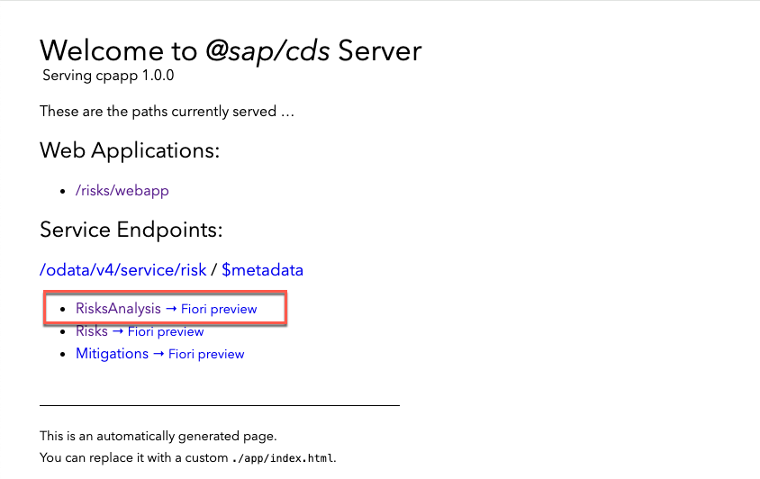
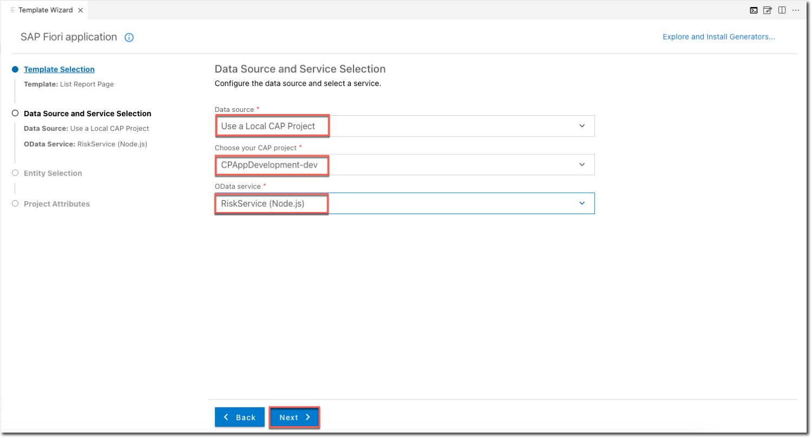
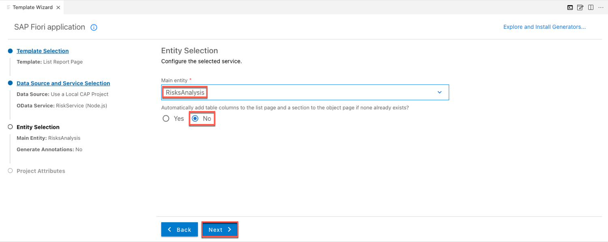
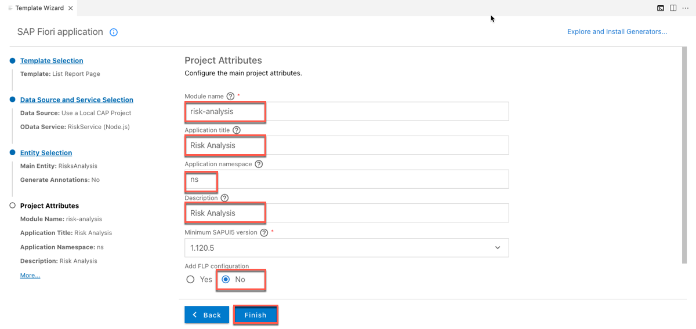
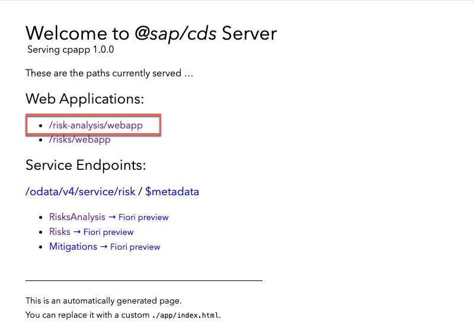
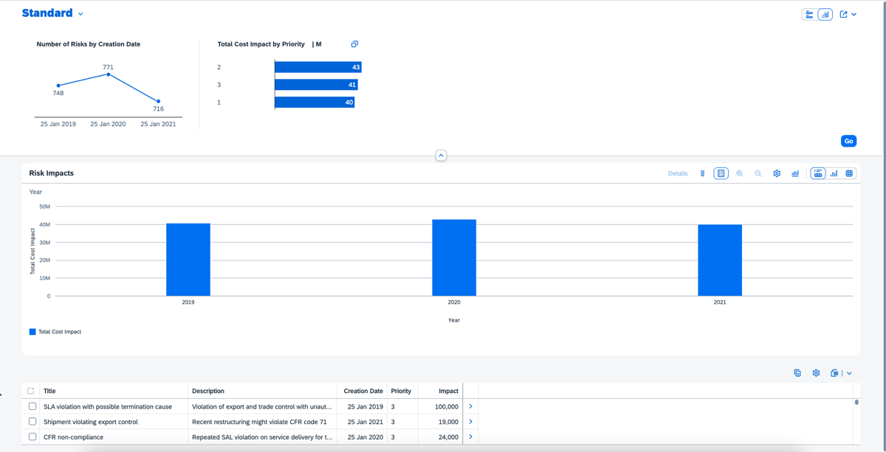
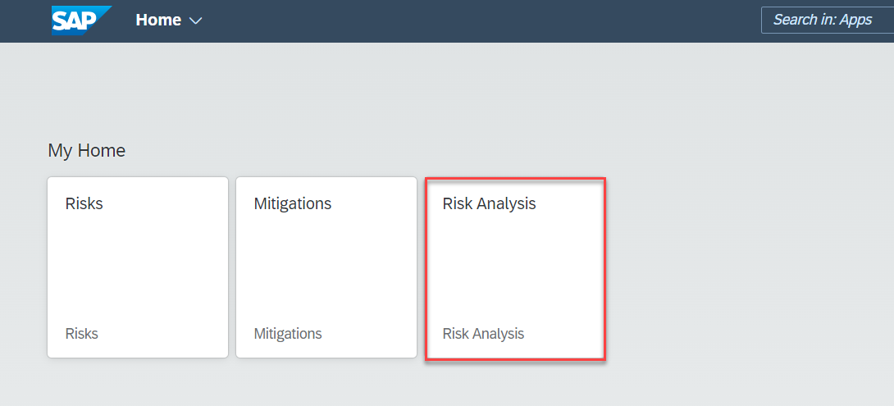

## Prerequisites
 - [Prepare Your Development Environment for CAP](../Prepare-Dev-Environment-CAP)
 - Before you start with this tutorial, you have two options:
    - Follow the instructions in **Step 16: Start from an example branch** of [Prepare Your Development Environment for CAP](../Prepare-Dev-Environment-CAP) to checkout the [`cap-roles`](https://github.com/SAP-samples/cloud-cap-risk-management/tree/cap-roles) branch.
	  - Complete the group of tutorials [Create a CAP Application and SAP Fiori UI](https://developers.sap.com/group.btp-app-cap-create.html).


## Details
### You will learn
 - How to set up your application for analytics
 - Add new files to your project
 - Generate UI with an SAP Fiori elements template
 - Modify the UI with OData annotations
 - Check the annotation files
 - Visualize Risks in the analytics UI
 - Add your application to the launch page

---

## Overview

SAP Fiori elements is a framework that comprises the most commonly used floor plans and is designed to:

1. Speed up development by reducing the amount of front-end code needed to build SAP Fiori apps.
2. Drive UX consistency and compliance with the latest SAP Fiori design guidelines.

SAP Fiori elements for OData version 2 (V2) offers **Analytical list page (ALP)** as a separate floor plan for a unique way to analyze data step by step from different perspectives, to investigate a root cause through drill-down, and to act on transactional content. On the other hand, in SAP Fiori elements for OData V4, the **Analytical List Page (ALP)** is not a separate floor plan, but rather a "flavor" of the **List Report Object Page** floor plan. Hence, you can configure a **List Report Object Page** floor plan in such a way that it can serve as an "ALP flavor" report page.


## Add new files to your project

Create a new service for Analytics as given in [Create a CAP-Based Application](../Create-CAP-Application) using the following details.

1. Open the `tutorial` directory created in tutorial [Prepare Your Development Environment for CAP](../Prepare-Dev-Environment-CAP).

2. Open the folder `templates`.

3. Copy the file `risk-analysis-service.cds` from `templates/analytics/srv` to the `srv` folder of your app.

    The content of the file looks like this:

    ```javascript
    using { sap.ui.riskmanagement as my } from '../db/schema';
    using { RiskService } from './risk-service';

    extend service RiskService {
        @readonly
        entity RisksAnalysis @(restrict : [
                    {
                        grant : [ 'READ' ],
                        to : [ 'RiskManager' ]
                    }
                ]) as projection on my.Risks {
            *,
            substring(createdAt,1,4) as riskyear:String,
            cast (substring(createdAt,1,10) as Date) as createdAt
        };
    }

    // Fix ambiguity in Mitigations.risk association ensuring it points to Risks
    extend RiskService.Risks with @cds.redirection.target;
    ```

    It extends the `RiskService` with a new `RisksAnalysis` entity that has a couple of date fields for data analysis.

4. Run `cds watch` in the VS Code terminal and open the link [http://localhost:4004/](http://localhost:4004/) in your browser.

    You should be able to see the new `RisksAnalysis` entity among with the rest of the `risk` service entities under `Service Endpoints`.

    

5. Copy the latest  `sap.ui.riskmanagement-Risks.csv` file from `templates/analytics/db/data` and replace the existing file in the `db/data` folder of your app.

    This `.csv` file has a large number of records for analytical purposes.

## Generate the UI with an SAP Fiori template

1. In VS Code, invoke the Command Palette ( **View** &rarr; **Command Palette** or <kbd>Shift</kbd> + <kbd>Command</kbd> + <kbd>P</kbd> for macOS / <kbd>Ctrl</kbd> + <kbd>Shift</kbd> + <kbd>P</kbd> for Windows) and choose **Fiori: Open Application Generator**.

	!!! tip "VS Code will automatically install `@sap/generator-fiori` if missing and open the **Template Wizard**."

	!!! tip "In case you get an error launching the Application Generator, see the [SAP Fiori tools FAQ](https://help.sap.com/viewer/42532dbd1ebb434a80506113970f96e9/Latest/en-US) on SAP Help Portal to find a solution."

2. Choose application type **SAP Fiori** and floor plan **List Report Page**.

   	

    !!! info "Why not use the Analytical List Page floor plan?"
        Although you are using SAP Fiori elements for OData V4, you will notice that there is still a floor plan **Analytical List Page** in the previous screen. However, it is due to be removed from the Fiori Generator UI, so you are not going to use it for this tutorial.

3. Choose **Next**.

4. In the next dialog, choose **Use a Local CAP Project** and point to the folder of your current **`cpapp`** project.

	??? error "In case you get the error: `Node module @sap/cds isn’t found. Please install it and try again.`"
		You might get the error `Node module @sap/cds is not found. Please install it and try again.` after you have chosen your CAP project. This is an issue with the App Generator not finding the corresponding CAP modules, due to different repositories. This should be a temporary issue. For the meantime you can work around it by opening a command line and running the following command:

		```bash
		npm install --global @sap/cds-dk --@sap:registry=https://npmjs.org/
		```

		See the [CAP Troubleshooting guide](https://cap.cloud.sap/docs/advanced/troubleshooting#npm-installation) for more details.

5. Select the **`RiskService(Node.js)`** as the OData service and choose **Next**.

	

6. Select **Risks Analysis** as the main entity, choose the option **No** to avoid adding table columns automatically. Choose **Next**.

    

7. Enter `risk-analysis` as the module name and `Risk Analysis` as the application title.

8. Enter `ns` as the namespace and `Risk Analysis` as the description for the application.

9. Choose **Finish** to generate the application.

	

The application is now generated and in a few seconds you can see it in the `app` folder of your project. It contains a `risk-analysis` and a `webapp` folder with a `Component.js` file that is characteristic for an SAPUI5 app.

### Check your application

1. If it is not still running from the previous tutorial, execute `cds watch` in a VS Code terminal and switch to <http://localhost:4004> in your browser.

    You can now see that the CAP server has discovered an HTML page in your `app` folder:

   	

2. Choose the link [http://localhost:4004/risk-analysis/webapp/index.html](http://localhost:4004/risk-analysis/webapp/index.html) for the HTML page.

2. Choose **Go** and log in.

      - **Username**: `risk.manager@tester.sap.com`
      - **Password**: `initial`

    

    You can now see the application without any data. The table is empty because the application is currently missing UI annotations. You add them in the next step.

## Modify the UI with OData annotations

1. Open the `app/risk-analysis/webapp/manifest.json` file.

2. Add the following lines to it:

    ```json hl_lines="25-70"
    {
        "_version": "1.59.0",
        "sap.app": {
            ...
        },
        "sap.ui5": {
            "flexEnabled": true,
            "dependencies": {
            ...
            },
            "routing": {
                "config": {},
                "routes": [
                    ...
                ],
                "targets": {
                "RisksAnalysisList": {
                    ...
                    "options": {
                        "settings": {
                            ...
                            "navigation": {
                            ...
                            }
                            ,"initialLoad": true,
                            "views": {
                                "paths": [
                                    {
                                        "primary": [
                                            {
                                                "annotationPath": "@com.sap.vocabularies.UI.v1.Chart"
                                            }
                                        ],
                                        "secondary": [
                                            {
                                                "annotationPath": "@com.sap.vocabularies.UI.v1.LineItem"
                                            }
                                        ],
                                        "defaultPath": "both"
                                    }
                                ]
                            },
                            "controlConfiguration": {
                                "@com.sap.vocabularies.UI.v1.LineItem": {
                                    "tableSettings": {
                                        "type": "AnalyticalTable",
                                        "enableExport": true
                                    }
                                },
                                "@com.sap.vocabularies.UI.v1.SelectionFields": {
                                    "layout": "CompactVisual",
                                    "initialLayout": "Visual",
                                    "filterFields": {
                                        "prio": {
                                            "label": "Priority",
                                            "availability": "Default",
                                            "visualFilter": {
                                                "valueList": "com.sap.vocabularies.Common.v1.ValueList#vlPrio"
                                            }
                                        },
                                        "createdAt": {
                                            "label": "creation Date",
                                            "availability": "Default",
                                            "visualFilter": {
                                                "valueList": "com.sap.vocabularies.Common.v1.ValueList#vlcreatedAt"
                                                    }
                                                }
                                            }
                                        }
                                    }
                                }
                            }
                    },
                    "RisksAnalysisObjectPage": {
                        ...
                    }
                }
            }
        },
        ...
    }
    ```

3. Copy the file `risks-analysis-service-ui.cds` from `templates/analytics/srv` to the `srv` folder of your app.

## Check the annotations file

Let us have a look at the `risks-analysis-service-ui.cds`.

There are three major segments in the **List Report Object Page** (ALP flavor):

- Visual filters
- Smart chart
- Analytical table

The annotations file `risks-analysis-service-ui.cds` and the `app/risk-analysis/webapp/manifest.json` file are used to specify configurations for these artifacts.

### Visual filters

The visual filter bar offers a unique way of filtering large datasets through visualizations. Currently SAP Fiori elements V4 supports Line and Bar charts for visual filters.


A visual filter can be defined by specifying `CommonValueList` in the annotations file and `SelectionFields` in the manifest file.

`Common Value List` provides the list of values from a specified property of the entity. It has two qualifiers underneath:

- Presentation variant defines the presentation / visualization of the chart (visual filter)
- Selection variant specifies the fields to be displayed for classical filtering (without chart and with dropdown boxes)

This is how you can define the **Cost Impact over Priority** visual filter:

=== "Chart with data point"

    You can define a chart (`#chartPrio`) with a data point (`#dpPrio`) in the following way:

    ```js
    UI.Chart #chartPrio : {
        $Type : 'UI.ChartDefinitionType',
        ChartType : #Bar,
        Dimensions : [
            prio
        ],
        DimensionAttributes : [
            {
                $Type : 'UI.ChartDimensionAttributeType',
                Dimension : prio,
                Role : #Category
            }
        ],
        Measures : [
            sumImpact
        ],
        MeasureAttributes : [
            {
                $Type : 'UI.ChartMeasureAttributeType',
                Measure : sumImpact,
                Role : #Axis1,
                DataPoint : '@UI.DataPoint#dpPrio',
            }
        ]
    },
    UI.DataPoint #dpPrio              : {
        Value       : impact,
        Title       : 'Impact'
    }
    ```

=== "Presentation variant"

    You can also use the chart (`#chartPrio`) to define a presentation variant (`#pvPrio`):

    ```js
    UI.PresentationVariant #pvPrio : {
        SortOrder : [
            {
                $Type : 'Common.SortOrderType',
                Property : impact,
                Descending : true
            },
        ],
        Visualizations : [
            '@UI.Chart#chartPrio'
        ]
    },
    ```

=== "Selection variant"

    You can define a selection variant (`#svPrio`) as defined in the following:

    ```js
    UI.SelectionVariant #svPrio : {
        SelectOptions : [
            {
                $Type : 'UI.SelectOptionType',
                PropertyName : impact,
                Ranges : [
                    {
                        $Type : 'UI.SelectionRangeType',
                        Sign : #I,
                        Option : #GE,
                        Low : 0,
                    },
                ],
            },
        ],
    },
    ```

=== "Common value list"

    Common value list (`#vlPrio`) is created by providing these two qualifiers (`#pvPrio` & `#svPrio`) and the property for the value list:

    ```js
    prio @(
            Common.ValueList #vlPrio: {
                Label : 'Priority',
                CollectionPath : 'Risks',
                SearchSupported : true,
                PresentationVariantQualifier : 'pvPrio',
                SelectionVariantQualifier : 'svPrio',
                Parameters : [
                    {
                        $Type : 'Common.ValueListParameterInOut',
                        LocalDataProperty : prio,
                        ValueListProperty : 'prio'
                    },
                ]
            }
        );

    ```

    Finally the common value list configuration (`prio`) is added into selection fields in the manifest file:

    ```json
    "@com.sap.vocabularies.UI.v1.SelectionFields": {
        "layout": "CompactVisual",
        "initialLayout": "Visual",
        "filterFields": {
            "prio": {
                "label": "Priority",
                "availability": "Default",
                "visualFilter": {
                    "valueList": "com.sap.vocabularies.Common.v1.ValueList#vlPrio"
                }
            }
        }
    }
    ```

Similarly, other charts like **Line Chart for Visual Filters** can be added.

## Visualize risks in the analytics UI

1. With `cds watch` running, open the app in your browser at <http://localhost:4004/risk-analysis/webapp/index.html>.

2. Log in if needed.

      - **Username**: `risk.manager@tester.sap.com`
      - **Password**: `initial`

3. You should be able to see the generated resultant visualization.

    

<!--
## Add your app to the launch page

Let us add the `Risk Analysis` application to the launch page where you already have the `Risks` and `Mitigations` apps.

1. Open the file `launchpage.html` in `app` folder of your application.

2. Add the following code after `mitigations-app`:

    ```html hl_lines="20-27"
	    <script>
                window['sap-ushell-config'] = {
                    defaultRenderer: 'fiori2',
                    applications: {
                        "risks-app": {
                            title: 'Risks',
                            description: 'Risks',
                            additionalInformation: 'SAPUI5.Component=ns.risks',
                            applicationType: 'URL',
                            url: "./risks/webapp",
                            navigationMode: 'embedded'
                        },
                        "mitigations-app": {
                            title: "Mitigations",
                            description: "Mitigations",
                            additionalInformation: "SAPUI5.Component=ns.mitigations",
                            applicationType: "URL",
                            url: "./mitigations/webapp",
                            navigationMode: "embedded"
                        },
                        "risk-analysis-app": {
                            title: "Risk Analysis",
                            description: "Risk Analysis",
                            additionalInformation: "SAPUI5.Component=ns.riskanalysis",
                            applicationType: "URL",
                            url: "./risk-analysis/webapp",
                            navigationMode: "embedded"
                        }
                    }
                };
            </script>
    ```

4. With `cds watch` running, open the app in your browser at [http://localhost:4004/launchpage.html#Shell-home](http://localhost:4004/launchpage.html#Shell-home).

5. You can now see the `Risk Analysis` app next to the `Mitigations` app.

    

 -->
=== "SAP"

    ## References
    1. SAP UI5 Documentation - [Descriptor Configuration for the Analytical List Page](https://sapui5.hana.ondemand.com/#/topic/2a9df06673d34f72b238549d49da8bfb)
    2. SAP Fiori Design Guidelines - [Analytical List Page](https://experience.sap.com/fiori-design-web/analytical-list-page/#top)

<!-- [VALIDATE_1] -->