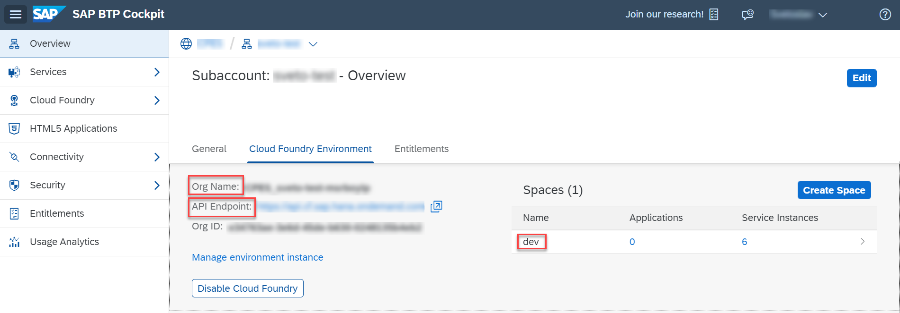

If you don't know whether you are logged on to Cloud Foundry or if you are wondering to which Cloud Foundry org and space are you logged on, you can always use `cf target` in a command line window to find out. If you aren't logged on already, go to your SAP BTP cockpit by using one of the following links, depending on the landscape you want to deploy to:

=== "Trial"

    [https://cockpit.hanatrial.ondemand.com/](https://cockpit.hanatrial.ondemand.com/)

=== "Canary"

    [https://account.int.sap.eu2.hana.ondemand.com](https://account.int.sap.eu2.hana.ondemand.com)

=== "Live"

    [https://account.hana.ondemand.com/](https://account.hana.ondemand.com/)


!!! info "Make sure you've installed the Cloud Foundry CLI (as described in [Step 6: Install the Cloud Foundry command line interface](../Prepare-Dev-Environment-CAP/#install-the-cloud-foundry-command-line-interface)) before proceeding with the steps below."


1. Enter your **Global Account**. If you are using a trial account, choose **Go To Your Trial Account**.

2. Choose **Account Explorer**.

3. In the **Subaccounts** tab, choose the subaccount to which you want to deploy your service and application.

    

2. On the subaccount page, gather all the data to log in to Cloud Foundry (CF).

    - `API Endpoint`
    - `Org Name`
    - `Space Name`

    


3. Open a command line window.

4. Set the Cloud Foundry API endpoint.

    ```bash
    cf api <API Endpoint of your landscape>
    ```

5. Log in to your Cloud Foundry account, using your SAP BTP credentials.

    ```bash
    cf login
    ```


