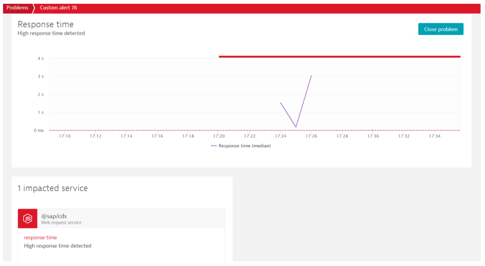
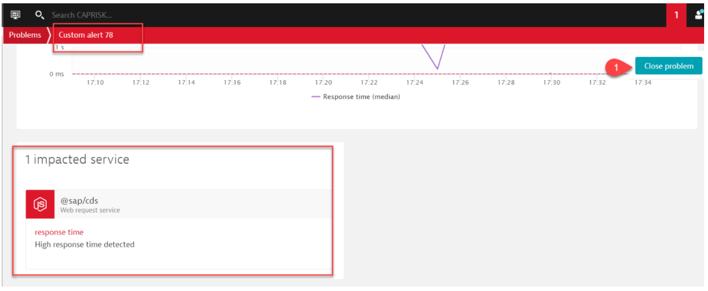

# Consume the Alert Notification Service in Cloud Foundry
### Description

Alert Notification is designed to deliver automatically real-time notifications and alerts about SAP Cloud events that may be of interest to business and operations. It is a service built on SAP Business Technology Platform that offers common APIs for:

1. Producers to publish alerts from SAP Cloud Platform services and applications.
2. Consumers to subscribe for those alerts.

Alert Notification delivers events through the following channels:

* SLACK channels
* E-mails (private or distributed lists)
* Web hooks
* SPC Incidents
* Alert Notification Consumer API

[Documentation](https://help.sap.com/viewer/5967a369d4b74f7a9c2b91f5df8e6ab6/Cloud/en-US/812b6e3ed8934648ad15780cd51721ef.html)

### Scenario:

Dynatrace can send alert to Alert notification service using its api endpoint. Alert notification can forward this alert to your e-mail. 
In this exercise, you will use dynatrace to figure out how the application is performing and the reason for the high response time.  
You will also set a threshold for response time, based on which an alert will be triggered when response time is above it.

### Prerequisites

1. Global Account and Subaccount [Environment: Cloud Foundry] on SAP

2. Cloud Platform with Alert notification entitlement.

3. The user has necessary roles assigned:

-	SpaceDeveloper for creating and managing service instances within the Subaccount

5. Install CF CLI as described [here](https://docs.cloudfoundry.org/cf-cli/install-go-cli.html)

6. Logon to SAP Cloud Platform to your Subaccount via CF CLI and target the CF Space where the consuming application is deployed

### Initial Setup

#### Using the SAP Cloud Platform cockpit

1. Create Alert Notification instance using below command line
 
     ```
     cf create-service alert-notification lite cpapp-alert-instance -c alert.json
     ```
Copy the alertkey.json file from the templates/observability to the root folder of the project. Change the "destination" parameter in JSON to your Email ID where you want to get Alert Notification. 

2. Bind the service to the deployed risk management application `risk-srv`.
     
     ```
     cf bind-service risk-srv cpapp-alert
     ```

3. You would have get a mail notification from SAP Cloud Platform Alert Notification with a confirmation token. Open the link `this link` in the mail and click on confirm as shown in the screenshot.

4. You will be navigated to another browser asking for confirmation. Click on `Confirm`

5. You will get confirmation message of configuring "SendEmail" in Alert Notification.

## Configure Dynatrace to send all Alert to Alert Notfication Service

Dynatrace sends alert for any unresponsive behavior of its binded application in its environment. To receive alerts from Dynatrace, you should create a custom Webhook integration inside your Dynatrace Environment. We’ll show you a standard mapping between the Dynatrace alert and the expected alert from Alert Notification. The integration is one time, so once you have done that you will be able to receive any kind of dynatrace alerts to SAP Cloud Platform Alert Notification. In that way, you can have a single channel for all kind of alerts (coming from Dynatrace and other services).

### Prerequisites

1. You need to enable Dynatrace for your environment.

2. Risk Management Application should be integrated with Dynatrace.

### Setup Custom Alert in Dynatrace.

Custom alerts can be defined when a specific threshold notification on a selected metric is required.

A custom alert provides a simple way of defining a threshold on a given metric. Dynatrace sends out alerts when a metric breaches a user-defined threshold. You can define alerts for when actual metric values are above or below the user-defined threshold. Because a metric can be recorded by multiple components within your environment, Dynatrace always alerts with a reference to the component that shows the violating metric.

1. Open Dynatrace Dashboard.
2. Navigate to Settings -> Anomaly detection -> Custom events for alerting.
3. Click on `Create custom event for alerting`.
4. Select Category as `Services`.
5. Select Metric as `Response time`.
6. Select Aggregation as `Median`.
7. Under `Monitoring strategy` select `static threshold` and enter below detail.
8. Alert anomalies with a static threshold of `3`. Select time in `MilliSecond(ms)`
9. Raise an alert if the metric is `above` the threshold for `1` minute during any `3` minute period.
10. Under Event-description, give any title. ex `High Response time from S/4 HANA`.
11. Under Severity select `Custom alert`.
12. Under message, enter `The {metricname} value of {severity} was {alert_condition} your custom threshold of {threshold}`.
13. Click on `Save Changes`.

### Setup Integration of Dynatrace with Alert Notification.

1. Create Alert Notification instance service key using below command line
    
     ```
     cf create-service-key cpapp-alert alertkey -c alertkey.json
     ``` 
 Copy the alertkey.json file from the templates/observability to the root folder of the project 

 
2. Get the details of service key from below command line and copy it in a clipboard. You will need the `url` while configuring webhook for Dynatrace. `Client id` and `Client Secret` will be needed for adding basic authorization
     
     ```
     cf service-key cpapp-alert alertkey`
     ```
   Example of necessary credentials payload from Alert Notification
   
        ````
        {
            "client_id": "<<generated_username>>",
            "client_secret": "<<generated_password>>",
            "url": "https://<<AlertNotification-service-API>>.cfapps.us10.hana.ondemand.com"
        }
        ````

3. In Dynatrace, navigate to Settings-> Integration -> Problem notifications -> Set up notifications ->Custom integration.
4. Enter name as `RiskAlertIntegration`.
5. In the field Webhook URL, enter the Alert Notification Producer API URL, and at the end add `/cf/producer/v1/resource-events`. Example - `https://<<AlertNotification-service-API>>.cfapps.us10.hana.ondemand.com/cf/producer/v1/resource-events`.
6. Click on Basic Authorization Header. Enter the username and password into the client_id and client_secret respectively.
7. In Custom Payload, enter a JSON payload similar to the following example:

    ```
    {
        "eventType": "Dynatrace_EVENT",
        "resource": {
            "resourceName": "unknown",
            "resourceType": "unknown"
        },
        "severity": "ERROR",
        "category": "ALERT",
        "subject": "{ProblemTitle}",
        "body": "{ProblemDetailsText}",
        "tags": {
            "ans:detailsLink": "{ProblemURL}",
            "dynatrace:PID": "{PID}",
            "dynatrace:problemID": "{ProblemID}",
            "dynatrace:impactedEntity": "{ImpactedEntity}",
            "dynatrace:problemSeverity": "{ProblemSeverity}",
            "dynatrace:problemImpact": "{ProblemImpact}",
            "dynatrace:problemState": "{State}",
            "dynatrace:tags": "{Tags}"
        }
    }

    ```

8. For the Alerting Profile, choose the value `Default`.
9. Click on `Send test notification`.
10. Click on `Save`.

## Demo Script to send Alert from Dynatrace

1. Open Risk Management Application -> Click the URL of risk-srv -> Click on `BusinessPartner` entity.
   Wait for 3-10 mins after trying out the service to get a mail to your mailbox
2. Receive Mail from Alert Notification service
   
   
3. Open Dynatrace from the link sent in mail.
   
4. Open the Problem and analyse the issue.
   
5. Close the Problem if the issue resolved. If issue automatically resolved, it will turn to Green from Red.
   
6. Get Mail from Alert Notification Service of the Resolved Notification.
   

