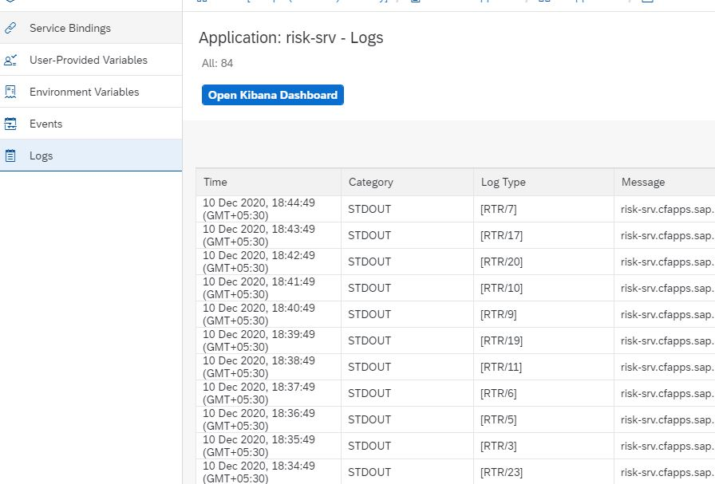
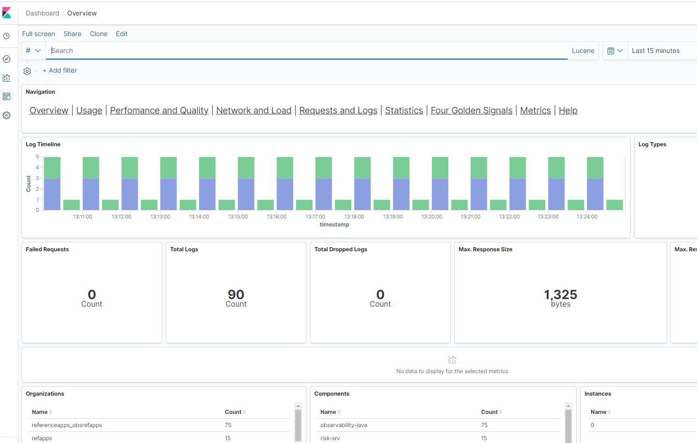

# Consume the Application Logging service in Cloud Foundry

### Description

The SAP Business Technology Platform Application Logging service on Cloud Foundry lets you stream logs of bound applications to a central application logging stack. Application Logging on Cloud Foundry uses Elastic Stack to store and visualize your application log data.

Application logging helps you Create, access and analyze application-related logs and custom metrics in your Cloud Foundry environment. Analyse CF app behavior through access and application logs.

SAP Cloud Platform Application Logging service offers multi-tenant environment to gather, store and analyse access/request logs (from the CF Router and application instances), general application logs, container metrics, and custom metrics via Elasticsearch / Kibana.

[Documentation](https://help.sap.com/viewer/ee8e8a203e024bbb8c8c2d03fce527dc/Cloud/en-US/68454d44ad41458788959485a24305e2.html)

### Scenario

From the dashboards created in application logging, one will be able to identify the some of the issues present in the code. A developer can drill down and even find the root cause of the issue if there are ample logs written in the code. 
 
### Bind a CF app to application logging service instance

You can bind the application using either the cloud cockpit or the cf cli.

##### Bind the application to the service instance using cf cli

1. Display the plans that are available for the service using the following command:
	
	`cf marketplace -s application-logs`
   
2. Create a service instance for the application-logs logging service using the following command:
   
	`cf create-service application-logs lite my-logs`
   
	If you want to create an instance of the plans standard or large, substitute lite with the respective plan name.
   
3. Bind apps to the service instance using the following command:
   
	`cf bind-service cfapp-srv my-logs`
	
	Although, the command line interface prompts you to restage the app, the binding takes effect without restaging.

##### Bind the application to the service instance using the cockpit

You can bind service instances to applications both at the application view, and at the service-instance view in the cockpit.

1.  Log on to the Cloud Foundry Environment Using the Cockpit.
2.  Navigate to the space in which your application is deployed. For more information, see [Navigate to Global Accounts, Subaccounts, Orgs, and Spaces in the Cockpit](https://help.sap.com/viewer/65de2977205c403bbc107264b8eccf4b/Cloud/en-US/5bf87353bf994819b8803e5910d8450f.html).
3.  In the navigation area, choose Services Service Marketplace.
4.  Search for `Application Logging`.
5.  In the navigation area, choose `Instances`.
6.  To create a new instance, choose New Instance.
    - In the following steps, you assign an application to this service. This application then writes its logs to the newly created service instance.
    - Choose the service plan, for example, standard. Then choose Next.
    - (Optional) Browse for the .json file of the app for which you want to write logs. Then choose Next.
    - (Optional) Choose an application from the dropdown box that lists all deployed applications. Then choose Next.
    - Enter the name of the new instance. Then choose Finish.
7.  (Optional) If you have not bound an application to the service instance in the optional steps above, you can bind it from the application’s dashboard. For more information, see [Bind Service Instances to Applications Using the Cockpit](https://help.sap.com/viewer/65de2977205c403bbc107264b8eccf4b/Cloud/en-US/2d2a3e8b2f1348ffbb54eaae10d80b95.html).

### Test It

1. Open the deployed application's URL in browser and view risks, mitigations etc. This will help in creating logs which can be viewed in the application logging.
   You can fetch the URL using `cf app`. Use the URl for cpapp-approuter.
   
2. Logon to cloud foundry > select the space where Application logging is provisioned > select applications > click the application or the service > click on logs > open kibana dashboard

	

3. Enter the username(email/scpid) and password.

4. Once logged in click on “Management” (gear symbol on the left)

5. If not provisioned, click on “Index Patterns” and then “Create Index Pattern”. You should now see some index patterns, some internal ones called Security-\* and one which contains the logs you shipped

6. create a pattern that matches the name of the index in which your logs are stored. or default use cases just type in “logs-\* “

7. Click on “Next Step” and select @timestamp as “Time Filter Field Name”

8. finally, click on Create index pattern.

9. If you now click on discover symbol on the left you will see the logs you shipped. More information about index patterns can be found here [here](https://www.elastic.co/guide/en/kibana/current/index-patterns.html).

	

10. You can go to Four Golden signals tab and view how your application has been performing.  
