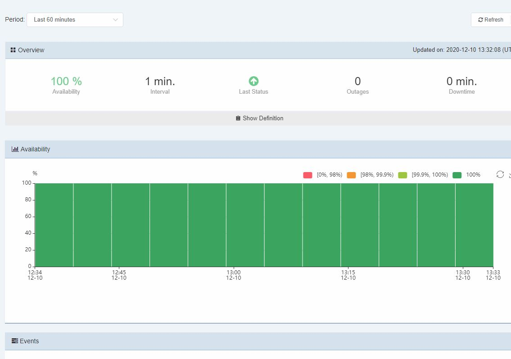
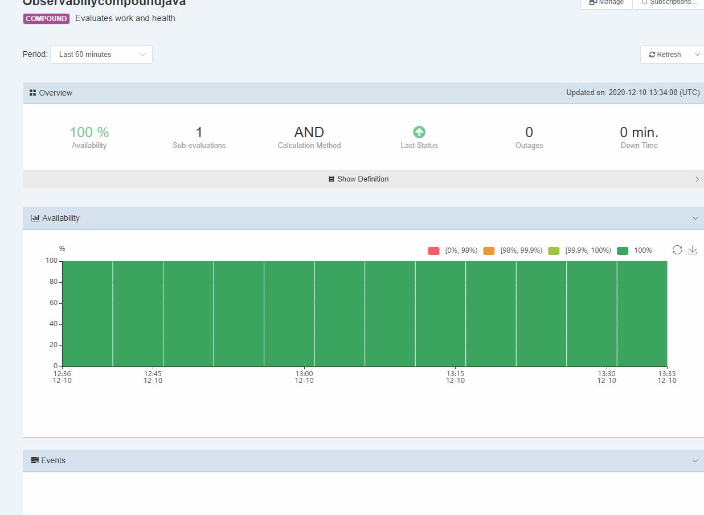
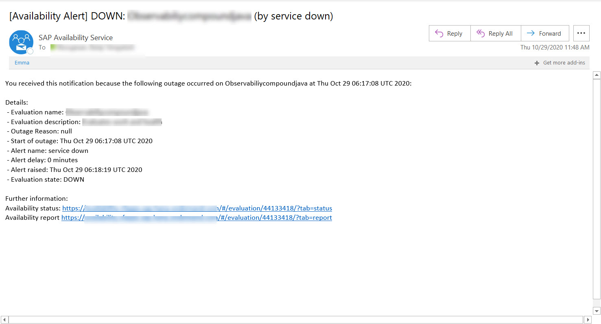

# Consume the Availability Service in Cloud Foundry

## Description

The SAP CP Availability Service (AvS) enables you to monitor cloud-based applications, including services and websites, regarding their availability.

Comparing with the traditional offerings, it:

- Integrates various internal and external availability monitoring services, such as Site24x7,
- Offers PushAPI for integration of any monitoring services
- Aggregates insights across individual basic evaluations.

In a nutshell, you can manage the availability of an application in 3 steps:

- Create basic evaluations to define the application endpoints to be monitored (the so-called check) and configure how its availability is assessed.
- Create compound evaluations to build up a hierarchy to analyse scenarios consisting of multiple basic and compound evaluations.
- Add notifications to get informed upon status changes.

[Availability Service Documentation](https://wiki.wdf.sap.corp/wiki/pages/viewpage.action?spaceKey=hcpka&title=Availability+Service)

## Scenarios


You can use the Availability Service for checks that are monitored by the Cloud Engineering team or by the application team itself. The onboarding is different between both scenarios.

Please refer to the **Service Offering** section of the [Availability Service Documentation](https://wiki.wdf.sap.corp/wiki/pages/viewpage.action?spaceKey=hcpka&title=Availability+Service) for further links.

This tutorial explains how to setup the Availability Service for an application team owned monitoring.

## Create a Basic Evaluation Health Check

### Add a Health Check Endpoint for Your CAP Service

First, you need to add a health check endpoint to your CAP service that the Availability Service can call. The simplest way is to register an GET handler in the CAP service's express middleware that returns `200 OK` to show that the service is reachable.

Create file `srv/server.js` with the following contents or add it to an existing file.

```js
const cds = require('@sap/cds');
cds.on('bootstrap', (app) => {
    app.get( '/health/ping', (req, res) => {
        res.set({
            'Content-Type': 'text/plain; charset=utf-8',
            'Cache-Control': 'no-cache',
            'X-Content-Type-Options': 'nosniff',
            'X-Frame-Options': 'DENY',
            'X-XSS-Protection': '1; mode=block'
        });

        res.status(200).send("OK");
    });
});

// Delegate bootstrapping to built-in server.js
module.exports = cds.server;
```

The `server.js` file is automatically loaded by CAP on startup.

The code registers a handler for `GET` requests for the path `/health/ping` that sends responses with status `200`, with a plain text body `OK`, adds some security response headers, and the `Cache-Control: no-cache` header to switch off caching.

### Get Permission to Create an AvS Group

Artefacts in AvS, for example, evaluations, testers and notifications, are managed in entity groups. The permissions granted to an AvS user are applied to all artefacts within the group.

1. https://availability.cfapps.sap.hana.ondemand.com/
2. Login
3. Choose **Manage**
4. Check if you can see the **Create Group ** (@todo or how it is called button) button ...
5. If you can't see the button, you need to request the permission first
6. Request admin permission from the desired group owner.
7. The group owner will grant you the desired permissions.

### Create an AvS Group and Assign Users

1. Choose **Manage** and select a group you would like to manage
2. Choose configure button on the page that opens. A dialog box is shown.
3. Choose Users tab and click add user.
4. Enter the user id(work email) and choose the permission as admin.
5. Likewise many users can be assigned.

   Artifacts have public or private visibility. Public artifacts are visible to every user, while the visibility of private artifacts is limited to their group. You can add users to change your group and see the private artifacts of the group.

   (NOTE: A user that shall be granted a permission must have logged on the AvS instance at least once.)


### Create a Basic Evaluation for Risk Management CAP Service

1. On the **Manage** page of the Availability Service
1. Click on basic evaluation.
2. In the page that follows click on create basic evaluation
3. Provide a name and description to the evaluation entity.
4. Set a visibility.
5. Under monitor definition provide a URL or rest endpoint you would like to monitor.

   You can retrieve the URL to your CAP service using:

   ```bash
   cf app cpapp-srv
   ```

   Append the path to the health check service to the URL `/health/ping`

6. Enter a tester timeout and an interval. This is defaulted to 30000 and 1 minute.
7. (Optional) Enter authentication method for the REST service and enter the username and password for the service to use.
8. Choose a proxy whether it is auto or off.
9. Click on save.

### Create alerts for Basic Evaluation for Risk Management CAP Service

1. Once the Basic evaluation is created. Alerts can be specified.
2. In the evaluations list, for the corresponding basic evaluation created choose the Alert notification option (Bell Icon) against it.
3. Under alert notifications tab click on Add Alert notification button.
4. Enter a notification name and choose a channel required for notification.
5. Enter the work email address incase Email channel is chosen
6. Check whether radio button ON is chosen against active.
7. Click on Add button. An alert notification is added.

### Test Basic Evaluation for Risk Management CAP Service
1. Click on preview button with basic evaluation. Availability chart is shown
   
2. Stop the service and check the channel for the notification which is sent.

## Create a Compound Evaluation health check

A Compound Evaluation sums up the results of multiple single evaluations. Based on underlying basic evaluations you can specify evaluations to build up a hierarchy to analyse scenarios consisting of multiple basic/compound evaluations. Availability in compound evaluations is always recalculated based on the status of availability intervals of underlying basic evaluations. When a compound evaluation is edited, this update may influence other evaluations which are consuming this one. Compound Evaluations can be deleted - however on the UI - this only works if there are no other super-ordinate evaluations including this one as a sub-evaluation. In such a case, you have to use the "Force Delete" button then it will be removed from all super-ordinate compounds and deleted.

To create a Compound Evaluation at least two Basic Evaluations are needed.

### Create a Health Check Endpoint for Your Risk Management DB

For the 2nd Basic Evaluation, you can create a health check endpoint for the database.

Since the HANA database doesn't offer a public HTTP endpoint for a health check, you can implement your own in the CAP service. However, you need to consider that if the CAP service goes down also the database health check goes down.

Add some code to do a simple and cheap database request in your `srv/server.js` file, like this:

```js
const cds = require('@sap/cds');
cds.on('bootstrap', (app) => {

  // ...

  let db;

  async function pingDB(req) {
    let tx;

    try {
      if (!db) db = await cds.connect.to("db");

      tx = db.tx(req);
      const result = await tx.run(SELECT.from(db.entities["HealthCheck"]));
      if (tx) tx.commit();
      tx = undefined;

      return { code: 200, body: "OK" };
    } catch (ex) {
      return { code: 500, body: "ERROR" };
    } finally {
      try {
         if (tx) tx.rollback();
      } catch(error) {
      }
    }
  }

  let pingDbPromise;

  app.get("/health/ping-db", async (req, res, next) => {
    res.set({
      "Content-Type": "text/plain; charset=utf-8",
      "Cache-Control": "no-cache",
      "X-Content-Type-Options": "nosniff",
      "X-Frame-Options": "DENY",
      "X-XSS-Protection": "1; mode=block",
    });

    if (!pingDbPromise) {
        pingDbPromise = pingDB(req);
    }

    // Send same response for all concurrent ping requests
    const result = await pingDbPromise;
    try {
        res.status(result.code).send(result.body);
        next();
    } finally {
        // Cache DB response for 500ms
        await new Promise( resolve => setTimeout(resolve, 500) );
        pingDbPromise = undefined;
    }
  });

  // ...
}
```

The code has some built-in protection for flooding the DB with requests using the unprotected health check endpoint:

1. It will only do one health check DB call at the same time and send back the same result to all concurrent requesters (by using the same promise)
2. It will cache the result for 500ms

Add a new entity to the `db/schema.cds` file that is used for the health check:

```js
  entity HealthCheck {
    key ID : UUID;
  }
```
### Create a Compound Evaluation for Risk Management

1. Logon to AvS of your cloud platform landscape (eu10-Canary)
2. Create a group or select a group and select your evaluation type (Compound) to put all your entities in.
3. Click on Compound Evaluation
4. In the page that follows click on create Compound Evaluation
5. Provide a name and description to the evaluation entity.
6. Set a visibility
7. Click on the + (plus) button on the right adjacent to sub-Evaluations
8. Search for the basic or previous compound evaluations created. Choose the required evaluations and press the add button.
9. Choose a calculation method.
10. Click on save.

### Test It

1. Click on preview button with basic evaluation. Availability chart is shown
   

2. Click on preview button with compound evaluation. Availability chart is shown
   

3. You can also stop the service in cloud foundry. This will trigger an email to the mailbox.
   
