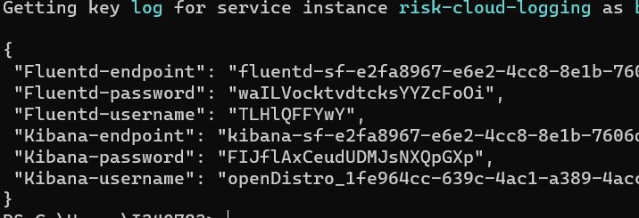
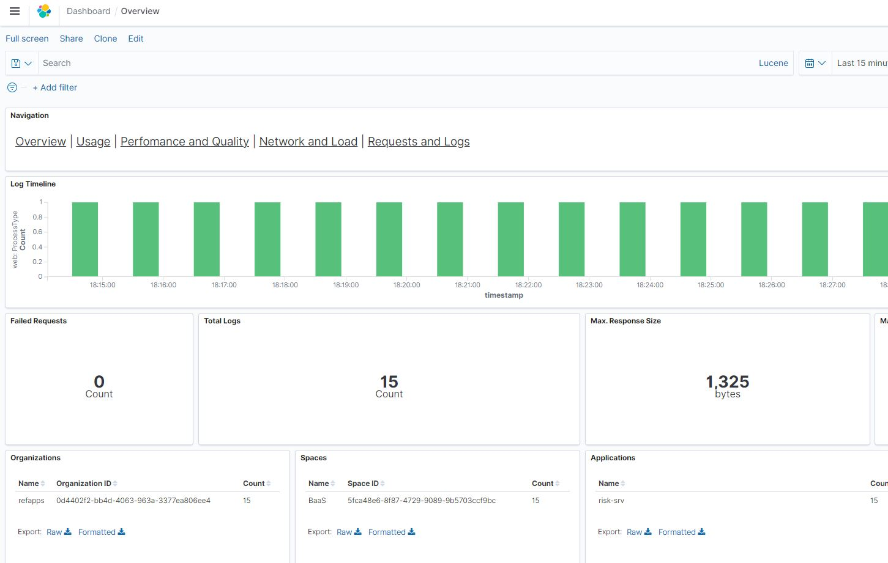

# Consume the Cloud Logging Service in Cloud Foundry

### Description

The Cloud Logging service offers managed logging service instances for shipping logs from Kubernetes, Cloud Foundry, or any other source. It uses the Elastic Stack (open source logging platform Elasticsearch, Logstash, Kibana) to store, parse, and visualize the application log data coming from Cloud Foundry applications.

To send application logs to the cloud logging service, a service instance needs to be created and bound to the application. If you have enabled Elasticsearch access within your standard service plan you may even use the Elasticsearch endpoint directly for shipping logs.

Cloud logging works with K8s and cloud foundry, also uses fluentid for providing the metrics.

[Documentation](https://pages.github.tools.sap/perfx/cloud-logging-service/consumption/from-sap-cp-cf/)

### Difference between Application Logging and Cloud Logging

Application Logging is offered as service only to CF. It is setup on Virtual machines to offer logging service. In order to extent the support to other platforms, Cloud Logging was introduced. It is setup on kubernetes. 
You can find the differences between both the service [here](https://pages.github.tools.sap/perfx/cloud-logging-service/operations/scope/).

### Scenario

From the dashboards created in cloud logging, one will be able to identify the issues present in the code to some extent. Here, the bad code is written such that the business partners take a longer time to load. From the cloud logging dashboard - performance and quality, one will be able to see the response time for each call and identify this. Cloud logging also gives a quick view if there have been any errors (with 4xx / 5xx series response code).

### Initial setup

#### Create and Bind the service instance using CLI

1. `cf marketplace` should display the service in the marketplace.

2. If the service is not available in cloud foundry marketplace add an entitlement to Cloud Logging plan standard.

     `cf create-service cloud-logging standard risk-cloud-log-instance`

   Here, the `standard` service plan is selected. More information about the service plans can be found [here](https://pages.github.tools.sap/perfx/cloud-logging-service/consumption/from-sap-cp-cf/Available-Service-Plans).

   For the `standard` service plan you can configure the following parameters. Refer to [Configuration Parameters](https://pages.github.tools.sap/perfx/cloud-logging-service/consumption/service-configuration-parameters/) for details.
   - Log retention period in days
   - Maximum number of data instances
   - Maximum number of ingestion instances
   - Enable access to Elasticsearch API

   These can be passed during the creation of service. For more explanation, especially with regards to SAML integration, refer to [SAML parameters](https://pages.github.tools.sap/perfx/cloud-logging-service/consumption/how-to/integrate-saml-tenant/)

   - Example command with additional parameters:

```
cf create-service cloud-logging standard cloud-logging -c '{

"retentionPeriod": < 1 to 30 > ,

"maxDataInstances": < 2 to 10 > ,

"esApiEnabled": false,

"maxIngestInstances": < 2 to 10 > ,

"saml": <see  the  SAML  config  section>

}'
```

>Note Wait for your dedicated instance to be provisioned. This might take about 8 to 10 minutes.

3. The service provisioning can be verified using the following command, which checks the `last operation` status:

    `cf services`

   Wait patiently, until the last operation is `create succeeded`. The service instance should now be available for consumption.

4. Once the service instance is created, you need to get the credentials. You can either:

	- **Bind an application** to the instance (automatically injects credentials into the bound app’s env)

	- **Create a service key** within the instance (service key would hold the credentials)

5.  To bind the application execute the following command:
    
	`cf bind-service <app-name> <service-instance>`
    
	The CF CLI will ask you to restage, this is not mandatory for using the cloud Logging service

#### Create and Bind the service instance using the cockpit

You can bind service instances to applications both at the application view, and at the service-instance view in the cockpit.

1.  Log on to the Cloud Foundry Environment Using the Cockpit.
2.  Navigate to the space in which your application is deployed. For more information, see [Navigate to Global Accounts, Subaccounts, Orgs, and Spaces in the Cockpit](https://help.sap.com/viewer/65de2977205c403bbc107264b8eccf4b/Cloud/en-US/5bf87353bf994819b8803e5910d8450f.html).
3.  In the navigation area, choose Services Service Marketplace.
4.  Search for `cloud Logging`.
5.  In the navigation area, choose `Instances`.
6.  To create a new instance, choose New Instance.
    - In the following steps, you assign an application to this service. This application then writes its logs to the newly created service instance.
    - Choose the service plan, for example, standard. Then choose Next.
    - (Optional) Browse for the .json file of the app for which you want to write logs. Then choose Next.
    - (Optional) Choose an application from the dropdown box that lists all deployed applications. Then choose Next.
    - Enter the name of the new instance. Then choose Finish.
7.  (Optional) If you have not bound an application to the service instance in the optional steps above, you can bind it from the application’s dashboard. For more information, see [Bind Service Instances to Applications Using the Cockpit](https://help.sap.com/viewer/65de2977205c403bbc107264b8eccf4b/Cloud/en-US/2d2a3e8b2f1348ffbb54eaae10d80b95.html).

#### Create a service key for the service instance

##### Using CF CLI

1.  To create a service key without binding to any application via _cf cli_, execute the following command:

    `cf create-service-key <service-instance> <service-key>` 
	
	Note: cloud-logging service requires NO configuration parameters during service key creation.

2.  The service key holds all the credentials for needed. To view a service key, execute:

    ```
    cf service-key <service-instance> <service-key>
    Getting key <service-key> for service instance <service-instance> as <logged-in user>...
    {
       "Elasticsearch-endpoint": "es-sf-d7138a55-416c-4524-b361-07dfccfff5fd.cls-02....ondemand.com",
       "Elasticsearch-password": "XXXXXXXXXXXXXX",
       "Elasticsearch-username": "openDistro_a2d4be37-1f7f-4568-896b-31692e6efe34",
       "Fluentd-endpoint": "fluentd-sf-d7138a55-416c-4524-b361-07dfccfff5fd.cls-02....ondemand.com",
       "Fluentd-password": "XXXXXXXXXXXXXX",
       "Fluentd-username": "XXXXXXXXXXXXXX",
       "Kibana-endpoint": "kibana-sf-d7138a55-416c-4524-b361-07dfccfff5fd.cls-02....ondemand.com",
       "Kibana-password": "XXXXXXXXXXXXXX",
       "Kibana-username": "openDistro_a2d4be37-1f7f-4568-896b-31692e6efe34"
    }

    ```

##### Using the cockpit

Service keys can also be created via cockpit. Read the official documentation: [Creating Service Keys in Cloud Foundry](https://help.sap.com/viewer/09cc82baadc542a688176dce601398de/Cloud/en-US/6fcac08409db4b0f9ad55a6acd4d31c5.html)

Note: cloud-logging service requires NO configuration parameters during service key creation.


### Test It

1. Open the deployed application's URL in browser and view risks, mitigations etc. This will help in creating logs which can be viewed in the application logging.
   You can fetch the URL using `cf app`. Use the URl for cpapp-approuter.
   
2. Get the service key with command `cf service-key risk-cloud-logging logkey` or use the SCP cockpit to get the service key instances.
  

3. Copy the Kibana-endpoint and paste it into the browser.

4. Enter the kibana-username and kibana-password for login as you had got it from the previous step.

5. Once logged in click on “Management” (gear symbol on the left)

6. Click on “Index Patterns” and then “Create Index Pattern”. You should now see some index patterns, some internal ones called Security-\* and one which contains the logs you shipped

7. Create a pattern that matches the name of the index in which your logs are stored. or default use cases just type in “logs-\* “

8. Click on “Next Step” and select @timestamp as “Time Filter Field Name”

9. finally, click on Create index pattern.

10. If you now click on discover symbol on the left you will see the logs you shipped. More information about index patterns can be found here [here](https://www.elastic.co/guide/en/kibana/current/index-patterns.html).

11. Click on “Management” and Click on “Saved Objects”

12. Click on import and upload the CF Content Package (View in Github [github](https://github.tools.sap/perfx/cloud-logging-service/blob/master/docs/resources/contents/kibana/cf_content_package.ndjson) | Download File[download](https://pages.github.tools.sap/perfx/cloud-logging-service/resources/contents/kibana/cf_content_package.ndjson)). Ignore potential warnings.

13. The Overview dashboard is available under https://<your kibana endpoint>/app/kibana#/dashboard/Overview.
  

14. You can go the "performance and quality" dashboard and view if there are any anomalies in the response time of any particular request.


