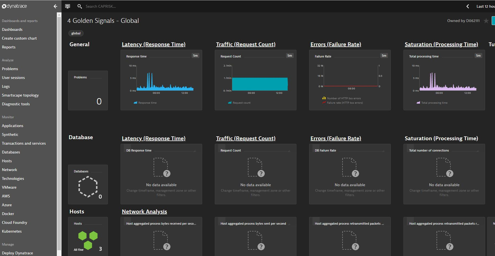

# Consume the Dynatrace Service in Cloud Foundry

### Description

Dynatrace, or Dynatrace Managed, is an Application Performance Management (APM) tool which provides full-stack, AI-powered monitoring for your applications. With Dynatrace, you can see what your applications are up to so you can avoid costly downtimes! And by applications we do not only mean apps, but also databases, networks, hardware and anything else that is part of your infrastructure.

As an intelligent monitoring solution, Dynatrace delivers information about what, where, when and especially why there is a problem. Dynatrace lets you set up your own, personalized monitoring dashboard, which fulfills all your monitoring needs. Set alerts and find solutions before problems even arise.

[Documentation](https://github.wdf.sap.corp/pages/apm/)

### Scenario

Dynatrace helps you take a deeper look and find out where your issue is coming from. Here we can look at the four golden signals and see check for anomalies and drill down further to 
find the root cause.

### Pre-requisites

1. Entitlement for Dynatrace service. 

### Create a service instance from CLI

1. `cf marketplace` should display the `dynatrace monitoring service`  service in the marketplace. If the service is not available in cloud foundry marketplace add an entitlement to Dynatrace service

2. Create a file named dt-config.json in the current directory with the following parameters:

    - Provide a name for the Dynatrace service.

    - Service parameters are optional.

    - Provide permission assignment objects that comprise the name of the CAM profile and the Dynatrace privileges to be assigned.

Refer the dt-config.json below

```json
{
    "environment_name": "EXAMPLE",
    "service_parameters": {
        "skiperrors":"true"
    },
    "permission_assignments": [
    {
      "name": "PROFILE_1",
      "roles": [
        "admin",
        "log_analytics"
      ]
    },
    {
      "name": "PROFILE_2",
      "roles": [
        "configure_sensitive",
        "view_sensitive"
      ]
    },
    {
      "name": "PROFILE_3",
      "roles": [
        "log_analytics",
        "user"
      ]
    }
  ]    
}

```

If the above step was successful, your Dynatrace environment gets created in the background. However It might takes up to 2 hours (worst case) until one gets access to a newly created Dynatrace environment with your CAM profiles.

### Linking existing Dynatrace environments

1. Create a dt-config.json for your existing environment

2. environment_name: Enter the name of your existing Dynatrace environment. See our FAQ page [https://github.wdf.sap.corp/pages/apm/get-support/faq#where-can-i-find-the-name-of-my-dynatrace-environment] to check how to find your environment name.

3. permission_assignments: If you want to keep the Authorization as it is, please add your existing CAM Profiles to the corresponding roles. If you want to change access privileges you can enter different assignments.

- Log in to the Cloud Foundry region that corresponds to your Dynatrace environment

### Create a service key for the service instance - Using cf CLI - Using the cockpit

1.  `cf services` should list the service instance that you have created in the previous step
2.  To create a service key without binding to any application via _cf cli_, execute the following command:

    `cf create-service-key <service-instance> <service-key>` Note: cloud-logging service requires NO configuration parameters during service key creation.

3.  The service key holds all the required credentials. To view a service key, execute:

```servicekey
cf service-key <service-instance> <service-key>
```

A sample service key:

```

{
  "apitoken": "xxxxxxxxxxxxxxxxxxxxxxxxxxxxxx",
  "apiurl": "https://xxxxxxxxxxxxxxxxxxxxxxxxxxxxxxxx/e/xxxxxxxxxxxxxxxxxxxxxxxxxxxxx/api",
  "environmentid": "xxxxxxxxxxxxxxxxxxxxxxxxxxxxxxxxxxx",
  "permission_assignments": [
    {
      "name": "DEMO1",
      "roles": [
        "admin",
        "log_analytics"
      ]
    },
    {
      "name": "DEMO2",
      "roles": [
        "configure_sensitive",
        "view_sensitive"
      ]
    },
    {
      "name": "DEMO3",
      "roles": [
        "log_analytics",
        "user"
      ]
    }
  ]
}

```

### Bind the Risk Management Application to the user service instance using the cockpit

You can bind service instances to applications both at the application view, and at the service-instance view in the cockpit.

1. Bind the application service(risk-srv) to user provided dynatrace instance using below CLI. 
    
    ```
    cf bind-service risk-srv dynatrace-service
    ```

2.  Restage `risk-srv` application  

     ```
     cf restage risk-srv
     ```

3. (Optional) Similar Steps you can perform for Approuter as well.       

4. Now when we open the dynatrace application we will be able to view the metrics like response time and error rate.

### Monitoring Cloud Foundry Risk Management Application with Dynatrace

1. Try running the application or specific service endpoints.
2. Navigate to the dynatrace web application instance from the service URL and explore below different feature.

### Four Golden Signal
    
You can create a custom chart in dynatrace to monitor your four golden signals (Latency, Traffic, Errors, Saturation).
   

### Dashboard.

Dynatrace provides powerful dashboard capabilities that support the unique monitoring needs of each team in your organization. Dashboards consist of tiles, which can be positioned and arranged in any way that best meets your needs. Dynatrace provides many preconfigured tiles in addition to a number of configurable tiles that can be customized to visualize whatever metrics are most relevant to your teams. Select any dashboard tile that reports on monitored entities in your environment (hosts, processes, or services) to view the list of monitored entities.
   

With multiple dashboards at your fingertips, you might want to have all your dashboards open at the same time in multiple browser tabs—this is perfectly fine.

### Smartscape Topology

Smartscape, our near real-time environment-topology visualization tool, is one of the most powerful features of Dynatrace.Smartscape auto-discovery delivers a quick and efficient visualization of all the topological dependencies in your infrastructure, processes, and services: On the vertical axis, it displays full-stack dependencies across all tiers and On the horizontal axis, it visualizes all ingoing and outgoing call relationships within each tier.
   

### Transactions and Services

Web and mobile applications are built upon services that process requests like web requests, web service calls, and messaging. Such "server-side services" can take the form of web services, web containers, database requests, custom services, and more. Services may in turn call other services.
   

### Response Time

On the Response time analysis page you see the average response time observed during the analyzed timeframe. On the left side of the infographic, under Distribution, you can see how much time is contributed by calls to other services, calls to databases, and code-level execution. On the right side, under Top findings, we list the biggest hotspots identified by Dynatrace. You can click any of these entries to view further details.
    

### Services Flow, Backtrace.

We can also understand the dependencies between various services via view service flow, backtrace and purepaths.
   
   

### PurePath visualization

Through PurePath technology, Dynatrace enables you to efficiently find the proverbial needle in the haystack and focus on those few requests (out of tens of thousands) that you’re interested in. You can view requests from multiple vantage points—from the perspective of the services you’re responsible for or from the point of view of where a request originates in your system. With PurePath, you really do get an end-to-end view into each web request.
   
For the given timeframe, you can see the 2 last single requests for `/service/risk/BusinessPartners` entity that were initiated by the service under analysis that also match the filter criteria. You can sort these single requests by Response time, CPU time, Method, or Response code. To view the PurePath of a single request, expand the Details column and click View PurePath.   
   
Each request executes some code, for example, Java, .NET, PHP, Node.js, Apache webserver, NGINX, IIS, or something else. PurePath view enables you to look at the code execution of each and every request. Simply click on a particular service and select the Code level tab.
   

### Databases

Dynatrace provides you with insights into the database load, response times, and failure rates. Even connection acquisition times can be monitored. As Dynatrace is a full-stack solution, it also provides insights from the infrastructure perspective of your databases—just by deploying OneAgent on the database hosts. This adds a second view into health metrics like CPU or memory utilization and even network health. Even log files are included in the analysis. If you can't install OneAgent on a database host itself, you can get visibility through our integrations with cloud providers (AWS and Azure) by using an ActiveGate extension or by reporting important metrics via a custom device that you set up. 
   
   

### Hosts

Host performance is tracked across multiple Dynatrace pages, beginning with high-level health metrics on the home dashboard and extending down to dedicated pages for each of your hosts. Full-stack infrastructure monitoring begins automatically as soon as Dynatrace OneAgent starts operation and begins capturing performance and event-related information on your hosts. 
     

### Technology overview

The Technology overview page provides a consolidated overview of the health and performance of all monitored technologies in your environment. This saves you the effort of browsing multiple technology-specific analysis views to get the information you need. To access the Technology overview page, select Technologies from the navigation menu.

The Technology overview page is organized around tiles—1 tile for each technology-specific process group in your environment. Each process group represents a set of processes that perform the same function across multiple hosts, for example Cassandra or ElasticSearch clusters.  
   
     

### Network overview

Dynatrace infrastructure monitoring offers more than visibility into hosts and processes. With network communication monitoring, Dynatrace also gives you insight into the quality of the communications between your hosts and the processes that run on them. It isn't enough to know that a process has sufficient server resources and responds in a timely manner. You also need assurance that your processes are clearly communicating their responses to calling parties and have uninterrupted access to all required resources. You also need to know which processes are consuming your network resources. Such network communication insight can be gained by monitoring the data packets that are exchanged between processes and the hosts they run on.    
     


