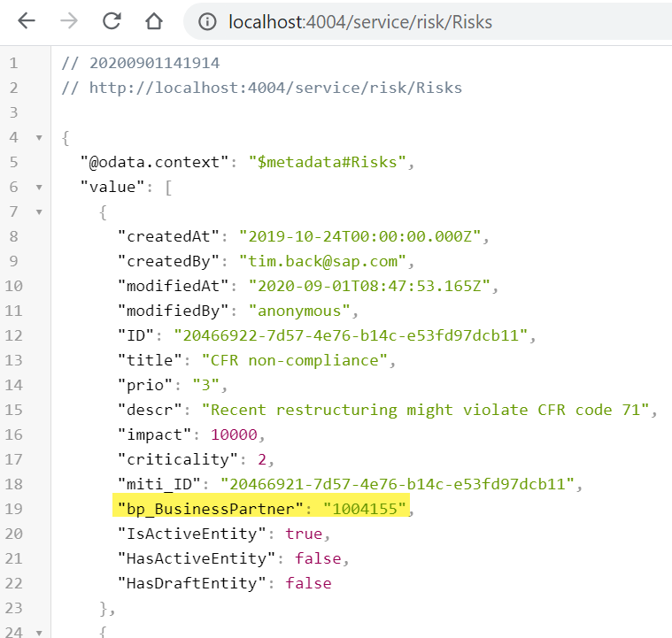
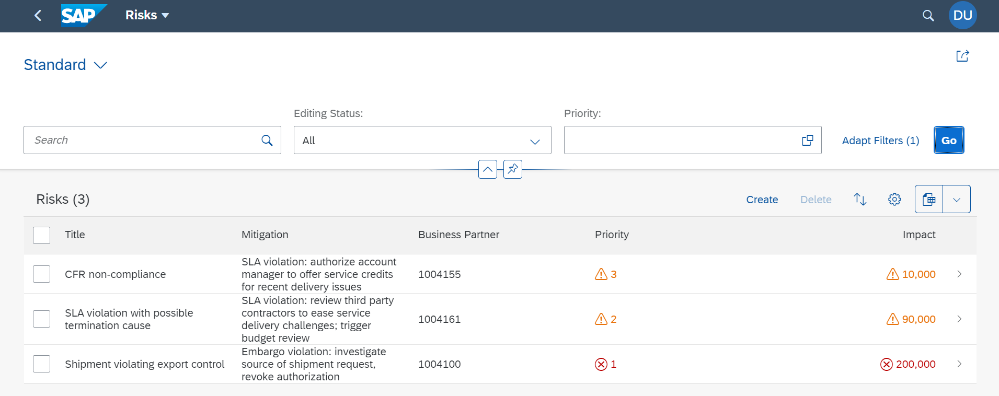
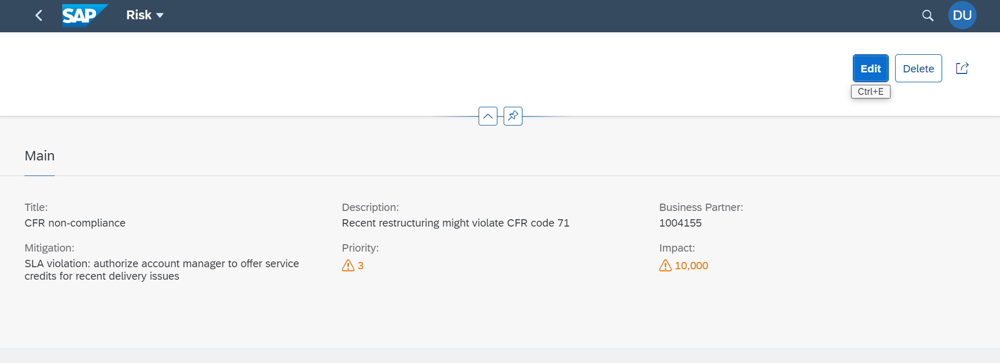

# Consume the External Service in Your UI Application

??? info "Prerequisites"
    - [Create a Directory for Development](../Sources)
    - [Create a CAP-based service](../CAP_Service)
    - [Create an SAP Fiori elements-based Application](../FE)
    - [Add the consumption of an external Service exposed by SAP API Business Hub to your service](../Ext_Service)

    === "SAP"

        The result of the previous module **Add the Consumption of an External Service Exposed by SAP API Business Hub to Your Service** can be found [here](https://github.tools.sap/CPES/CPAppDevelopment/tree/cap/api-hub).

    === "External"

        The result of the previous module **Add the Consumption of an External Service Exposed by SAP API Business Hub to Your Service** can be found [here](https://github.com/SAP-samples/cloud-cap-risk-management/tree/cap/api-hub).

??? note "Additional Documentation"
    - [Official CAP documentation](https://cap.cloud.sap/docs/)
    - [CAP Getting started](https://cap.cloud.sap/docs/get-started/)

In this section, you incorporate the external service into the UI application.

1. Open the `db/schema.cds` file in the `cpapp` folder.

2. Add the `bp` property:

    <!-- cpes-file db/schema.cds -->
    ```text hl_lines="10-10"
    namespace sap.ui.riskmanagement;
    using { managed } from '@sap/cds/common';
      entity Risks : managed {
        key ID      : UUID  @(Core.Computed : true);
        title       : String(100);
        prio        : String(5);
        descr       : String;
        miti        : Association to Mitigations;
        impact      : Integer;
        bp          : Association to BusinessPartners;
        criticality : Integer;
      }
      entity Mitigations : managed {
        key ID       : UUID  @(Core.Computed : true);
        description  : String;
        owner        : String;
        timeline     : String;
        risks        : Association to many Risks on risks.miti = $self;
      }
      // using an external service from
      using {  API_BUSINESS_PARTNER as external } from '../srv/external/API_BUSINESS_PARTNER.csn';
      entity BusinessPartners as projection on external.A_BusinessPartner {
        key BusinessPartner as ID,
        BusinessPartnerFullName as businessPartnerFullName,
        BusinessPartnerIsBlocked as businessPartnerIsBlocked,
        SearchTerm1 as searchTerm1
      }
    ```

	As you got a new property in your entity, you need to add data for this property in the local data file that you have created before for the `risk` entity.


3. Open the `srv/risk-service.js` file within the `cpapp` folder in your VS Code workplace.

4. Add the highlighted lines at the end of the file:

    <!-- cpes-file srv/risk-service.js -->
    ```js hl_lines="1-1 15-37 40-43"

    /**
     * Implementation for Risk Management service defined in ./risk-service.cds
     */
    module.exports = async (srv) => {
        srv.after('READ', 'Risks', (risks) => {
            risks.forEach((risk) => {
                if (risk.impact >= 100000) {
                    risk.criticality = 1;
                } else {
                    risk.criticality = 2;
                }
            });
        });
        srv.on('READ', 'Risks', async (req, next) => {
            const expandIndex = req.query.SELECT.columns.findIndex(({ expand, ref }) => expand && ref[0] === 'bp');
            if (expandIndex < 0) return next();
            req.query.SELECT.columns.splice(expandIndex, 1);
            if (!req.query.SELECT.columns.find( column => column.ref.find( ref => ref == "bp_ID" ))) req.query.SELECT.columns.push({ ref: ["bp_ID"] });
            const data = await next();
            const risks = Array.isArray(data) ? data:[data]
            // Request all Business Partners
            const mock = !cds.env.requires.API_BUSINESS_PARTNER.credentials;
            const tx = mock ? BupaService.tx(req) : BupaService;
            const businessPartnerIds = risks.map( risk => risk.bp_ID );
            const businessPartners = await tx.run(SELECT.from(srv.entities.BusinessPartners).where({ ID: businessPartnerIds }).columns([ "ID", "businessPartnerFullName", "businessPartnerIsBlocked" ]));
            // Convert in a map for easier lookup
            const businessPartnerMap = {};
            for (const businessPartner of businessPartners) {
                businessPartnerMap[businessPartner.ID] = businessPartner;
            }
            // Add Business Partner properties to risks result
            for (const risk of risks) {
                const businessPartner = businessPartnerMap[risk.bp_ID];
                if (businessPartner) risk.bp = businessPartner;
            }
            return risks;
        });
        const BupaService = await cds.connect.to('API_BUSINESS_PARTNER');
        srv.on('READ', srv.entities.BusinessPartners, async (req) => {
            // Workaround for CAP issue
            const mock = !cds.env.requires.API_BUSINESS_PARTNER.credentials;
            const tx = mock ? BupaService.tx(req) : BupaService;
            return await tx.run(req.query);
        });
    }
    ```

5. Copy the file `sap.ui.riskmanagement-Risks.csv` from `templates/cap/api-hub/db/data` to the `db/data` folder of your app. If VS Code asks you whether to replace the existing file (which doesn't have the bp data), confirm.

	If you check the content of the file, you see numbers like `1004155` at the end of the lines, representing business partners.

4. Open http://localhost:4004/service/risk/Risks for the new data.

	


## Add the Business Partner Field to the UI

Now, you also introduce the business partner field in the UI. For this you need to do several things:

- You add a label for the columns in the result list table as well as in the object page by adding a title annotation.
- You add the business partner as a line item to include it as a column in the result list.
- You add the business partner as a field to a field group, which makes it appear in a form on the object page.

All this happens in the cds file that has all the UI annotations.

1. Open the `srv/risks-service-ui.cds` file in the `cpapp` folder.

2. Add the following lines to the file:

	<!-- cpes-file srv/risks-service-ui.cds -->
	```text hl_lines="7-7 32-32 54-55 64-64"
	using RiskService from './risk-service';
	annotate RiskService.Risks with {
		title       @title: 'Title';
		prio        @title: 'Priority';
		descr       @title: 'Description';
		miti        @title: 'Mitigation';
		bp          @title: 'Business Partner';
		impact      @title: 'Impact';
	}
	annotate RiskService.Mitigations with {
		ID @(
			UI.Hidden,
			Common: {
			Text: description
			}
		);
		description  @title: 'Description';
		owner        @title: 'Owner';
		timeline     @title: 'Timeline';
		risks        @title: 'Risks';
	}
	annotate RiskService.Risks with @(
		UI: {
			HeaderInfo: {
				TypeName: 'Risk',
				TypeNamePlural: 'Risks'
			},
			SelectionFields: [prio],
			LineItem: [
				{Value: title},
				{Value: miti_ID},
				{Value: bp_ID},
				{
					Value: prio,
					Criticality: criticality
				},
				{
					Value: impact,
					Criticality: criticality
				}
			],
			Facets: [
				{$Type: 'UI.ReferenceFacet', Label: 'Main', Target: '@UI.FieldGroup#Main'}
			],
			FieldGroup#Main: {
				Data: [
					{Value: title},
					{Value: miti_ID},
					{Value: descr},
					{
						Value: prio,
						Criticality: criticality
					},
					{Value: bp_ID},
					{Value: bp.businessPartnerIsBlocked},
					{
						Value: impact,
						Criticality: criticality
					}
				]
			}
		},
	) {
	};
	```

3. In your browser, choose the link [/launchpage.html](http://localhost:4004/launchpage.html) for the HTML page.

4. On the launch page that now comes up, choose the **Risks** tile and then choose **Go**.

	You now see the `Risks` application with the business partner in both the result list and the object page, which is loaded when you choose one of the rows in the table:

	

	


=== "SAP"

    The result of these steps can be found [here](https://github.tools.sap/CPES/CPAppDevelopment/tree/cap/api-hub-ui).

=== "External"

    The result of these steps can be found [here](https://github.com/SAP-samples/cloud-cap-risk-management/tree/cap/api-hub-ui).
