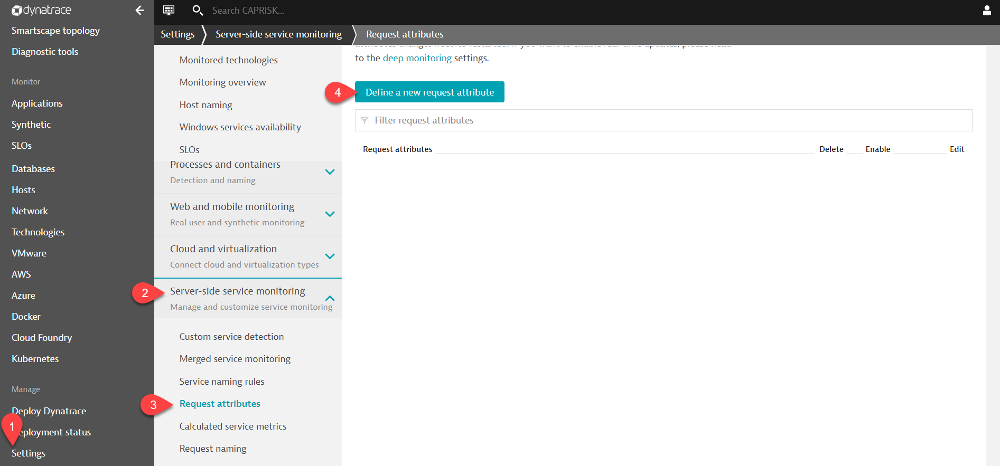
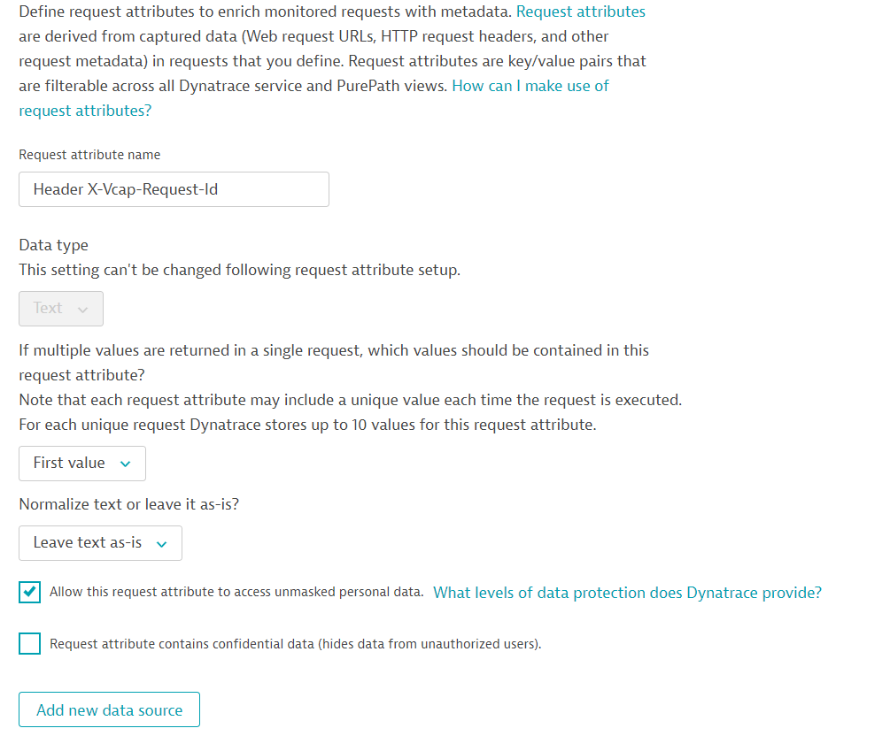
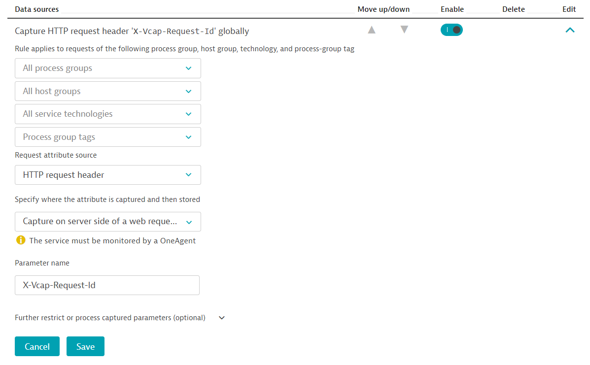
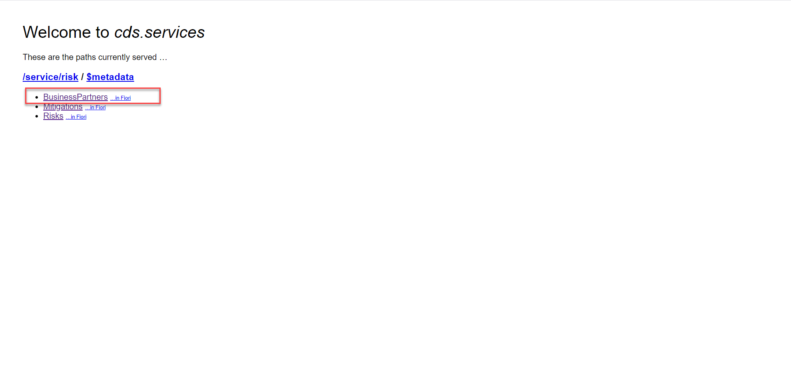
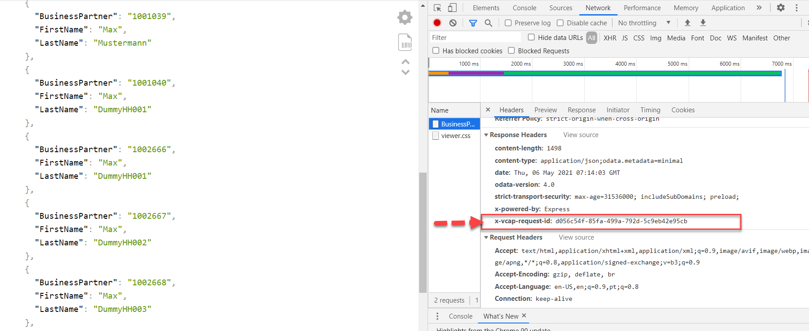
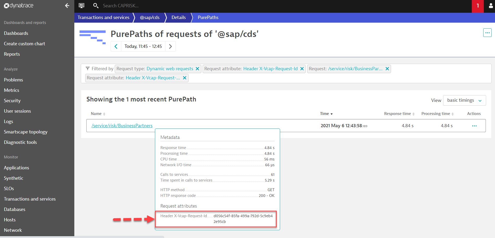
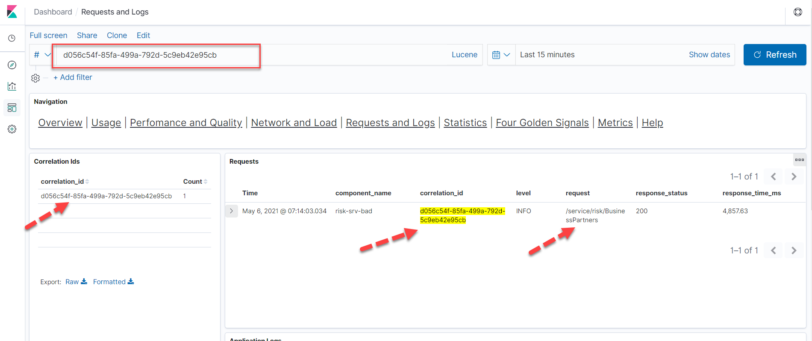

# Correlate Dynatrace with Kibana in Cloud Foundry

### Description

Dynatrace tracks all requests, from end to end, and automatically monitors the services that underlie each transaction. The performance and attributes of each request can be analyzed in detail. You are not limited to just certain predefined attributes. You can also configure custom request attributes that you can use to improve filtering and analysis of web requests.

In some scenarios, you would like to be able to see a single transaction in Dynatrace and to follow that transaction in Kibana. This can easily be done with a single configuration setting.

[Documentation](https://github.wdf.sap.corp/pages/apm/blog/correlate-Dynatrace-Kibana/)

### Setup

You can ask the Dynatrace Configuration Admins to configure the capture of the HTTP request header X-Vcap-Request-Id. This can be done globally or to specific Process Groups or Services.

1. Go to Settings > Server-side monitoring > Request attributes.

2. Click the Create new request attribute button.

3. In `Request attribute name` enter 'Header X-Vcap-Request-Id'

4. Click on Checkbox `Allow this request attribute to access unmasked personal data`

5. Click on `Add new data source`

6. In `Request attribute source` select 'HTTP request header'

7. In `Specify where the attribute is captured and then stored` select 'Capture on server side of a web request service'.

8. In `Parameter name` enter 'X-Vcap-Request-Id'

9. Click on `Save`

   
   
   

### Follow your transaction

 1. Click on `BusinessPartners` of your risk-srv service.

    

2. At the same time click on F12 and capture the returing `X-Vcap-Request-Id`

    

### See your request id in Pure Path

1. Open the pure path of your `/service/risk/BusinessPartners` and hover the cursor there. You will see the request id.

   

### Explore more on Kibana

 1. Open the Kibana Dashboard.

 2. Click on `Requests and Logs`.

 3. Under `Search` column enter your `correlation_id`.

 4. You will see your requested service `/service/risk/BusinessPartners`.

 5. Expand the details to check get more information of this service.

   

