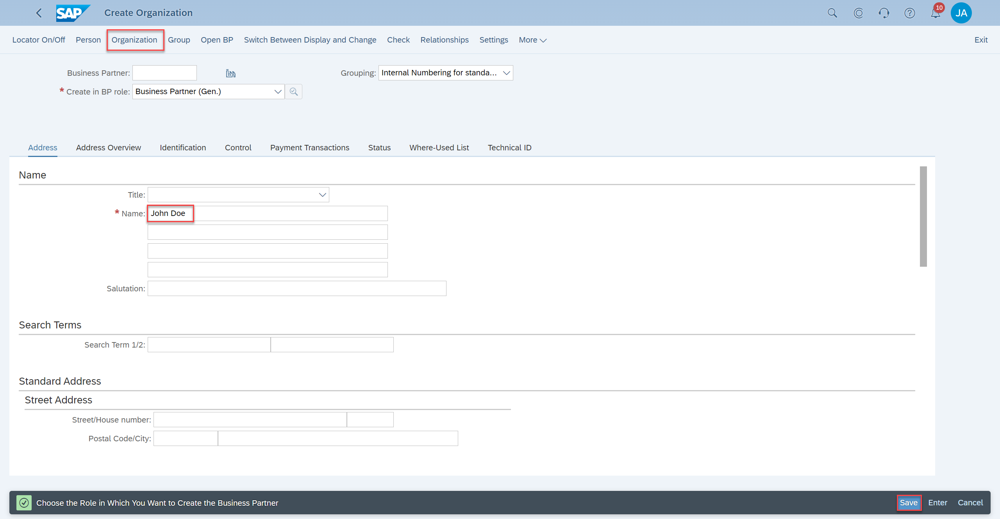
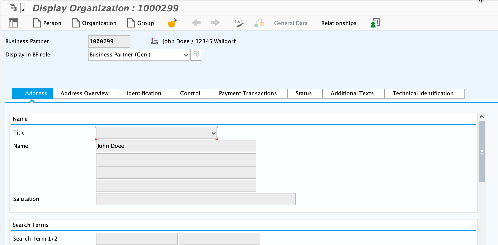
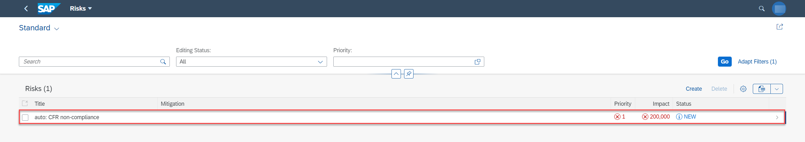
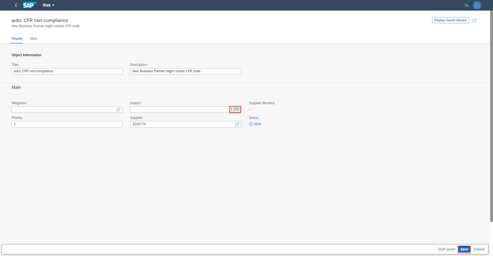
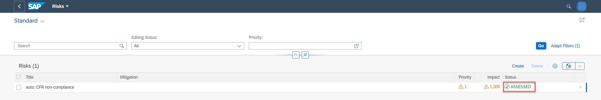
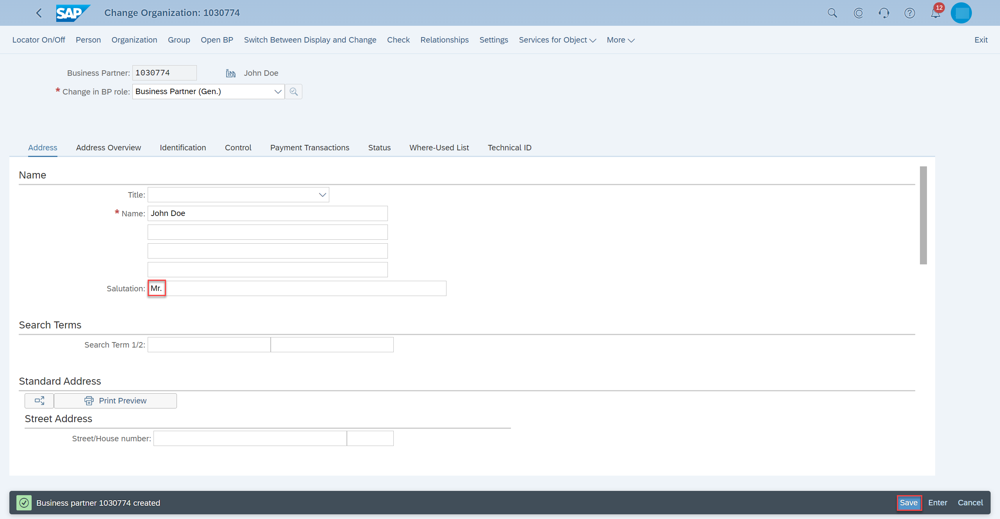
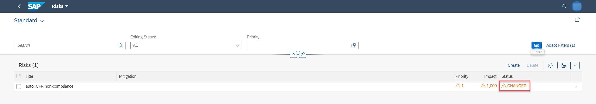

# Demo for Eventing Scenario

In this section, lets see the demo on how to test/validate the eventing scenario.

1. Create a new `BusinessPartner` in the SAP S/4HANA system with the following details:

    
    
    

2. Choose Industry as `Leisure and Hotel`

    
3. Save the `BusinessPartner`.
     

4. Open the UI application.

5. Choose the `Risks` tile and find the automatically created `Risk` for the newly saved `BusinessPartner`.

     

6. Fill in the other details as shown below, set `Priority` to `1` and `impact` to `100000` and choose **Save**.
    

    After saving the Risk, it should look like this:

    

8. Open the SAP S/4HANA system and open the `BusinessPartner` created in Step 1. Notice the change in `SearchTerm` and the `Lock` status.

    
    

10. Refresh the UI application. The changes are now reflected in the UI.

    

11. Run the mitigation by editing the `BusinessPartner` in the S/4HANA system, by modifying the  `SearchTerm` and `Central Lock` status as below and choose the **Save** button.

    
    

12. Refresh the UI application to notice the changes.

     
