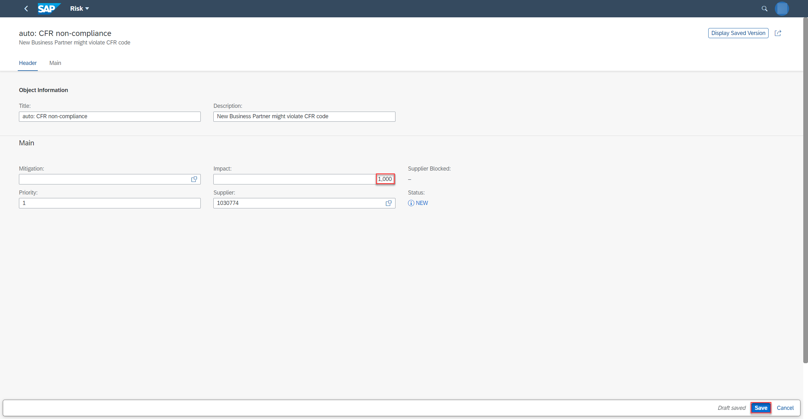
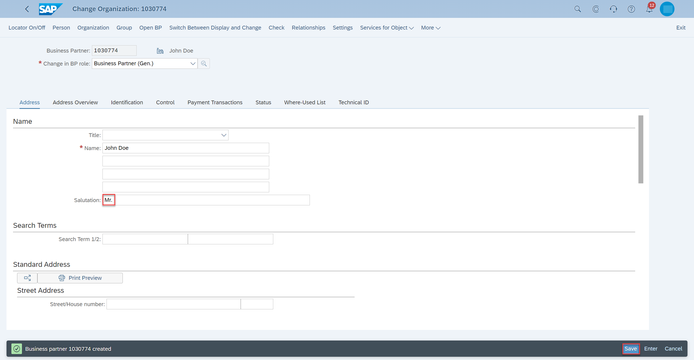

## Prerequisites
 - [Enable Events from SAP S/4HANA Cloud to SAP BTP](../Events-Enable-S4HC)

## Details
### You will learn
 - How to create and change a Business Partner in your SAP S/4HANA Cloud system
 - How to check if the Business Partner creation and change events sent from your SAP S/4HANA Cloud system have updated your CAP application
---

## Create a Business Partner and check updates in your CAP application

1. In your SAP S/4HANA Cloud system, go to **Maintain Business Partner**. You can also use the **Search** field in the upper right corner of the screen.

    

2. Under **Organization**, add a name for the business partner and choose **Save**.

    

3. Open the UI application. Choose the **Risks** tile and find the automatically created `Risk` for the newly saved `BusinessPartner`.

    

4. Open the object page of the new risk. Set **Impact** to `1000` and choose **Save**.

    

5. Refresh the **Risks** app and choose **Go**. The risk status is updated to `Assessed`.

    

5. In the SAP S/4HANA Cloud system, change the already created business partner. For example, add a salutation and choose **Save**.

    

6. Refresh the **Risks** app and choose **Go** again. The status of the new risk is updated to `Changed`.

    

Congratulations! You have completed all tutorials.

<!-- [VALIDATE_1] -->
