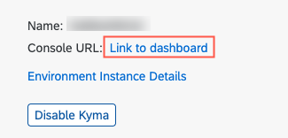
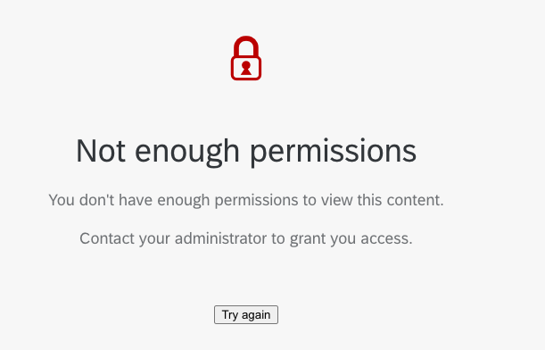
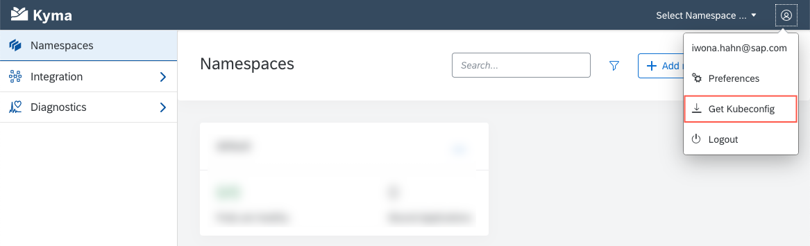
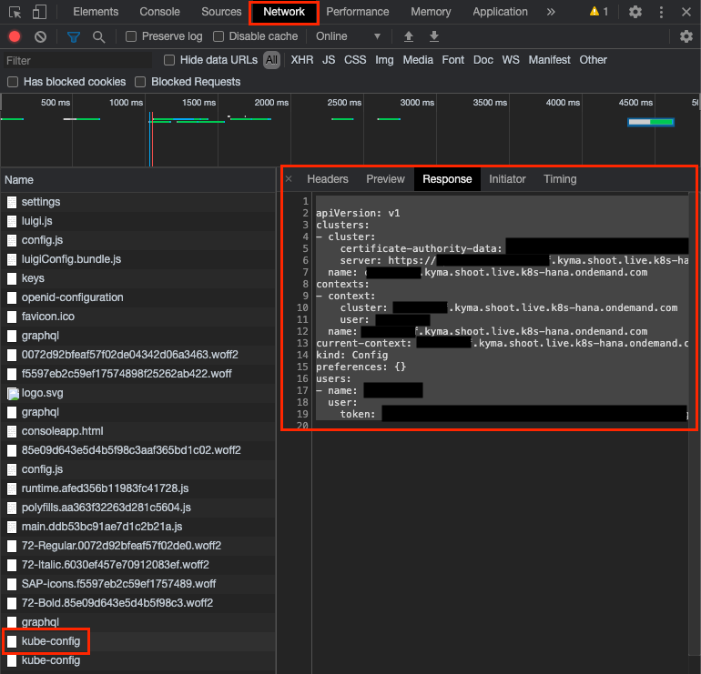

# Run a CAP Application on Kyma

??? note "Additional Documentation"

    - [Administration and Operations in the Kyma Environment](https://help.sap.com/viewer/65de2977205c403bbc107264b8eccf4b/Cloud/en-US/b8e16869e64a4abe93cc194aa6fdacf5.html)
## Preface

SAP recently released the [SAP Business Technology Platform, Kyma runtime](https://blogs.sap.com/2020/05/12/get-a-fully-managed-runtime-based-on-kyma-and-kubernetes/), a managed Kubernetes offering with Kyma.

Kyma is much about extending existing applications, but you also get a full-blown Kubernetes cluster including [Istio service mesh](https://istio.io/latest/docs/concepts/what-is-istio/#what-is-a-service-mesh) that you can use to build a standalone cloud application.

In this tutorial, you deploy an application built with the SAP Cloud Application Programming Model (CAP) to an *SAP Business Technology Platform, Kyma runtime* cluster. The CAP application has an OData service, SAP Fiori UI and uses SAP HANA as a database.

The [SAP BTP Application Development](https://github.com/SAP-samples/cloud-cap-risk-management) example is used as starting point.

The tutorial can be also done with any other Kyma installation, but you need an SAP HANA database and an HDI container and you then need to do the part with SAP HANA credentials differently.

The CAP part is probably the smallest in the tutorial: Frankly speaking, just package it into a docker container and run it. But the tutorial also describes how to get a small docker registry running. If you are experienced with Kubernetes, you can skip some sections.

Since SAP HANA Cloud isn’t yet available for Kyma, you take it from Cloud Foundry. It's a bit tricky to copy the credentials, but at the end it's just copying and pasting values. Scripts are provided to help you here. So, don't get distracted by this.

## Disclaimer

Note, that this tutorial is intended to give an introduction in the topic and not for deploying productive applications.

CAP doesn't officially support *Kubernetes* and *Kyma* as a platform right now.

## Preconditions

These are preconditions to do this tutorial:

### SAP BTP Application Development Example

=== "SAP"

    You need a project containing the **SAP BTP Application Development** example from the tutorial with the completed [Add more than one application to the [launchpage](Launchpage.md) step.

    Alternatively, you can use the example code for this step by copying the content of the [cap/freestyle-ui5-app](https://github.tools.sap/CPES/CPAppDevelopment/tree/cap/freestyle-ui5-app) branch.

    The result of this tutorial is available in the [kyma/app](https://github.tools.sap/CPES/CPAppDevelopment/tree/kyma/app) branch.

=== "External"

    You can find the starting point of this tutorial in the [cap/freestyle](https://github.com/SAP-samples/cloud-cap-risk-management/tree/cap/freestyle-ui5-app) branch:

    1. Go to the directory where you want to create the example.

    2. Create a folder for your example:

        For example:

        ```bash
        mkdir cap-kyma-app
        ```

    3. Clone the example GitHub repository and checkout the example branch:

        ```bash
        git clone https://github.com/SAP-samples/cloud-cap-risk-management
        cd cloud-cap-risk-management
        git checkout cap/freestyle-ui5-app
        ```

    4. Copy all files from the example to your folder, except the `.git` folder:

        For example:

        ```bash
        cp -r .gitignore $(ls -1A | grep -v .git) ../cap-kyma-app
        ```

    5. Open a new project in your source editor for the folder `cap-kyma-app`:

        For Visual Studio Code:

        ```bash
        cd ../cap-kyma-app
        code .
        ```


    Find the final code in the [kyma/app](https://github.com/SAP-samples/cloud-cap-risk-management/tree/kyma/app) branch.

### Local Software

The following local software is required:

* `node` ([Node.js](https://nodejs.org/en/download/) version 12.x or 14.x is recommended)
* `@sap/cds-dk` NPM package (`npm install --global @sap/cds-dk`)
* `docker` (for example, [Docker Desktop](https://www.docker.com/products/docker-desktop) for macOS or Windows)
* A source code editor ([Visual Studio Code](https://code.visualstudio.com/) is recommended)
* `bash` or `zsh` shell to run the command snippets on MacOS or Linux, or [Git Bash](https://gitforwindows.org/) for Windows, MinGW, or [Cygwin](https://www.cygwin.com/))
* `kubectl` ([Kubernetes Command Line tool](https://kubernetes.io/docs/tasks/tools/)), see this [tutorial](https://developers.sap.com/tutorials/cp-kyma-download-cli.html) how to install it
* `helm` ([Helm Chart Command Line](https://helm.sh/docs/intro/install/), not needed if you use an existing docker registry)
* `cf` ([Cloud Foundry Command Line Interface (CLI)](https://docs.cloudfoundry.org/cf-cli/install-go-cli.html))
* `git` ([Git Downloads](https://git-scm.com/downloads) )
* (For Windows users only): You have installed the [SQLite](https://sqlite.org/download.html) tools for Windows. Find the steps how to install it in the [Troubleshooting guide](https://cap.cloud.sap/docs/advanced/troubleshooting#how-do-i-install-sqlite-on-windows) in the CAP documentation.

If you have a Mac, many of the commands can be installed using Homebrew (`brew install ...`). For Windows, there's a similar offering called Chocolatey. Refer to the binary installers of the components otherwise.


### Enable Kyma in SAP BTP Subaccount

You need an SAP BTP Subaccount with consumption-based model (that is, Cloud Credits). Kyma is currently supported on Azure landscapes only, as of September 2020. Although Kyma is needed at a later point in the tutorial, it’s recommended to start with this step, because the Kyma provisioning can take some time.

For this tutorial you have two options:

**Option 1:** [Create Your Own SAP BTP Trial Account](#option-1-create-your-own-sap-btp-trial-account)

**Option 2:** [Use an Existing SAP BTP Subaccount](#option-2-use-your-existing-sap-btp-subaccount)


### Option 1: Create Your Own SAP BTP Trial Account

1. Go to [SAP BTP Cockpit](https://cockpit.eu10.hana.ondemand.com/trial/#/home/trial).
2. Choose **Go To Your Trial Account**.
3. If you don't have a user, you need to [register](https://developers.sap.com/tutorials/hcp-create-trial-account.html) for a free.
4. Wait for the completion of the on-boarding.
5. You should land on the **Subaccounts** page of your **Global Account** on trial.
6. Choose **trial**.
6. Go to **Kyma Environment**.
7. Choose **Enable Kyma**.
8. Provide a **Cluster Name**.
9. Choose **Create**.

This takes a while. You can start the tutorial in the meantime.

### Option 2: Use Your Existing SAP BTP Subaccount

If you already have an older trial account, then you might not see the **Enable Kyma** button. In that case:

1. Go to **Entitlements**.
2. Choose **Configure Entitlements**.
3. Choose **Add Service Plans**.
4. Search for and select **Kyma runtime**.
5. Check the **trial (Environment)** checkbox.
6. Choose **Add 1 Service Plan**.
7. Choose **Enable Kyma**.
8. Provide a **Cluster Name**.
9. Choose **Create**.

This takes a while. You can start the tutorial in the meantime.


SAP BTP’s XSUAA is used to access the Kyma runtime. Please follow the steps to assign [Roles in the Kyma Environment](https://help.sap.com/viewer/65de2977205c403bbc107264b8eccf4b/Cloud/en-US/148ae38b7d6f4e61bbb696bbfb3996b2.html). In some cases, it will still take 5-10 minutes to get access to Kyma Runtime.

### Enable Cloud Foundry

To use the SAP HANA Cloud service, you can either enable Cloud Foundry for the same subaccount or use a different subaccount, for example, an already existing or trial subaccount.

### Install the Cloud Foundry CLI

Later in this tutorial, you need to log on to Cloud Foundry using the command line. Therefore, it's necessary to install the Cloud Foundry CLI. See the [Cloud Foundry documentation](https://docs.cloudfoundry.org/cf-cli/install-go-cli.html) for detailed steps on how to do that.

## Run the CAP Application in a Docker Container Locally

In the first part of this tutorial, you prepare your application to be run on Kyma.

### Build a Docker Container

Since all applications in Kubernetes as in Kyma are docker containers, you need to create a docker image for the CAP application. For that, you need to define a file `Dockerfile` that describes, how to build up the image and what to do when the docker image is run. The file starts with the `FROM` directive that names the base image that you want to use since you don't want to start from scratch. Here, you use a public image that already contains the NodeJS 12.x installation. Additionally install `openssl`, which is required by the SAP HANA client and carry out `npm install`.

You then declare that the CAP default port `4004` is exposed to the outside and run the CAP server with `npm start`.

1. Navigate to the root folder of your app:

    ```
    cd cpapp
    ```

2. Create a file named `Dockerfile` and add the following lines to it:

    ```Dockerfile
    FROM node:12-slim

    WORKDIR /usr/src/app
    COPY gen/srv .
    RUN npm install

    EXPOSE 4004
    USER node
    CMD [ "npm", "start" ]
    ```

3. Add `sqlite3` as project dependency, so you can try out the scenario without an external database service:

    First, the dev dependency to `sqlite3` needs to be removed and then its added again as a runtime dependency.

    ```bash
    npm uninstall sqlite3
    npm install sqlite3
    ```

4. Add the following snippet to the `package.json` file:

    ```json hl_lines="4-10"
    {
      "name": "cpapp",
      ...
      "cds": {
        "requires": {
          "db": {
            "kind": "sql"
          }
        }
      }
    }
    ```

    This tells CAP to use SQLite in dev and SAP HANA in productive mode.

5. Before you can build the image, run `cds build`, because the image takes the build results from the `gen/srv` folder. You can also do this in the docker build, but that would require additional steps that you skip for now.

    ```bash
    cds build
    ```

6. Build the docker image locally:

    !!! info "Make sure that the docker daemon is running (for example, Docker Desktop for MacOS or Windows)."

    ```bash
    docker build -t cpapp .
    ```

    This builds the docker image specified in `Dockerfile` from the current directory (`.` argument). The image is tagged with the name `cpapp`. Without giving a tag a random tag will be added.

    You should see an output similar like:

    ```shell hl_lines="12 13"
    ...
    Removing intermediate container 4f451017d70f
    ---> 948523646f60
    Step 5/6 : EXPOSE 4004
    ---> Running in 1a2b7a0ec606
    Removing intermediate container 1a2b7a0ec606
    ---> be849ff002e1
    Step 6/6 : CMD [ "npm", "start" ]
    ---> Running in cb0b32163709
    Removing intermediate container cb0b32163709
    ---> 1e0c26b94ac6
    Successfully built 1e0c26b94ac6
    Successfully tagged cpapp:latest
    ```

Docker images consist of several "filesystem layers". The *base image* is a layer and your own docker image is a layer on top. Each layer can add or remove files. This is convenient because it saves storage because your custom images contain only the delta of files added or removed. To be more precise an image consists of multiple layers. The `docker build` will automatically decide when to create a new layer. You can see the different layers in the `docker build` output, for example: ` ---> 365313c4290e`

### Run the Docker Container

#### Check the Content of the Docker Container

1. You can run the docker container and look inside its contents:

    ```bash
    docker run --rm -i -t cpapp /bin/bash
    ```

    This starts a docker container with your image (`-t cpapp`) and starts the bash shell (`/bin/bash`) that happens to be part of your base image in an interactive (`-i`) mode.

2. Look inside the contents using the `ls` command:

    ```bash
    node@a5a0b8115eb5:/usr/src/app# ls
    manifest.yaml  node_modules  package-lock.json  package.json  srv
    ```

3. Exit the container using `exit` (Pro-tip: <kbd>Ctrl</kbd> + <kbd>D</kbd> :-)).


#### Run Your CAP Service

Now, it's time to run your CAP service. So, lets do this.

1. Run the container:

    ```bash
    docker run --rm -t cpapp
    ```

    Without specifying the command, it runs the default command, that is `npm start`.
    You can try to access the service at http://localhost:4004, but it doesn't work. It shows a similar error message like this:

    ```
    This site can’t be reached

    localhost refused to connect.
    ```

    Although the docker container exposes port `4004`, the "host" of the container, that is your PC or Mac, doesn't make it accessible. You need to declare it in the docker command line.

2. Stop the service with <kbd>Ctrl</kbd> + <kbd>C</kbd>.

3. Run the container again with the publish parameter:

    ```bash
    docker run --rm -p 4004:4004 -t cpapp
    ```

    This tells docker to expose the port `4004` of the docker container to the port `4004` of the host. You could also use a different port of the host, but let's keep it simple.

    Now, you can access the CAP service at http://localhost:4004.

    You can click on the *Risks** (http://localhost:4004/service/risk/Risks) or **Mitigations** (http://localhost:4004/service/risk/Risks) link that returns an empty OData response.

### Add SAP Fiori UI

There's already an SAP Fiori Elements UI for **Risks** and a SAPUI5 Freestyle UI for **Mitigations** in the project. You could think of several ways to deploy it to the cloud. For the sake of simplicity, you can use the CAP service's capability to serve static resources from the `app` folder. After the `cds build`, the `app` folder isn’t part of the service. You can copy it in, but you need to remove the `*.cds` files because they’re already copied from `app` to `srv` and duplicating these files confuses CAP.

You can automate this in the docker build by modifying the `Dockerfile`.

1. Add the highlighted lines to the file `Dockerfile`:

      ```Dockerfile hl_lines="6-7"
      FROM node:12-slim

      WORKDIR /usr/src/app
      COPY gen/srv .
      RUN npm install
      COPY app app/
      RUN find app -name '*.cds' | xargs rm -f

      EXPOSE 4004
      USER node
      CMD [ "npm", "start" ]
      ```

2. Rebuild the docker image:

    ```bash
    cds build
    docker build -t cpapp .
    ```

3. Run it locally:

    ```bash
    docker run --rm -p 4004:4004 -t cpapp
    ```

4. Try it out by navigating to http://localhost:4004/launchpage.html.

## Deploy to Kyma

In this part of the tutorial, you deploy the dockerized CAP application to Kyma.

### Log In to Kyma (Kubernetes Cluster)

The first step is to log in to Kyma using the **Kyma Console** and configure the local `kubectl` command to connect to the Kyma Kubernetes cluster.

1. Go to [SAP BTP Cockpit](https://cockpit.eu10.hana.ondemand.com/trial/#/home/trial).
1. Choose **Enter Your Trial Account**.
1. Choose your **Global Account**.
1. Choose your **Subaccount**.
1. On the **Overview** page, under **Kyma Environment**, choose **Link to dashboard**.

    

    The Kyma console should open. The console is a web-based administrative UI for Kyma. If not, see the troubleshooting information.

    ??? info "Troubleshooting: Not enough permissions to launch the kyma console"
        

        If you can not launch the kyma console, please follow the steps to get permissions:

        1. Open your subaccount.
        2. Navigate to **Security** --› **Role Collections** --› **Trust Configuration** and assign the role collection _Kyma_Roles_ to your user.
        2. Navigate back to the subaccount overview and launch the kyma console.

1. Choose the account icon in the upper right corner.
1. Choose **Get Kubeconfig** from the dropdown menu.

    

    A file download should be triggered. If no download is triggered, see the troubleshooting information.

    ??? info "Troubleshooting: If no download is triggered"
        It can happen, that no download is triggered. In this case follow these steps:

        1. Open your browser's developer tools (press `F12`).
        2. Navigate to the **Network** tab.
        3. Choose the **Get Kubeconfig** button again.
        4. Locate the response of the `kubeconfig` file.
        5. Look at the response.

          

        6. Copy the response, you will need it in the next steps.


1. Navigate to your home folder.

    The config for the default cluster is stored in `.kube/config` in your home directory.

1. Navigate to the `.kube` folder.

1. Create a file named `cap-kyma-app-config` to avoid overwriting the existing configuration.

1. Copy the content of the downloaded `kubeconfig.yml` into the file `cap-kyma-app-config`.

1. Make sure that only your user can access the content of the file, that contains your login token.

  For example, on Mac or Linux, change the file to be only readable and writable by your user using:

  ```
  chmod 0600 ~/.kube/cap-kyma-app-config
  ```

2. Set the new config file for the running shell process:

    ```bash
    export KUBECONFIG=~/.kube/cap-kyma-app-config
    ```

    Now, you can access your kubernetes cluster.

3. Check if you can access your kubernetes cluster.

    ```bash
    kubectl get pods
    ```

    The command should run without an error message, but it doesn't output any pods if you have a newly created cluster.

    If you want to use `kubectl` in another shell session, then rerun the `export` statement.
    The authentication session will expire after some hours. You then need to download the `kubeconfig.yml` file again and replace the value of the token parameter in your `cap-kyma-app-config` file with the one from the newly downloaded `kubeconfig.yml` file.

### Prepare the Docker Registry

Kubernetes needs a docker registry that can be accessed from the cluster's network. This could be any public or private registry. To keep this tutorial self-contained, you use a slightly different approach, which isn’t recommended for productive use: You deploy your own docker registry to the cluster.

If you want to use a different docker registry, then you need to adjust the `docker push` commands and the URLs for the docker images.

In the approach with the cluster's own docker registry, a [Helm Chart](https://charts.helm.sh/stable) is used to install it on the cluster.

1. Add the stable Helm Chart repository to the `helm` CLI:

    ```bash
    helm repo add stable https://charts.helm.sh/stable
    ```

2. Install the Helm Chart for a docker registry:

    ```bash
    helm install docker-registry stable/docker-registry
    ```

3. You need to make the docker registry available on the public internet. The details to this step are explained later. Run the following commands:

    ```bash
    kubectl apply -f - <<EOF
    apiVersion: gateway.kyma-project.io/v1alpha1
    kind: APIRule
    metadata:
      labels:
        app: docker-registry
      name: docker-registry
    spec:
      service:
        host: docker-registry
        name: docker-registry
        port: 5000
      gateway: kyma-gateway.kyma-system.svc.cluster.local
      rules:
        - path: /.*
          methods: ["GET", "HEAD" ]
          accessStrategies:
            - handler: noop
          mutators: []
    EOF
    ```

4. To be able to push docker images via HTTP, you need to add it as an "insecure registry" (not using secure socket communication) to your Docker config.

    1. Open your Docker Desktop.
    2. Choose **Preferences**.
    3. Choose **Docker Engine**.
    4. Add the following line:

        ```json hl_lines="3"
        {
          ...
          "insecure-registries" : ["0.0.0.0:5000"]
        }
        ```

    5. Choose **Apply and Restart**.
    6. Wait for the startup to be completed.

### Push Docker Image

1. Since the docker registry isn’t exposed to the open internet (and you don't want to), you need to establish a tunnel from your localhost to the registry:

    ```bash
    kubectl port-forward deployment/docker-registry 5000:5000 &
    ```

    The `&` causes the process to run in the background. You need to keep it running until you finished pushing docker images. You may need to start it newly in case the "docker push" doesn't work anymore.

    You should see the following output that tells you that the tunneling is established:

    ```
    Forwarding from 127.0.0.1:5000 -> 5000
    Forwarding from [::1]:5000 -> 5000
    ```

2. Your docker image needs an additional tag to declare it part of your `forwarded` docker registry. Otherwise, you can't push it.

    ```bash
    docker tag cpapp 0.0.0.0:5000/cpapp
    ```

3. Push it, using the new tag:

    ```bash
    docker push 0.0.0.0:5000/cpapp
    ```

    The output mixes the `docker push` output with the `kubectl port-forward` output. It should finish with a line like:

        ```
        latest: digest: sha256:4054dd60ee4f9889d58aa97295cb3b1430a5c1549e602b6c619d7c4ed7d04ad0 size: 2412
        ```

### Deploy the CAP Application

Now, you can deploy your CAP service to Kubernetes. You use the `Deployment` resource of Kubernetes to describe the application. It contains a description of the container and manages its creation and takes care that the instance keeps running.


1. Create a directory to store your deployment YAML files:

    ```bash
    mkdir deployment
    ```

2. Create a file `deployment/deployment.yaml` with the following contents:

    ```yaml
    apiVersion: apps/v1
    kind: Deployment
    metadata:
      name: cpapp
      labels:
        app: cpapp
        version: v1
    spec:
      replicas: 1
      selector:
        matchLabels:
          app: cpapp
          version: v1
      template:
        metadata:
          labels:
            app: cpapp
            version: v1
        spec:
          containers:
          - name: cpapp
            image: docker-registry.{{CLUSTER_DOMAIN}}/cpapp
            imagePullPolicy: Always
            ports:
            - containerPort: 4004
    ```

    The file contains a placeholder `{{CLUSER_DOMAIN}}` that you need to replace with your cluster's domain. Either in the file or replacing it when applying the file.

    You can find your cluster's domain, for example, for the URL of the Kyma Console. If your console URL is for example `https://console.c-abcd123.kyma.shoot.live.k8s-hana.ondemand.com/`, the cluster's domain is `c-abcd123.kyma.shoot.live.k8s-hana.ondemand.com`, just without the leading `console.`

3. Apply the new configuration:

    ```bash
    kubectl apply -f deployment/deployment.yaml
    ```

    Or you can take it from the current `kubectl` configuration and replace it on deployment, like this:

    ```bash
    sed <deployment/deployment.yaml "s/{{CLUSTER_DOMAIN}}/$(kubectl config current-context)/" | kubectl apply -f -
    ```

4. Check the state of the deployment using:

    ```bash
    kubectl get deployments
    ```

    Initially, it looks like this:

        ```
        NAME              READY   UP-TO-DATE   AVAILABLE   AGE
        cpapp             0/1     1            0           5s
        ```

    If all goes well, it turns to:

        ```
        NAME              READY   UP-TO-DATE   AVAILABLE   AGE
        cpapp             1/1     1            1           14m
        ```

5. Since you have not exposed the app to the public internet, you can only access it with a tunnel. So, lets create another tunnel:

    ```bash
    kubectl port-forward deployment/cpapp 4004:4004
    ```

6. Open the CAP service in the browser at http://localhost:4004.

    Your service is now running through kubernetes.

7. Press <kbd>Ctrl</kbd> + <kbd>C</kbd> to stop the tunnel.

### Expose CAP Application to the Public Internet

1. Create a new file `deployment/apirule.yaml` with following content:

    ```yaml
    apiVersion: v1
    kind: Service
    metadata:
      name: cpapp
      labels:
        app: cpapp
        service: cpapp
    spec:
      ports:
      - port: 4004
        name: http
      selector:
        app: cpapp
    ---
    apiVersion: gateway.kyma-project.io/v1alpha1
    kind: APIRule
    metadata:
      labels:
        app: cpapp
      name: cpapp
    spec:
      service:
        host: cpapp
        name: cpapp
        port: 4004
      gateway: kyma-gateway.kyma-system.svc.cluster.local
      rules:
        - path: /.*
          methods: ["GET", "PUT", "POST", "HEAD", "PATCH", "DELETE" ]
          accessStrategies:
            - handler: noop
          mutators: []
    ```

2. Apply with:

    ```bash
    kubectl apply -f deployment/apirule.yaml
    ```

3. Look up your CAP service URL:

    ```bash
    echo "https://cpapp.$(kubectl config current-context)"
    ```

    The console outputs your CAP service URL, for example `https://cpapp.example.kyma.live.k8s-hana.ondemand.com/`.

4. Check if you can access your service via your URL.

    You can also add entries to the **Risks** application.

## Add SAP HANA Cloud

Your application runs on Kyma and is accessible from public internet now. Still, it works like the local development version (`cds watch`) without a real database persistence. In this step, you add support for SAP HANA. As already said, you need to provision it from Cloud Foundry and add the credentials manually.

To keep the latency between the CAP service and SAP HANA low, it makes sense to provision the SAP HANA Cloud database on the same SAP BTP region as the Kyma cluster. But to try it out you can also use an SAP HANA Cloud instance from your Trial account.

### Prepare CAP Application for SAP HANA Cloud

The `hdb` module needs to be added to your `package.json` to enable CAP to talk to an SAP HANA database.

1. Install the `hdb` module:

    ```bash
    npm install --save hdb
    ```

2. Open the `package.json` file.

3. Add the following snippet for SAP HANA:

    ```json hl_lines="9-15"
    {
      "name": "cpapp",
      ...
      "cds": {
        "requires": {
          "db": {
            "kind": "sql"
          }
        },
        "hana": {
          "deploy-format": "hdbtable"
        }
      }
      ...
    }
    ```

    With `requires.db.kind`: `sql` you tell CAP to use SQLite in development and SAP HANA in productive mode. The setting `hana.deploy-format`: `hdbtable` is required for SAP HANA Cloud since it supports only the `hdbtable` and `hdbview` files for deployment.

4. You now need to tell the CAP service to run in the productive mode. To do that, edit the `Dockerfile` and add the highlighted statement:

    ```Dockerfile hl_lines="3"
    FROM node:12-slim

    ENV NODE_ENV=production
    WORKDIR /usr/src/app
    COPY gen/srv .
    RUN npm install
    COPY app app/
    RUN find app -name '*.cds' | xargs rm -f

    EXPOSE 4004
    USER node
    CMD [ "npm", "start" ]
    ```

5. Rebuild the CAP project and the docker image for production:

    ```
    cds build --production
    docker build -t 0.0.0.0:5000/cpapp .
    docker push 0.0.0.0:5000/cpapp
    ```

    The command `cds build` uses the `--production` argument to build the SAP HANA artifacts. `npm` and `node` uses the environment variable `NODE_ENV=production`. Without that CAP falls back to "development mode" settings and tries to use SQLite.

### Create and Deploy SAP HANA HDI Container

You use the `cds deploy` command to create an HDI container on Cloud Foundry and deploy the database schema to the container.

Make sure that you are logged in to a Cloud Foundry account where an SAP HANA Cloud instance and entitlement for the service plan `hana` `hdi-shared` is available or you use an SAP BTP Trial account, run:

1. Set the Cloud Foundry API endpoint:

    ```bash
    cf api <api-endpoint>
    ```

    You can find the API Endpoint URL in the overview page of your subaccount.

2. Log on to your Cloud Foundry account:

    ```bash
    cf login
    ```

3. Run the following line to create an HDI container:

    ```bash
    cds deploy --to hana:cpapp-kyma-db
    ```

    The suffix `:cpapp-kyma-db` tells `cds deploy` to create an HDI container with name `cpapp-kyma-db`. It also creates a service key with the name `cpapp-kyma-db-key` that you use to access the database in the next section.

    Then it deploys the database tables and the test content.

    It should end with something like:

      ```
        Finalizing...
        Finalizing... ok  (0s 96ms)
        Make succeeded (0 warnings): 14 files deployed (effective 22), 0 files undeployed (effective 0), 0 dependent files redeployed
        Making... ok  (1s 597ms)
        Enabling table replication for the container schema "C5DF44CB9C08482D821F5BC3BE344FCF"...
        Enabling table replication for the container schema "C5DF44CB9C08482D821F5BC3BE344FCF"... ok  (0s 63ms)
      Starting make in the container "C5DF44CB9C08482D821F5BC3BE344FCF" with 14 files to deploy, 0 files to undeploy... ok  (1s 756ms)
      Deploying to the container "C5DF44CB9C08482D821F5BC3BE344FCF"... ok (2s 211ms)
      No default-access-role handling needed; global role "C5DF44CB9C08482D821F5BC3BE344FCF::access_role" will not be adapted
      Unlocking the container "C5DF44CB9C08482D821F5BC3BE344FCF"...
      Unlocking the container "C5DF44CB9C08482D821F5BC3BE344FCF"... ok (0s 0ms)
      Deployment to container C5DF44CB9C08482D821F5BC3BE344FCF done [Deployment ID: none].
      (4s 499ms)
      Application can be stopped.
      ```

    If it's missing, then there's probably a problem with the HDI deployer on your operating system. It can be worked around by putting the HDI deployer in a docker container as describe in the following section.

### Workaround: Use HDI Deployer in Docker Container

Create a file `Dockerfile.hdi-deploy` with the following content:

```Dockerfile
FROM node:12-slim AS build

ENV NODE_ENV=production
WORKDIR /usr/src/app
RUN apt-get update
RUN apt-get install -y openssl python make g++
COPY gen/db/package.json .
RUN npm install
COPY gen/db .

CMD [ "npm", "start", "--", "--exit" ]
```

Execute the following commands and check if the output gets right this time:

```bash
docker build -t cpapp-hdi-deployer -f Dockerfile.hdi-deploy .
docker run --rm --env VCAP_SERVICES='{"hana":[{"credentials": '"$(cf service-key cpapp-kyma-db cpapp-kyma-db-key | sed 1d )"', "name": "hana","label":"hana","plan":"hdi-shared","tags":["hana"]}]}' -t cpapp-hdi-deployer
```

### Add SAP HANA HDI Container Credentials

You need to somehow inject the SAP HANA credentials into the CAP application. On Cloud Foundry that is done using an environment variable called `VCAP_SERVICES` that takes the credentials for all bound services. Kubernetes takes a slightly different approach, it uses secrets, that can be injected into applications as environment variables. But as individual environment variables for each value. Luckily, CAP supports both.

On Kyma the service credentials for SAP HANA would look like this:

```
driver=com.sap.db.jdbc.Driver
hdi_password=...
hdi_user=...
host=...hana.eu10.hanacloud.ondemand.com
password=...
port=443
schema=DE6922EF2F3449E984E2E794456B7CBE
url=jdbc:sap://...hana.eu10.hanacloud.ondemand.com:443?encrypt=true&validateCertificate=true&currentschema=DE6922EF2F3449E984E2E794456B7CBE
user=...
```

Since you need to take the SAP HANA credentials from Cloud Foundry, it’s easier to stick to the `VCAP_SERVICES` approach for now.

So, let's have a look at the credentials that have been created by `cds deploy`:

```bash
cf service-key cpapp-kyma-db cpapp-kyma-db-key
```

The output looks like this:

```json

Getting key `cpapp-kyma-db-key` for service instance `cpapp-kyma-db` as MySelf...

{
 "certificate": "-----BEGIN CERTIFICATE-----\n...\n...\n...\n-----END CERTIFICATE-----",
 "driver": "com.sap.db.jdbc.Driver",
 "hdi_password": "...",
 "hdi_user": "...",
 "host": "...hana.eu10.hanacloud.ondemand.com",
 "password": "...",
 "port": "443",
 "schema": "C5DF44CB9C08482D821F5BC3BE344FCF",
 "url": "jdbc:sap://...hana.eu10.hanacloud.ondemand.com:443?encrypt=true\u0026validateCertificate=true\u0026currentschema=C5DF44CB9C08482D821F5BC3BE344FCF",
 "user": "..."
}
```

## Create a Secret for SAP HANA HDI Container Credentials

As a first step, you need to upload the SAP HANA HDI container credentials from the Cloud Foundry service key to a Kubernetes secret.

You build the file `gen/hdi-secret.yaml` with the next steps.

1. Create the file `gen/hdi-secret.yaml` with the following content:

    ```yaml
    apiVersion: v1
    kind: Secret
    metadata:
      name: cpapp-kyma-db-secret
    type: opaque
    stringData:
      VCAP_SERVICES: >
        {
            "hana": [
                {
                "binding_name": null,
                "credentials": {{CREDENTIALS}},
                "instance_name": "hana",
                "label": "hana",
                "name": "hana",
                "plan": "hdi-shared",
                "provider": null,
                "syslog_drain_url": null,
                "tags": [
                  "hana",
                  "database",
                  "relational"
                ],
                "volume_mounts": []
                }
            ]
        }
    ```

2. Replace the `{{CREDENTIALS}}` variable:

    - Option A:
        1. Replace `{{CREDENTIALS}}` with the JSON output of `cf service-key cpapp-kyma-db cpapp-kyma-db-key` (without the initial line).
        2. Create the secret on Kubernetes:

          ```bash
          kubectl apply -f gen/hdi-secret.yaml
          ```

    - Option B:

      ```bash
      node -e 'console.log(process.argv[1].replace("{{CREDENTIALS}}", process.argv[2]))' "$(cat gen/hdi-secret.yaml)" "$(cf service-key cpapp-kyma-db cpapp-kyma-db-key | sed 1d | sed 's/^/    /')" | kubectl apply -f -
      ```

3. Look at your uploaded secret:

    ```bash
    kubectl describe secret cpapp-kyma-db-secret
    ```

    It should be similar to the following output:

    ```
    NAME                                    TYPE                                  DATA   AGE


    Name:         cpapp-kyma-db-secret
    Namespace:    docker-registry
    Labels:       <none>
    Annotations:
    Type:         opaque

    Data
    ====
    VCAP_SERVICES:  2602 bytes
    ```

### Connect the CAP Application to the SAP HANA HDI Container

Now, you need to inject the secret's value as environment variables into your CAP application.

1. Add the highlighted lines to your `deployment/deployment.yaml` file:

    ```yaml hl_lines="9-12"
    ...
        spec:
          containers:
          - name: cpapp
            image: docker-registry.{{CLUSTER_DOMAIN}}/cpapp
            imagePullPolicy: Always
            ports:
            - containerPort: 4004
            envFrom:
              - secretRef:
                  name: cpapp-kyma-db-secret
    ```

    This adds all name value pairs in the secret, currently only `VCAP_SERVICES`, as environment variables to the container of the deployment.

2. Update the Kubernetes cluster with the deployment file:

    - Option A (if you replaced `{{CLUSTER_DOMAIN}}` in the `deployment/deployment.yaml` file):

    ```bash
    kubectl apply -f deployment/deployment.yaml
    ```

    - Option B:

    ```bash
    sed <deployment/deployment.yaml "s/{{CLUSTER_DOMAIN}}/$(kubectl config current-context)/" | kubectl apply -f -
    ```

    Through the deployment, you see temporarily two pods. The old pod will be deleted after the new was launched.

3. Check the pods:

    ```bash
    kubectl get pods
    ```

    Output:

    ```
    NAME                                 READY   STATUS     RESTARTS   AGE
    cpapp-566fcb5f9b-8dfjb               2/2     Running    0          26m
    cpapp-66b5cb4876-hx5l6               0/2     Init:0/1   0          2s
    ```

    Rerun the command `kubectl get pods` until there’s only one `Running` pod for the application.

4. Get the URL of your application:

    ```bash
    echo "https://cpapp.$(kubectl config current-context)"
    ```

5. Open the URL to your application.

    Now, you can create some entries in the **Risks** application, which are stored in the SAP HANA database.


## Summary

In the tutorial, you’ve learned how to deploy a CAP application on Kyma. When the SAP HANA Cloud service is available for Kyma (Disclaimer: This isn’t an SAP product commitment), it will be much easier.

=== "SAP"

    You can find the result of the tutorial in the [kyma/app](https://github.tools.sap/CPES/CPAppDevelopment/tree/kyma/app) branch of this project.

    The next tutorial describes how to configure the XSUAA service for your CAP application.

=== "External"

    You can find the final code in the [kyma/app](https://github.com/SAP-samples/cloud-cap-risk-management/tree/kyma/app) branch.

## Troubleshooting

### Viewing the Application's Log

You can use the following command to view the latest logs of your app:

```
kubectl logs $(kubectl get pods -l app=cpapp -o jsonpath='{.items[0].metadata.name}') cpapp
```

The log-level of the CAP application can be increased, by adding the environment variable `DEBUG` to the `deployment/deployment.yaml` file and apply the file again with `kubectl`:

```
        env:
          - name: DEBUG
            value: "y"
```

Make sure that `env` has the same indent as `envFrom`.

### Execute Commands in the Application's Container

With the following command, you can "ssh" to your container and start a bash shell:

```
kubectl exec $(kubectl get pods -l app=cpapp -o jsonpath='{.items[0].metadata.name}') -t -i /bin/bash
```

## Teardown

If want to quickly delete all artifacts created in this tutorial, execute the following commands:

```bash

cf delete-service-key cpapp-kyma-db cpapp-kyma-db-key  -f
cf delete-service cpapp-kyma-db -f

for i in deployment/*.yaml; do
    kubectl delete -f $i
done

kubectl delete secret cpapp-kyma-db-secret

helm uninstall docker-registry
```
