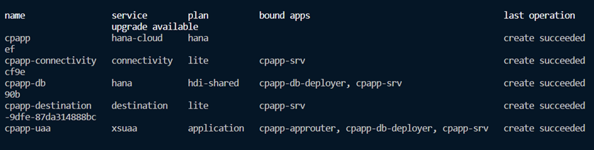
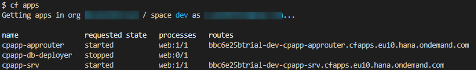
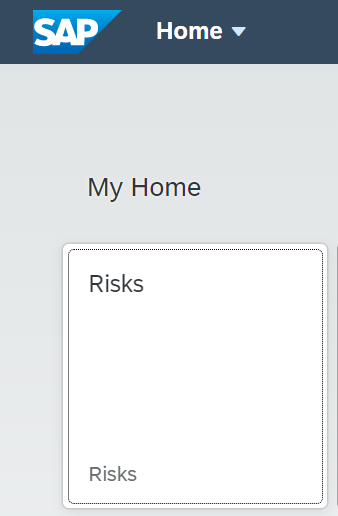

# Deploy Your Application Using MultiApps (MTA)

<!-- WIP - please contact Uwe -->

??? note "Additional Documentation"

    - [Create the MTA Description Files (SAP Help)](https://help.sap.com/viewer/4505d0bdaf4948449b7f7379d24d0f0d/latest/en-US/ebb42efc880c4276a5f2294063fae0c3.html)

As a result of this section, you have a running application in the cloud based on SAP HANA. The deployment is based on MTA (*Multi Target Application*, sometimes also called *MultiApps*) technology. The MTA is an SAP-proprietary way to do deployments that consist of multiple modules. The modules can be implemented in different technologies.

??? info "Advantages compared to the `cf push` method"
    * a build tool
    * automatically created service instances
    * service keys
    * destinations
    * content deployment (HTML5, workflow, ...)
    * blue-green deployment

## Build and Deploy MultiApps (MTA)

### Prerequisites

#### Install the MTA Build Tool `mbt`

1. Check if you have already installed the MTA build tool:

    ```
    mbt --version
    ```

2. If you don't get back a version number, install the **MultiApps Archive Builder**:

    ```
    npm install --global mbt
    ```

#### Install `make` Tool

!!! info "Linux and macOS are already shipped with `make`. This is only relevant for Windows users.`"

The `make` utility is required by the `mbt` tool. You can download it from the GNU make site:

1. Go to http://gnuwin32.sourceforge.net/packages/make.htm.
2. Choose the download with the description **Complete package, except sources**.
3. Run the installer.
4. Enter **Edit the System Environment Variables** in the Windows search box (Windows icon in the task bar). The **System Properties** dialog is opened.
5. Choose **Environment Variables...**.
6. Choose your `Path` env variable under *User Variables for `<your_user_name>`* and choose **Edit**.
7. Choose **Browse** and navigate to *GNU make* (usually `C:\Program Files (x86)\GnuWin32\bin`).
8. Click **OK** to add *GNU make* to your `Path` env variable.
7. Restart VS Code to make the change effective.


#### Install the `MultiApps` Cloud Foundry CLI Plugin

The `MultiApps` plugin is required to deploy an MTA archive. It needs to be available in your Cloud Foundry landscape's Cloud Foundry plugin repository.

1. Log on to your Cloud Foundry landscape.

2. Check if the multiapps plugin is already installed:

    ```
    cf plugins
    ```

3. If the multiapps plugin isn’t installed, install it now:

    ```
    cf install-plugin multiapps
    ```

    If the process fails, do the installation manually as described [here](https://github.com/cloudfoundry-incubator/multiapps-cli-plugin#manual-installation).


### Generate MTA Deployment Descriptor (`mta.yaml`)

The MTA deployment is described in the MTA Deployment Descriptor, a file called  `mta.yaml`.
As the first step, you let CAP generate an initial `mta.yaml` file. Run the following command from the project root folder:

```
cds add mta
```

The `cds` CLI has generated the file based on your previously created settings in the `package.json` file.

The `mta.yaml` file consists of different modules (Cloud Foundry apps) and resources (Cloud Foundry services).

*Modules:*

* `cpapp-srv` - OData service
* `cpapp-db-deployer` - Deploy CAP schema and data (CSV files) to database
<!-- Renamed the module `db` to `cpapp-db-deployer`. -->

*Resources:*

The resources are generated from the `requires` section of `cds` in the `package.json`.

* `cpapp-db` - SAP HANA DB HDMI container
* `cpapp-uaa` - XSUAA service

The resources are Cloud Foundry service instances that are automatically created and updated during the MTA deployment.

### Exclude CSV Files from Deployment

In one of the first steps creating the CAP application, you have added two csv files with test data. These files are required to pre-fill local testing with the SQLite memory. Without the files, the database would be empty after each restart.

!!! Warning "Test files should never be deployed to a HANA database as table data."
     This can cause the deletion of all files of the affected database table with a change of a data file, even if the data file for the affected table has been removed before. HANA remembers all data files that have ever been deployed to the table and might restore it. Only data files that contain data, which are defined by the application developer and can't be changed by the application should be delivered in this way. Delivering files for tables with customer data already caused data loss in productive scenarios!

To avoid any loss of data, you change the MTA build parameters to remove all the `CSV` files and the `hdbtabledata` that is generated by the CAP server out of the `CSV` files. Add the following lines to the `mta.yaml` file:

<!-- cpes-file mta.yaml:$['build-parameters'] -->
```yaml hl_lines="8-10"
_schema-version: '3.1'
...
build-parameters:
  before-all:
    - builder: custom
      commands:
        - npm install --production
        - bash -c "cds -v 2>/dev/null >/dev/null || npm install --no-save @sap/cds-dk"
        - npx cds build --production
        - bash -c 'find gen -type f \( -name '*.csv' -or -name '*.hdbtabledata' \) | xargs rm -f'
```

Files that should be delivered can be added before the `|` using this syntax:

```
  ! -name <filename>
```

For example:

```
      - bash -c 'find gen -type f -name '*.csv' ! -name 'CodeList.csv' | xargs rm -f'
```

## Add Authorization and Trust Management Service (XSUAA)

The next step is to add the Authorization and Trust Management service to `mta.yaml` to allow user login, authorization, and authentication checks.

<!-- cpes-file mta.yaml:$.resources[?(@.name=="cpapp-uaa")] -->
```yaml hl_lines="10-10 14-22"
_schema-version: '3.1'
...
resources:
  ...
  - name: cpapp-uaa
    type: org.cloudfoundry.managed-service
    parameters:
      service: xsuaa
      service-plan: application
      path: ./xs-security.json
      config:
        xsappname: 'cpapp-${space}'
        tenant-mode: dedicated
        role-collections:
          - name: 'RiskManager-${space}'
            description: Manage Risks
            role-template-references:
              - $XSAPPNAME.RiskManager
          - name: 'RiskViewer-${space}'
            description: View Risks
            role-template-references:
              - $XSAPPNAME.RiskViewer
```

The configuration for XSUAA is read from the `xs-security.json` file that was created in [XSUAA Security Configuration](../Prepare_XSUAA#xsuaa-security-configuration).

But in the `config` element, values can be added and overwritten.

The value `xsappname` gets overwritten with a space-dependent value. The name has to be unique within a subaccount.

This allows multiple deployments of this tutorial in different spaces of the same subaccount. For example, different people of a team that want to try it out and don't want to create a new subaccount for each team member.

For a productive application, the `xsappname` should be explicitly set to the desired value.

Further, you can add role collections using the `xs-security.json` file. Since role collections need to be unique in a Subaccount like the `xsappname`, you can add it here and use the `${space}` variable to make them unique like for the `xsappname`.

Alternatively, role collections can be manually added in the SAP BTP cockpit.

## Add UI Application Using the SAP Application Router

Although you can run your application with a UI locally, you are not able to use the UI in the cloud since it's not deployed yet. This is provided by another application (`module` in the MTA context). This application is a so-called AppRouter application that contains all our static UI files and allows access to the CAP service from the UI.

### Create the AppRouter NPM Module

1. Create a folder `approuter` where you store all AppRouter artifacts and switch to the new folder:

    ```
    mkdir approuter
    cd approuter
    ```

1. Initialize `npm` in this folder and install the latest version of AppRouter NPM module:

    ```bash
    npm init --yes
    npm install @sap/approuter
    ```

    The functionality of the AppRouter is provided by the `@sap/approuter` NPM module.

2. Check the required Node.js version for AppRouter.

      This is declared in the `package.json` file of the AppRouter. You can check it, for example, with this script:

    === "macOS/Linux"
         ```cat node_modules/@sap/approuter/package.json | grep '"node"'```
    === "Windows"
         ```cat node_modules/@sap/approuter/package.json | findstr '"node"'```


    It outputs something like:

    ```
    "node": "^12.0.0 || ^14.0.0"
    ```

    In this example AppRouter supports Node.js 12.x.x and 14.x.x versions.

3. Add required Node.js version in `approuter/package.json` file.

    This depends on the supported versions of the AppRouter, like ^12.0.0 in this example:

    <!-- cpes-file approuter/package.json:$.engines -->
    ```json hl_lines="4-6"
    {
      "name": "approuter",
      ...
      "engines": {
        "node": "^12.0.0"
      }
    }
    ```

4. Add the start script for the AppRouter in `approuter/package.json` file:

    <!-- cpes-file approuter/package.json:$.scripts -->
    ```json hl_lines="5-5"
    {
      "name": "approuter",
      ...
      "scripts": {
        "start": "node node_modules/@sap/approuter/approuter.js"
      }
    }
    ```

### AppRouter Configuration

Configure the AppRouter by creating a file `approuter/xs-app.json` with the following content:

<!-- cpes-file approuter/xs-app.json -->
```json
{
    "welcomeFile": "/app/launchpage.html",
    "authenticationMethod": "route",
    "sessionTimeout": 30,
    "logout": {
        "logoutEndpoint": "/do/logout",
        "logoutPage": "/"
    },
    "routes": [
        {
            "source": "^/app/(.*)$",
            "target": "$1",
            "localDir": "resources",
            "authenticationType": "xsuaa"
        },
        {
            "source": "^/service/(.*)$",
            "destination": "srv-api",
            "authenticationType": "xsuaa"
        }
     ]
}
```

Most importantly, you have to tell the AppRouter how to respond to requests in the `routes` array:

- The files in the `resources` folder will be served for all requests to `/app`. Later, there’s an explanation how you get the "app" files into this resource folder.
- All requests starting with `/service` will be forwarded to the CAP service based on the URL we configured in the MTA using the destination `srv_app`. Remember, the ```risk``` service is reachable via `/service/risk`. Further, services are automatically routed as long as they start with `/service/` as well.

Further, the AppRouter will automatically redirect to the `/app/launchpage.html` when accessed without a path, which will then serve the file `resources/launchpage.html`.

### Build SAPUI5 Files

The resources for the AppRouter origin come from the `app` folder. Add another module `cpapp-app` in `mta.yaml` to build these resources for use in the AppRouter:

<!-- cpes-file mta.yaml:$.modules[?(@.name=="cpapp-app")] -->
```yaml hl_lines="3-12"
_schema-version: '3.1'
...
modules:
  - name: cpapp-app
    type: html5
    path: app
    build-parameters:
      builder: custom
      commands:
        - bash build.sh
      supported-platforms: []
      build-result: dist
```

This will call the script `build.sh` in the `app` folder and expects the build result in `app/dist`. By providing an empty list of supported platforms, it’s ensured that this "module" isn't deployed to the cloud. It’s only needed to build the SAPUI5 apps.

### Add Build

Add the script `app/build.sh` to execute the SAPUI5 build:

<!-- cpes-file app/build.sh -->
```sh
#!/bin/bash
set -e
cd "$(dirname "$0")"
rm -rf dist
mkdir dist
cp launchpage.html dist
for APP in *; do
    if [ -f "$APP/webapp/manifest.json" ]; then
        echo "Build $APP"
        cd "$APP"
        if [ ! -f "package.json" ]; then
            npm init --yes
        fi
        npm install
        npm install --save-dev @ui5/cli
        if [ ! -f "ui5.yaml" ]; then
            cat >ui5.yaml <<EOF
specVersion: "2.1"
type: application
metadata:
  name: $APP
EOF
        fi
        npx ui5 build --dest "../dist/$APP/webapp"
        cd ..
    fi
done
```

Each SAPUI5 application needs the module `@ui5/cli` for the build and a `ui5.yaml` file. The script creates the file if it doesn't exist. It can be modified if needed.

The SAPUI5 build is then triggered and writes the results into the folder `app/dist/<app-folder-name>/webapp`.

The `webapp` folder is part of the design time structure of SAPUI5 and usually doesn't show up at runtime. However, the build script keeps this folder, so that the URLs in the `launchpage.html` work for the AppRouter and keep working locally.

### Add AppRouter Module to `mta.yaml`

Add the `cpapp-approuter` module for the AppRouter to the `mta.yaml`:

<!-- cpes-file mta.yaml:$.modules[?(@.name=="cpapp-approuter")] -->
```yaml hl_lines="5-22"
_schema-version: '3.1'
...
modules:
  ...
  - name: cpapp-approuter
    type: nodejs
    path: approuter
    requires:
      - name: cpapp-uaa
      - name: srv-api
        group: destinations
        properties:
          forwardAuthToken: true
          strictSSL: true
          name: srv-api
          url: '~{srv-url}'
    build-parameters:
      requires:
        - name: cpapp-app
          artifacts:
            - ./*
          target-path: resources
```

The AppRouter takes the SAPUI5 build results from the `cpapp-app` and puts it in the `resources` directory. This is where the `xs-app.json` looks for the files requested for `/app/...`.

The `cpapp-uaa` binding adds our already existing XSUAA service instance to the AppRouter, which makes login and logout possible. By this, the AppRouter forwards requests with the authentication token (`Authorization: Bearer <jwt-token>`) to the CAP service. The CAP service then uses it for authentication and authorization checks.

The `srv-binding` creates an environment variable `destinations` that contains a JSON array with one object containing the "destination" to the CAP service. This is required to forward requests to the CAP service.

The generated environment variable looks like this:

```sh
destinations='[{ "name": "srv-biding", "forwardAuthToken": true, "strictSSL": true, url: "https://..." }]
```

The URL is taken from the `cpapp-srv` module that needs to be enhanced to export this information.

### Adapt CAP Server Module

Do the following changes for the `cpapp-srv` module to the `mta.yaml`:

<!-- cpes-file mta.yaml:$.modules[?(@.name=="cpapp-srv")] -->
```yaml hl_lines="4-4"
_schema-version: '3.1'
...
modules:
  ...
  - name: cpapp-srv
    type: nodejs
    path: gen/srv
    requires:
      - name: cpapp-db
      - name: cpapp-uaa
    provides:
      - name: srv-api
        properties:
          srv-url: '${default-url}'
```

<!-- The current state of the module `cpapp-srv` in the file mta.yaml before this step is the same as shown in this sample code. Hence, this step doesn't provide any changes.  @TODO: (Uwe) Double check if this should be the case, or some changes should be made to the mta.yaml in this step. -->
Besides exporting the CAP service's URL as `srv-url` property, the XSUAA service instance that is required for authentication and authorization checks is added here.

### Build, Deploy, and Test `mtar` File

1. Build the MTA module from the project root folder:

    ```
    mbt build -t ./
    ```

    This creates a `mtar` file `cpapp_1.0.0.mtar` in the current folder (option: `-t ./`).

    !!! caution "If you get an error ```Mapping values are not allowed in this context```, make sure to doublecheck spacing of code snippets copied from the previous steps."

2. Deploy the module to your current Cloud Foundry space:

    ```
    cf deploy cpapp_1.0.0.mtar
    ```

3. After successful deployment, check if all the services have been created:

    ```
    cf services
    ```
    After successful deployment, you should see the following services in your space:

    

4. Check if the apps are running:

    ```
    cf apps
    ```

    

5. Open the AppRouter URL in the browser.

    In the screenshot example `bbc6e25btrial-dev-cpapp-approuter.cfapps.eu10.hana.ondemand.com`.

6. Log on with your SAP user name and password.

    You now see the tile with the ```Risks``` application. If you choose the tile, the application is started and the content is available.

    

    You receive an error if you try to start the ```Risks``` application, because your user doesn't have the `RiskRead` role. The required steps are explained in the next module.

    !!! Tip

        You can also deploy a single module using `-m <module-name>` command line parameter.

