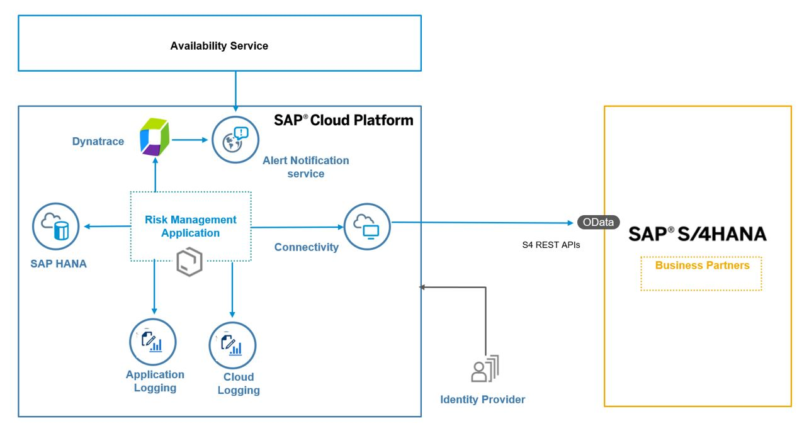

# Setup the CAP application for observability

## Scenario Overview 

In this scenario, you will start with a version of risk management application that has bad coding practices which result in a high response time. Using the different observability tools, you will be able to identify the issues and then fix them.

The different tools that will be connected to the application as part of this exercise are:

1. Application logging
2. Cloud logging
3. Dynatrace
4. Alert notification service
5. Availability service

## Architecture

## Application set up

1. Clone the risk management application branch that contains the anomalous code

     `git clone https://github.tools.sap/CPES/CPAppDevelopment-dev -b observability`

2. Provide github username, access token when prompted to.

3. cd < repo >

4. Log on to the Cloud Foundry environment from the command line window.
   
     `cf api <api endpoint>`
   
     `cf login`
   
   Provide username, password, org, space when prompted to.
	 
5. Build the mtar (refer [link](https://pages.github.tools.sap/CPES/CPAppDevelopment/MTA_Deployment/) for more details)
   
     `mbt build -t ./`
   
6. Deploy the application
   
     `cf deploy cpapp_1.0.0.mtar`	

