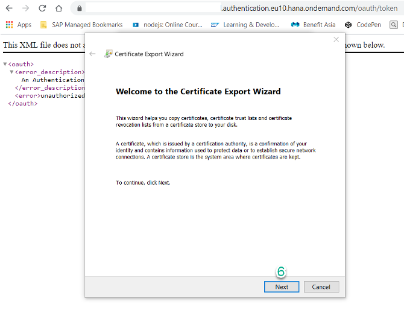
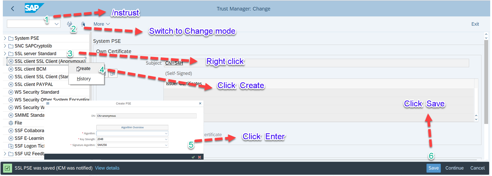
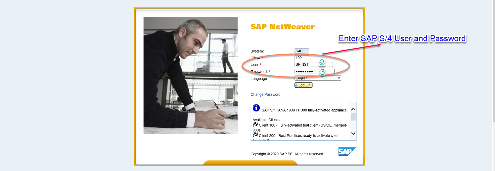
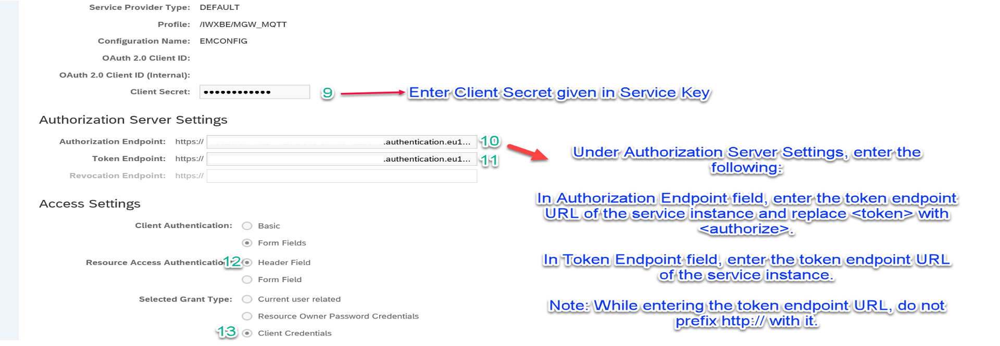
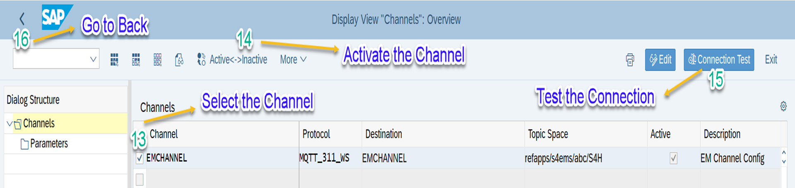

# Configure event-based communication between SAP S/4HANA(1809/1909) and SAP Event Mesh

??? note "Additional Documentation"

    - [Configuring trust and creating the RFC destination](
    https://help.sap.com/viewer/810dfd34f2cc4f39aa8d946b5204fd9c/1809.000/en-US/12559a8c26f34e0bbe8c6d82b7501424.html)

## Introduction

In this how to guide, you will establish a connection between your SAP S/4HANA on system and SAP Event Mesh. This connection is needed to transport events from the SAP S/4HANA system to SAP Event Mesh. 

**Prerequisite:** SAP S/4HANA System(v.1809/v.1909)

**Persona:** S/4 HANA Developer

### Enable Role for SAP Event Mesh

1. Navigate to Transaction PFCG from GUI.
2. Enter Role as "ENTERPRISEMESSAGING" and Click on Change Icon.

    

3. Click on Authorizations Tab and then Click on Change Authorization Data.   

    

4. Click on More and Navigate to Edit -> Insert authorization(s) -> From template

    

5. Select SAP Event Mesh Enablement Admin role  "IWXBE/RT_XBE_ADM" from template and click on continue.

    

6. Click on Status. Initially it will be in Mustard Yellow Colour. Once you click a popup will come for confirmation to continue.

    

7. Now Status button will change to Green colour. Select on Generation Icon to Generate the template and Save the role.

       

   
### Export certificates

1. Open your browser. Then go to your sub account in SAP Cloud Platform and from there to your BusinessPartner space. 
2. Click on *Service Instances* (on the left).
3. Click on your SAP Event Mesh instance.

    

4. Find and copy your SAP Event Mesh token endpoint URL. Look for token endpoint and then copy the URL.

    

5. In your browser, open your SAP Event Mesh token endpoint url (*https:// ... Enterprise Messaging URL ... /oauth/token*). 

6. Click on view site information button (lock symbol on top left corner)and open the *certificate*.

    

7. Choose the tab *certificate path* and double click on "DigCert" 

    Hint: it is sufficient to export any of the three certificates. Later on you will import only a single one.

    

8. Next choose the tab *Details* and click on the buttoon *Copy to files*, then choose *Next*

    

9. Click on *Next*

    

10. Then copy your file name into the empty space (Alternatively you can browse for the file)

    

11. Click on *Next*, then *Finish*

    

12. In the pop-up window click on *Ok* for confirmation 

    

    Hint: the steps for exporting the certificates might work differently depending on your browser and operating system. On a Mac for example, you could just drag and drop the certificates to a folder in your file system.

### Import certificates

13. Go back to your SAP S/4HANA system.
14. Go to transaction 'STRUST' by entering `/nstrust` in the ok code field.
    

15.	Switch to Change mode
16.	Right Click on SSL client SSL Client (Anonymous) and Select *Create*
17. Click Enter
18. Click Save
19. Double Click on SSL Anonymous Node
20. Import  the Certificate fro local folder
21. Save

    

    You will end up importing a single certificate of choice to the Anonymous Node.

    

### Restart ICM

22. Enter transaction  "/nsmicm" to go and clear the cache.
23. Navigate to Administration -> iCM -> Exit soft -> Local
24. Click on *Yes* to finish

### Setup RFC connection

25. Enter the transaction '/nspro', then click on *SAP Reference IMG* button to execute.

    

26. Now you need to navigate in the structure to configure a RFC Connection
27. Navigate to **SAP NetWeaver** --› **Enterprise Event Enablement** --› **Administration** --› **Channel Connection Settings**.

    

28. Click on Manage RFC destination and click on the execute icon
29. On your new screen choose the icon to create a new destination

    

30. Enter a destination name 'EMCHANNEL' and select connection type 'G Http connection to external server' from the drop down
31. Click on the check icon to finish
32. Enter host name - enter the service key from em. <app-url> eg: enterprise-messaging-messaging-gateway.cfapps.eu10.hana.ondemand.com
 
     
 
33. Enter path prefix - /protocols/mqtt311ws
34. Click on ‘logon and security‘ tab

     

35. Scroll to security options 
36. Select SSL client 'Anonymous'
37. Click on radio button "active"  for SSl
38. Click on *save*
39. Click on *back* 
40. Click on *back*

### Manage oAuth Client setup

41. On the next screen click on the *execute icon* for "manage Oauth client setup"

     

42. Change the port from 44301 to 44300 in the url
43. Open the Logon and use your Technical User credentials to log into the system

     

44. On the next screen click on the *create* button to create a new OAuth 2.0 Client

     

45. Enter field name  '/IWXBE/MGW_MQTT' for *OAuth 2.0 Client profile* or select it from the dropdown.
46. Enter a Configuration Name for the auth 'refappsEMAuth'.
47. Enter OAuth client ID.

     

48. Confirm with **OK**.

49. Click on *Details* tab and choose *Administration*. 

     

50. Enter *Client Secret* given in the Service Key

     

51. Enter *Authorization Endpoint* and *Token Endpoint*. Replace *token* with *authorize* in the URL for the authorization endpoint. 
52. For *Resource access authentication* choose *Header Field*
53. For *Grant Type* choose *Client Credential*
54. Don´t forget to click on *Save*

     
 
     

55. Go back to the Screen Display IMG

### Manage Channel and Parameters

56. Click on the icon to execute 'Manage Channel and Parameters'

     

57. Click on *New Entries*

     

58. Enter 'EMChannel' in the channel tab of the table
59. Select the protocol 'MQTT'
60. Enter 'EMCHANNEL' destination 
61. Enter the topic name created in CP

    To identify your topic name, go the the SAP BTP Cockpit and click on *Subscriptions*. Look up the *Event Mesh* tile. Click on *Go to Application*. This opens up SAP Event Mesh. Click on your messaging client and copy the value under *Namespace*. 

62. Enter a Description
63. Choose **Save** to finish
64. Select EMChannel
65. Double click on parameters

     

66. Click on *new entries*
67. Configure your channel as described in the following:
    - *Parameter name* "MAX_RECONNECT_ATTEMPTS" -->  Leave the parameter value field empty.
    - *Parameter name* MQTT_QOS --> *Parameter value* 1
    - *Parameter name* OAUTH_20_CLIENT_PROFILE  -->  *Parameter value* /IWXBE/MGW_MQTT
    - *Parameter name* OAUTH_20_CONFIGURATION --> *Parameter value*  EMCONFIG (the name you had used earlier in step 50 for the auth 'refappsEMAuth')
    - *Parameter name* RECONNECT_WAITTIME --> Leave parameter value field empty. 
68. Click on *Save*
69. Click on *back* 

### Activate the channel

70. Click on *display/ change*

     

71. Select the channel
72. Click on *active- inactive* button

    Make sure the channel is active.

73. Test the connection

     

74. Click on *Back* and go back to the Screen Display IMG

### Configure Event Topics

75. Click on *Configuration*
76. Click on *Maintain Event Topics*

     

77. Enter channel 'EMChannel' created in the steps before
78. Click on the check icon to finish.

79. Change to screen: Change View - Enterprise Event Enablement Channel Topics: Overview	
80. Click on *New Entries*

     

81. Choose the mirror icon or hit F4 on your keyboard.
82. Select "BO/BusinessPartner/Created" in the Topic Filter field.
83. Choose the mirror icon or hit F4 on your keyboard.
84. Choose "BO/BusinessPartner/Changed" in the Topic Filter field.
85. Choose **Save** to finish.
