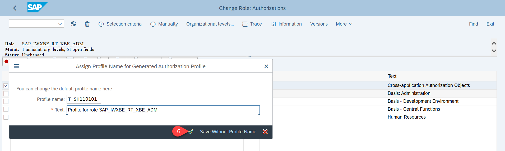

# Configure event-based communication between SAP S/4HANA and SAP Event Mesh

## Introduction

In this how to guide, you will establish a connection between your SAP S/4HANA system and SAP Event Mesh. This connection is needed to transport events from the SAP S/4HANA system to SAP Event Mesh. 

Additional documentation on configuring trust and creating the RFC destination can be found  in the official guide:
 
https://help.sap.com/viewer/810dfd34f2cc4f39aa8d946b5204fd9c/1809.000/en-US/12559a8c26f34e0bbe8c6d82b7501424.html

**Prerequisite:** SAP S/4HANA System

**Persona:** SAP S/4HANA Developer

### Enable Role for SAP Event Mesh

1. Navigate to Transaction PFCG from GUI.

2. Enter Role as `SAP_IWXBE_RT_XBE_ADM` and Click on Change Icon.

    

3. Click on Authorizations Tab and then Click on Change Authorization Data.   

    

4. Click on Generate.

    

5. Popup will appear to generate profile. Click on Generate.

    

6. Click on OK to generate profile.

    

7. Click on Status.

       

8. A popup will appear to assign full authorization. Click OK. Go Back.

         

9.  Now Authorization is Changed to Green and profile is assigned. Click on Save. Click on User Tab.

        

10. Enter you Technical User and Press Enter. Click on  User Comparison.

       

11. A popup will appear to Compare role user master record. Click on  Full Comparison.

      

12. Once Comaprison has been done. Click on Cancel Icon.

       

13. Now user tab change to green.

    

### Enable SAP Event Mesh.

1. Enter Transaction `/N/IWXBE/CONFIG`.

    

2. Click Via Service Key.

        

3. Enter any Channel name.
4. Enter any Description.
5. Paste the Service Key of SAP Event Mesh.

      

6. Click on Activate.

      

7. Click on **Check Connection**. If connection was successful, click on **Outbound Bindings**.

     

8. Click on Create icon.

      

9. Click on search icon to get list of topic for business event handling.

      

10. Select the topic `BusinessPartner/Changed/v1` from the list.

      

11. Click on Save.

     

12. One it's saved, topic will appear in the bindings.

                                  

