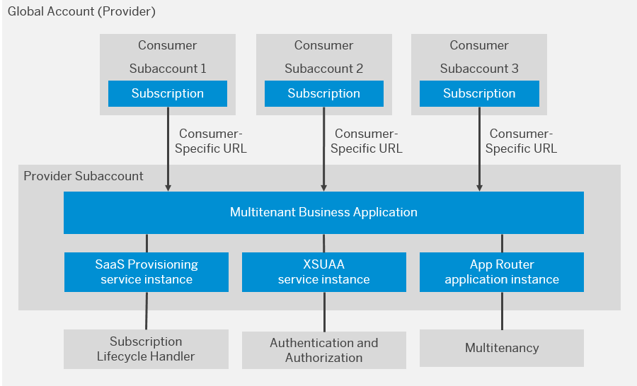
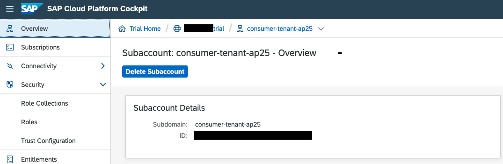
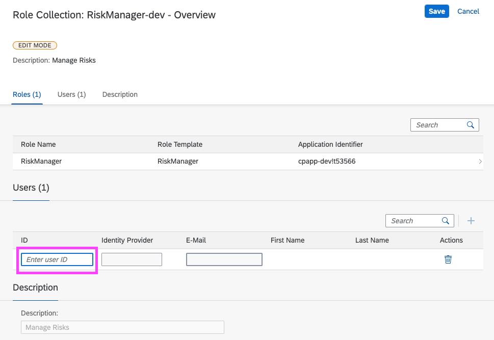

# Make Your Application Subscribable by Other Subaccounts

In this tutorial, an existing **single tenant** application evolves into a **multi tenant** application that different subaccounts of the **same** global account can subscribe to. When an application can be used by other tenants without software development activities, it's called "Software-as-a-Service" or, in short, "SaaS".

The module is based on the application from the [Add the SAP BTP Portal Service](../Portal) module. Alternatively, you can clone the branch [portal/service](https://github.tools.sap/CPES/CPAppDevelopment/tree/portal/service) as a starting point.

As the result of the tutorial, other subaccounts of your global account can subscribe to the application. You can run the application standalone or in the central Fiori launchpad.

The application could be used from other global accounts ("customers") as well, but the required "commercialization" steps aren’t covered by this tutorial module.

!!! note "Documentation"

    * [Multi Tenancy @ SAP CP](https://wiki.wdf.sap.corp/wiki/display/HCPCoreOrg/Multi-Tenancy)
    * [CDS Multi Tenancy Extension (MTX) (Doc)](https://github.wdf.sap.corp/pages/cap/advanced/multi-tenancy)
    * [CDS Multi Tenancy Extension (MTX) (GitHub)](https://github.wdf.sap.corp/cdx/cds-mtx)
    * [Developing Multitenant Applications in the Cloud Foundry Environment (SAP Help)](https://help.sap.com/viewer/65de2977205c403bbc107264b8eccf4b/Cloud/en-US/5e8a2b74e4f2442b8257c850ed912f48.html)

## Overview

This section gives an overview of the aspects that make the SaaS solution. The individual changes are listed here.

## SaaS Architecture

The following example shows the SaaS architecture in a simplified way. An application is provided on the global account level by one "provider subaccount". Different "consumer subaccounts" within the same global account can then subscribe to the application. Key components in this architecture:

 * AppRouter - enables multitenancy
 * XSUAA service instance - takes care of authentication and authorizations
 * SaaS Provisioning service - handles the subscription

You get to know these components in more detail here.



### URL of a SaaS Application

Each subaccount gets an individual URL to access the application. The hostname of the URL identifies the subaccount by its subdomain.

*Syntax:*

`https://<subdomain><application-host-name><landscape-domain>`

*Example:*

* Subaccount Name: `MySubaccount`
* Subdomain: `my-subdomain`
* SaaS application domain: `cpapp-dev`
* Landscape domain: `cfapps.eu10.hana.ondemand.com`
* URL for Subaccount *MySubaccount*: `https://my-subdomain-cpapp-dev.cfapps.eu10.hana.ondemand.com`

The AppRouter needs to know how to authenticate users of the different subaccounts. Therefore, a variable called `TENANT_HOST_PATTERN` with a regular expression is used to parse the URL (in this case `my-subdomain`). The AppRouter then looks up the subaccount using the extracted subdomain and forwards the user to the authentication service of the subaccount.

### Subscribing and Unsubscribing

In addition to the user requests, the AppRouter is the entrypoint for subscribing and unsubscribing requests to the application. The AppRouter forwards those requests to SaaS reuse services, such as the portal. This works by binding the service to the AppRouter.

The MTX module of the CAP service also needs to receive the subscribing and unsubscribing requests and can also have dependencies. Unfortunately, this isn’t supported by the AppRouter out-of-the-box. There’s an additional JavaScript file that extends the AppRouter for that purpose.

The SaaS Provisioning service (`sap-provisioning`) executes the subscribing and unsubscribing requests. Both the AppRouter and the CAP service protect their subscription endpoints with the `Callback` scope. The scope is granted to the `sap-provisioning` tenant with the `xs-security.json`, the so called application security descriptor.

### On- and Off-Boarding

In CAP each subscribed subaccount has its own HDI container. The MTX module uses the Service Manager to create and delete the HDI containers when subscribing or unsubscribing. It will automatically deploy the database content that is packaged in the CAP application.

This works similar to creating and deleting an HDI container using `cf create-service` and `cf delete-service`. The only difference is that it works "under the hood" and the HDI container instances aren’t listed by the `cf services` command.

## Prepare the CAP Application

!!! warning "Eventing in Multitenancy is not yet supported in CAP, Please proceed the next steps without eventing section."

### Add Modules for Multitenancy

Multitenancy in CAP is realized with dedicated HDI containers for each tenant that is created on a HANA database instance.

CAP provides the "MTX" node module that implements the creation and deletion of the HDI containers for tenants. Further, it makes sure that the right HDI container is addressed for each service request.

1. Add the required node modules to your project.

    ```bash
    npm install --save @sap/cds-mtx @sap/hdi-deploy @sap/instance-manager
    ```

2. The CAP multitenancy module needs to be plugged into the request handling of CAP, therefore an own server implementation is required.
Create a file `srv/server.js` with the following content:

    <!-- cpes-file srv/server.js -->
    ```js
    const cds = require ('@sap/cds');
    cds.on('bootstrap', (app) => {
        if (cds.env.env !== "development")
            cds.mtx.in(app); // serve cds-mtx APIs (only in productive env)
    });
    module.exports = cds.server;
    ```

    The `server.js` file is automatically called by CAP if present.

### Add a CDS Configuration for Multitenancy

The multitenancy mode needs to be enabled in the CAP database configuration.

Add the database configuration for multitenancy in the `package.json` file.

<!-- cpes-file package.json:$.cds.requires.db -->
```json hl_lines="6-10"
{
  ...
  "cds": {
    "requires": {
      "db": {
        "kind": "sql",
        "multiTenant": true,
        "vcap": {
          "label": "service-manager"
        }
      }
    }
  }
}
```

### XSUAA Settings Multitenancy

In single tenant mode, the application accepts only logins from its own subaccount. Now, you need to enable other subaccounts that have subscribed to the application to log in. Therefore, the UAA needs to be configured as "shared".

1. Change the tenant mode to `shared` in the `xs-security.json` file to allow login from subscribed subaccounts:

    <!-- cpes-file xs-security.json:$["tenant-mode"] -->
    ```json hl_lines="3-3"
    {
      ...
      "tenant-mode": "shared"
    }
    ```

2. Make sure that the `tenant-mode` is not overwritten in the `mta.yaml` file.

    Delete the line with `tenant-mode` from the `mta.yaml` file if it's present:

    <!-- deletion deltas generation are not supported / cpes-file mta.yaml:$.resources[?(@.name=="cpapp-uaa")].parameters.config -->
    ```yaml hl_lines="7-7"
    ...
    - name: cpapp-uaa
      type: org.cloudfoundry.managed-service
      parameters:
        config:
          ...
          tenant-mode: dedicated
    ```

3. Add the scopes `Callback` and `uaa.user` to the `xs-security.json` file. The `Callback` scope is granted to the tenant onboarding service called `sap-provisioning`. It's checked by the tenant on- and off-boarding code of CAP.

    <!-- cpes-file xs-security.json:$.scopes -->
    ```json hl_lines="11-28"
    {
      ...
      "scopes": [
        {
          "name": "$XSAPPNAME.RiskViewer",
          "description": "RiskViewer"
        },
        {
          "name": "$XSAPPNAME.RiskManager",
          "description": "RiskManager"
        },
        {
          "name": "$XSAPPNAME.Callback",
          "description": "AppRouter: With this scope set, the callbacks for subscribe, unsubscribe and getDependencies can be called.",
          "grant-as-authority-to-apps": [
            "$XSAPPNAME(application,sap-provisioning,tenant-onboarding)"
          ]
        },
        {
          "name": "$XSAPPNAME.mtcallback",
          "description": "MTX: With this scope set, the callbacks for subscribe, unsubscribe and getDependencies can be called.",
          "grant-as-authority-to-apps": [
            "$XSAPPNAME(application,sap-provisioning,tenant-onboarding)"
          ]
        },
        {
          "name": "uaa.user",
          "description": "UAA"
        }
      ]
    }
    ```

### Integration of the CAP Subscription in the Approuter

1. Copy the file `templates/saas-app/approuter/server.js` from the `Master` branch to the `approuter` folder of your project.

    The script registers handlers for `getDependencies`, `subscription`, and `unsubscription` in the AppRouter and forwards the calls to the CAP service that is registered as `srv-api` destination. At the end of the script, it starts the AppRouter.

2. Open the `package.json` file in the `approuter` folder.


3. Change the `npm start` command to use your new startup script:

<!-- cpes-file approuter/package.json -->
```json hl_lines="11-11 17-17"
{
    "name": "approuter",
    "version": "1.0.0",
    "description": "",
    "main": "index.js",
    "devDependencies": {},
    "engines": {
        "node": "^12.0.0"
    },
    "scripts": {
        "start": "node server.js"
    },
    "keywords": [],
    "author": "",
    "license": "ISC",
    "dependencies": {
        "@sap/approuter": "^10.0.0"
    }
}
```

??? info "SAP"

    This step wouldn't be needed if there's a possibility to add a second subscription callback in the SaaS registry. By this, the provisioning service would call both the AppRouter and the CAP application.

    There's already a feature request for this. You might want to leave a comment and vote for it if you think this would be useful for you.

    https://jtrack.wdf.sap.corp/browse/CPCORE-2313


## MTAR Changes

### Remove DB Module and Service

Database provisioning and deployment is done by the MTX module in the CAP service using the Service Manager. Therefore, you can remove the `cpapp-db-deployer` module and the `cpapp-db` resource from the `mta.yaml` file.

1. Open the `mta.yaml`file.
2. Under `modules`, remove the module with the name `cpapp-db-deployer`.
3. Under `resources`, remove the resource with the name `cpapp-db`.
4. Under `cpapp-srv` in `modules`, remove `cpapp-db` from `requires`.

### Add a OAuth Callback URI

Add OAuth Configuration for the `cpapp-uaa` service in the `mta.yaml` file.

!!! info "If your application uses custom domains, then you will also need to change the OAuth callback configuration because by default it's only configured for the default domain of Cloud Foundry. You can use the variables in the following code snippet that are added to the `mta.yaml` file."

<!-- cpes-file mta.yaml:$.resources[?(@.name=="cpapp-uaa")] -->
```yaml hl_lines="6-8 24-28"
...
resources:
  ...
  - name: cpapp-uaa
    type: org.cloudfoundry.managed-service
    requires:
      - name: app-binding
      - name: srv-multi-tenancy
    parameters:
      service: xsuaa
      service-plan: application
      path: ./xs-security.json
      config:
        xsappname: 'cpapp-${space}'
        role-collections:
          - name: 'RiskManager-${space}'
            description: Manage Risks
            role-template-references:
              - $XSAPPNAME.RiskManager
          - name: 'RiskViewer-${space}'
            description: View Risks
            role-template-references:
              - $XSAPPNAME.RiskViewer
        oauth2-configuration:
          credential-types:
            - binding-secret
          redirect-uris:
            - 'https://*~{srv-multi-tenancy/tenant-delimiter}~{app-binding/app-fqdn}/login/callback'
```

### Add the Service Manager

MTX uses the `service-manager` service with the plan `container` to create and delete HDI containers during tenant on- and offboarding.

Add the service to the resources of the `mta.yaml` file.

<!-- cpes-file mta.yaml:$.resources[?(@.name=="cpapp-service-manager")] -->
```yaml hl_lines="6-10"
...
resources:
  ...
  - name: cpapp-html5-repo-host
    ...
  - name: cpapp-service-manager
    type: org.cloudfoundry.managed-service
    parameters:
      service: service-manager
      service-plan: container
```

### Add the SaaS Registry Service

The service instance of the `saas-registry` publishes a subscribable application to the SAP BTP. Once the application is deployed, all subaccounts of the **same** global account display the application in form of a tile under **Subscriptions**. With the `onSubscription` callback, a specific URL is called when subscribing to (`PUT` request) or unsubscribing from (`DELETE` request) an application. These callbacks are called when the **Subscribe** and **Unsubscribe** buttons are clicked in the cockpit.

As said, the functionality for creating and deleting HDI containers for tenants is already implemented by the CAP MTX module. It also provides the `onSubscription` that just needs to be configured here.

Add the `saas-registry` service to the resources of the `mta.yaml` file.

<!-- cpes-file mta.yaml:$.resources[?(@.name=="cpapp-saas-registry")] -->
```yaml hl_lines="6-20"
...
resources:
  ...
  - name: cpapp-service-manager
    ...
  - name: cpapp-saas-registry
    type: org.cloudfoundry.managed-service
    requires:
      - name: app-binding
    parameters:
      service: saas-registry
      service-plan: application
      config:
        xsappname: 'cpapp-${space}'
        appUrls:
          getDependencies: '~{app-binding/app-url}/callback/v1.0/dependencies'
          onSubscription: '~{app-binding/app-url}/callback/v1.0/tenants/{tenantId}'
        displayName: 'Risk Management (${space})'
        description: Risk Management SaaS Application
        category: CAP
```

### Update the AppRouter

Check the code snippet to perform the following steps.

1. Bind the AppRouter to the SaaS registry service (`cpapp-saas-registry`).

2. Add the property `TENANT_HOST_PATTERN`.

    !!! warning "The value of the parameter `TENANT_HOST_PATTERN` has to be lowercase."

3. Expose the properties for the host, port, and the URL of the AppRouter application.

<!-- cpes-file mta.yaml:$.modules[?(@.name=="cpapp-approuter")] -->
```yaml hl_lines="11-12 16-16 24-39"
...
modules:
  ...
  - name: cpapp-mitigations
    ...
  - name: cpapp-approuter
    type: nodejs
    path: approuter
    requires:
      - name: cpapp-uaa
      - name: cpapp-destination
      - name: cpapp-connectivity
      - name: cpapp-logs
      - name: cpapp-portal
      - name: cpapp-html5-repo-runtime
      - name: cpapp-saas-registry
      - name: srv-api
        group: destinations
        properties:
          forwardAuthToken: true
          strictSSL: true
          name: srv-api
          url: '~{srv-url}'
      - name: srv-multi-tenancy
    properties:
      TENANT_HOST_PATTERN: '^(.*)~{srv-multi-tenancy/tenant-delimiter}${default-host}.${default-domain}'
      SAP_JWT_TRUST_ACL: |
        [
          {"clientid":"*","identityzone":"sap-provisioning"}
        ]
    parameters:
      keep-existing-routes: true
      routes:
        - route: '${default-url}'
    provides:
      - name: app-binding
        properties:
          app-fqdn: '${default-host}.${default-domain}'
          app-url: 'https://~{app-binding/app-fqdn}'
```

### Update Service

<!-- cpes-file mta.yaml:$.modules[?(@.name=="cpapp-srv")] -->
```yaml hl_lines="10-10 13-19 24-26"
...
modules:
  ...
  - name: cpapp-approuter
    ...
  - name: cpapp-srv
    type: nodejs
    path: gen/srv
    requires:
      - name: cpapp-service-manager
      - name: cpapp-uaa
      - name: cpapp-logs
      - name: cpapp-connectivity
      - name: cpapp-destination
    properties:
      SAP_JWT_TRUST_ACL: |
        [
          {"clientid":"*","identityzone":"sap-provisioning"}
        ]
    provides:
      - name: srv-api
        properties:
          srv-url: '${default-url}'
      - name: srv-multi-tenancy
        properties:
          tenant-delimiter: '-'
```

### (Optional) Update Portal Content Deployer

The binding of the Portal Content Deployer to the SaaS Registry service allows accessing a subscribed application in the central Fiori launchpad. This step is optional and can be skipped if you don't want to use the central Fiori launchpad. If you'd like to use the central Fiori launchpad, finish this module and continue with the module [Add your Application to the Central Fiori launchpad (cFLP)](Add_Application_FLP.md).

<!-- cpes-file mta.yaml:$.modules[?(@.name=="cpapp-portal-content-deployer")] -->
```yaml hl_lines="9-10 22-24"
...
modules:
  ...
  - name: cpapp-ui-resources
    ...
  - name: cpapp-portal-content-deployer
    type: com.sap.application.content
    path: portal-content
    properties:
      TENANT_HOST_PATTERN: '^(.*)~{srv-multi-tenancy/tenant-delimiter}~{app-binding/app-fqdn}'
    requires:
      - name: cpapp-portal
        parameters:
          content-target: true
          service-key:
            name: cpapp-portal-deploy-key
            config:
              content-endpoint: developer
      - name: cpapp-uaa
      - name: cpapp-html5-repo-host
      - name: cpapp-ui-resources
      - name: cpapp-saas-registry
      - name: app-binding
      - name: srv-multi-tenancy
```
## Deployment

Before deployment, run the following steps to delete the XSUAA service instance:

```sh
cf unbind-service cpapp-approuter cpapp-uaa
cf unbind-service cpapp-srv cpapp-uaa
cf unbind-service cpapp-portal-content-deployer cpapp-uaa
cf unbind-service cpapp-db-deployer cpapp-uaa
cf unbind-service cpapp-ui-deployer cpapp-uaa
cf delete-service cpapp-uaa -f
```

Build and deploy the application as usual:

```sh
mbt build -t ./
cf deploy cpapp_1.0.0.mtar
```


### Subscription

The next step is to subscribe to the application.

1. Go to your global account in the SAP BTP Cockpit.
2. Create a new subaccount or use an existing subaccount different from the subaccount that contains the application.
3. Choose **Service Marketplace**.
4. Choose **Risk Management**.
5. Choose **Create**.

The state of the subscription turns into `Processing`. After a while, the state of the subscription should turn to `Subscribed`.


### SaaS URL Configuration

To make this module easy to implement, each subscribed subaccount gets its own host name on the Cloud Foundry default domain. The host name is concatenated from the subaccount's subdomain and the application's hostname. The URL looks like this after the application is deployed:


`https://<subaccount-subdomain>-<application-host-name>.<default-domain>`

For example:

`https://mysubaccount-cpapp.cfapps.eu10.hana.ondemand.com`

In the `mta.yaml` file, you see the settings done for this scenario.

```yaml hl_lines="1 3"
tenant-delimiter: '-'
...
app-fqdn: '${default-host}.${default-domain}'
```

The `tenant-delimiter` is used in the `TENANT_HOST_PATTERN`. The subdomain and the MTA-generated *Full Qualified Domain Name* (FQDN) will be concatenated with a `-` instead of the `.` that results in the URL in Cloud Foundry's default domain.

You need to create an individual route for each subaccount that subscribes to your application. The generic command for creating a route looks like this:

```bash
cf map-route cpapp-app <default-domain> --hostname <subdomain>-<application-host>
```

Follow these steps to create an individual route for your subscribing subaccount.

1. Open the SAP Cloud Platform Cockpit.
2. Choose the subscribing subaccount.
3. Check the value of the subaccount's subdomain. In the screenshot example, the subdomain is "consumer-tenant-ap25".

    <!-- TODO: Screenshot to be updated -->

    

4. Replace `<subdomain>` with your subaccount's subdomain and use the following script snippet to automate the route creation.

    ```bash
    SUBDOMAIN=<subdomain>
    SAAS_HOST_SUFFIX="$(cf env cpapp-approuter | grep TENANT_HOST_PATTERN | sed 's/.*(..)//' | sed 's/\..*//')"
    SAAS_DOMAIN="$(cf env cpapp-approuter | grep TENANT_HOST_PATTERN | sed 's/.*(..)//' | sed 's/[^.]*\.//')"

    cf map-route cpapp-approuter $SAAS_DOMAIN --hostname $SUBDOMAIN$SAAS_HOST_SUFFIX
    ```

5. Check the created route.
  ```bash
  cf routes
  ```
  You see the URL for the created route, that is the URL for the given subaccount. You need this URL to call the application later.

!!! info "You need to run the route creation after every MTA deployment, because that will delete these additional routes. You can also add it as an additional route for your test project in the `mta.yaml` file."


### Assign Your User to the Role Collection

After the successful subscription, assign the *RiskManager* role collection to your user to be able to use the application.

1. Go to the subaccount that subscribed to the application.
2. Choose *Security* > *Role Collections*.
3. Choose the Role Collection `RiskManager-<space>` (where `<space>` is the name of your Cloud Foundry space, in this example `dev`).
2. Choose **Edit**.
3. Add your user's *email address* to the *ID* field.

    

4. Choose **Save**.

### Start the Application

Open the URL of the application and try it out. It will take you to the login screen for the *subscribing* subaccount.

1. Use the command `cf routes` to check for the route that you created in the step [SaaS URL Configuration](#saas-url-configuration). Make sure to call the URL of the AppRouter, not the application itself, because the AppRouter is the gateway to your application.

    The URL should look like this:

    `https://<subaccount-subdomain>-<application-host-name>.<default-domain>`

    For example:

    `https://subscriber-trialaccount-dev-cpapp-approuter.cfapps.eu10.hana.ondemand.com`

2. Open the URL in the browser.
3. Open the `Risk` tile.
4. Click on the `Go` button in the header to load the data. This ensures that your application is successfully subscribed.

??? tip "Keep Routes on Re-Deploy"

    The additionally created routes will be deleted when you deploy the application again. You can make the MultiApps deployer to keep these routes by adding a property to the `mta.yaml` file. Alternatively, we can do this specificaly for a deployment by creating an MTAEXT file.

    1. Create a new file called `keep-routes.mtaext` in your project folder:

        <!-- cpes-file keep-routes.mtaext -->
        ```text
        _schema-version: '3.1'
        ID: cpapp-local-testing
        extends: cpapp
        version: 1.0.0
        modules:
        - name: cpapp-approuter
          parameters:
             keep-existing-routes: true
        ```

    2. Deploy the application using the MTAEXT file:

        ```bash
        cf deploy cpapp_1.0.0.mtar -e keep-routes.mtaext
        ```


### Congratulations, you have finished the first part of this module.

You have learned the following things:

- How to update an existing application to enable multitenancy.
- How to create and prepare a subaccount to consume a multi-tenant application.
