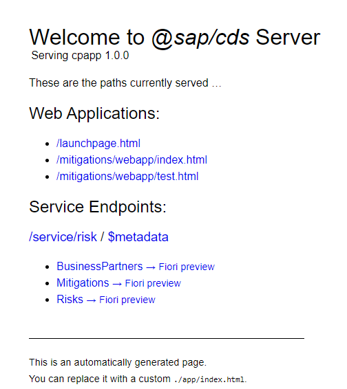
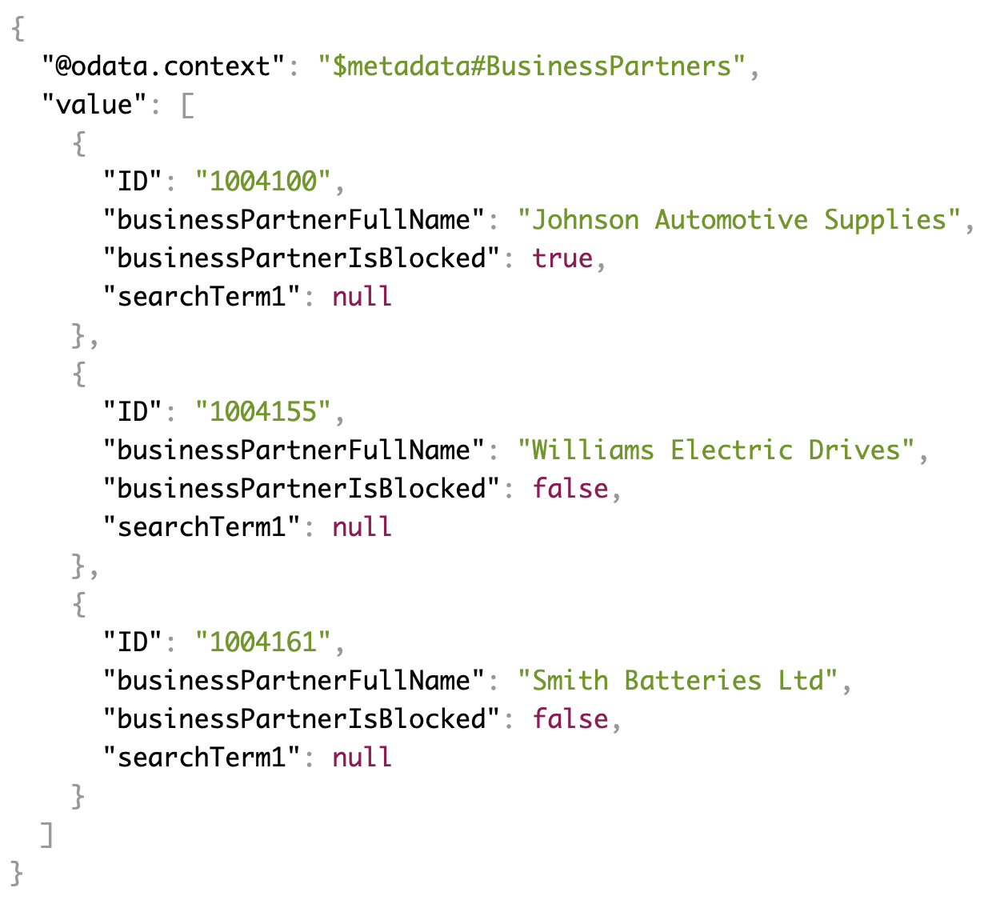
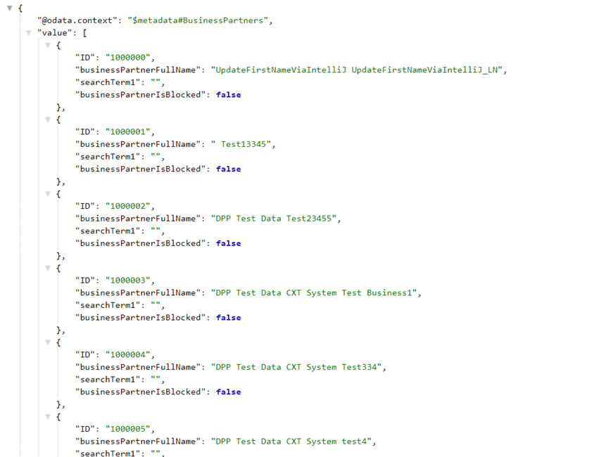
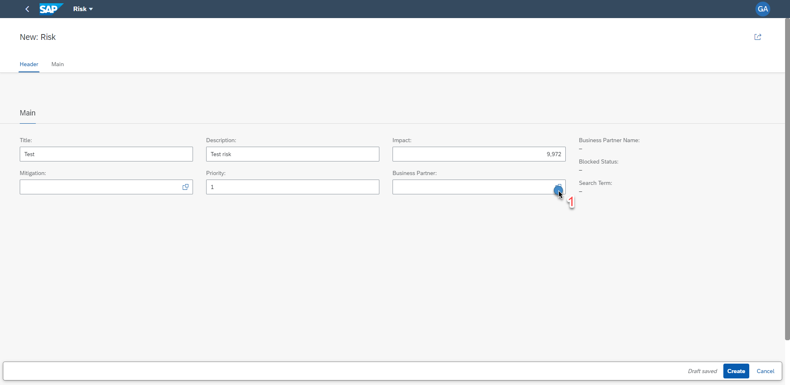
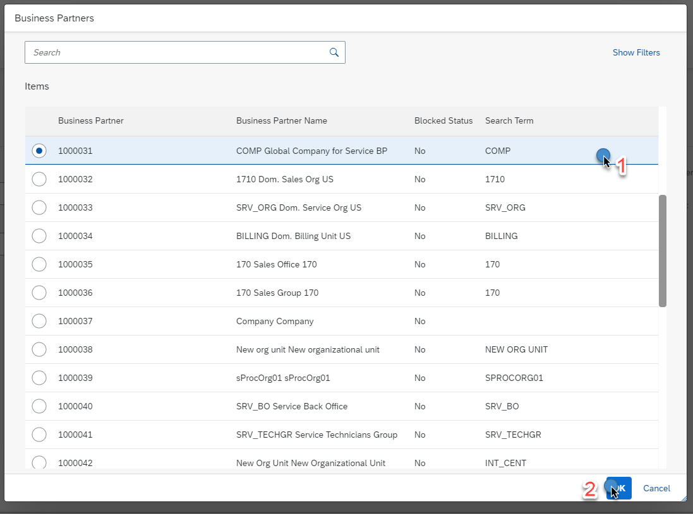
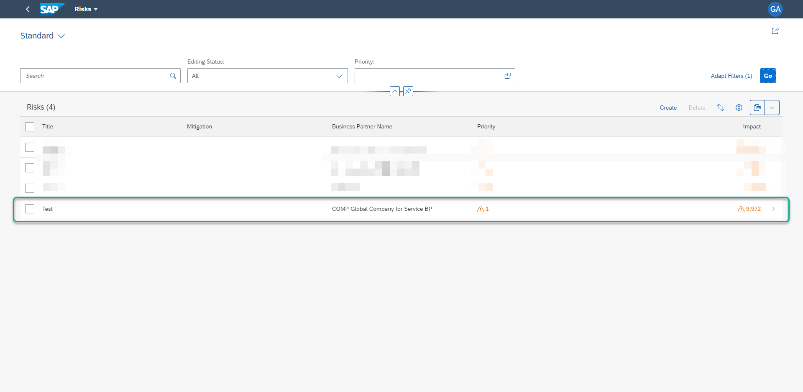

<!-- SAAS OnPremise Connectivity -->
## Connect your application to S/4 HANA On-Premise and get Business Partners 

!!! warning "In this section you will be adding new services, Before going to the next step, Unsubscribe the application from the subscriber's account." 

The following example will show how to Connect to an S/4 On-premise system and get business partners from there into the risk management application.
The appliation architecture will look like following: 


### Prerequisite 

Before you get started you need to expose OData for business partner from your S/4 HANA on-premise System, Then Establish a connection with cloud connector to your Subscriber subaccount and at last create a destination in the Subscriber Subaccount which will be used in the risk management application. 

  1. [Expose OData Service](Setup_oDataService.md)
  2. [Setup Cloud Connector](Setup_CloudConnector.md)
  3. [Create destination in Subscriber's Subaccount](Setup_Destination.md) 

## Add Connectivity and Destination service

Add configuration for `Destination service` and `Connectivity Service` in `mta.yaml`.

Adding dependency in `approuter`. It will be later used during the tenant onboarding.

<!-- cpes-file mta.yaml:$.modules[?(@.name=="cpapp-approuter")] -->
```yaml hl_lines="15-16"
...
modules:
  ...
  - name: cpapp-mitigations
    ...
  - name: cpapp-approuter
    type: nodejs
    path: approuter
    requires:
      - name: cpapp-uaa
      - name: cpapp-logs
      - name: cpapp-portal
      - name: cpapp-html5-repo-runtime
      - name: cpapp-saas-registry
      - name: cpapp-connectivity
      - name: cpapp-destination
      - name: srv-api
        group: destinations
        properties:
          forwardAuthToken: true
          strictSSL: true
          name: srv-api
          url: '~{srv-url}'
      - name: srv-multi-tenancy
    properties:
      TENANT_HOST_PATTERN: '^(.*)~{srv-multi-tenancy/tenant-delimiter}${default-host}.${default-domain}'
      SAP_JWT_TRUST_ACL: |
        [
          {"clientid":"*","identityzone":"sap-provisioning"}
        ]
    parameters:
      routes:
        - route: '${default-url}'
    provides:
      - name: app-binding
        properties:
          app-fqdn: '${default-host}.${default-domain}'
          app-url: 'https://~{app-binding/app-fqdn}'
```


<!-- cpes-file mta.yaml:$.modules[?(@.name=="cpapp-srv")] -->
```yaml hl_lines="14-15"
...
 # --------------------- SERVER MODULE ------------------------
 - name: cpapp-srv
 # ------------------------------------------------------------
   type: nodejs
   parameters:
     memory: 252M
   path: gen/srv
   requires:
    # Resources extracted from CAP configuration
    - name: cpapp-service-manager
    - name: cpapp-uaa
    - name: cpapp-logs
    - name: cpapp-connectivity
    - name: cpapp-destination
   properties:
      SAP_JWT_TRUST_ACL: >
        [
          {"clientid":"*","identityzone":"sap-provisioning"}
        ]
   provides:
    - name: srv-api      # required by consumers of CAP services (e.g. approuter)
      properties:
        srv-url: ${default-url}
    - name: srv-multi-tenancy
      properties:
        tenant-delimiter: "-"
```

Adding the service instances
<!-- cpes-file mta.yaml:$.modules[?(@.name=="cpapp-srv")] -->
```yaml hl_lines="4-14"
...
resources:
...
 - name: cpapp-destination
   type: org.cloudfoundry.managed-service
   parameters:
     service: destination
     service-plan: lite

 - name: cpapp-connectivity
   type: org.cloudfoundry.managed-service
   parameters:
     service: connectivity
     service-plan: lite

```


### Add the Consumption of an External Service Exposed to Your Service 

In this section, you extend your CAP service with the consumption of an external Business Partner service. You get the definition of the Business Partner service from SAP's API Business Hub.

## Add the EDMX File to the Project and Add Local Data

1. If `cds watch` is not already running, start it in your VS Code.
2. Drag the `API_BUSINESS_PARTNER.edmx` file from your browser's download area/folder onto your VS Code workplace and drop it into the `srv` folder of your `cpapp` app.

    The CAP server has noticed the new file and automatically created a new `external` folder under `srv`. Also, the CAP server has added a new `API_BUSINESS_PARTNER.csn` file ([CSN](https://github.wdf.sap.corp/pages/cap/cds/csn) is a compact representation of CDS) in the new `external` folder.

    ??? info "If the folder is not created automatically, follow these steps:"
        1. Navigate to the `cpapp` folder.
        2. Create a new folder `external` under `srv`.
        3. Create the `.csn` file in the new folder manually:

          ```bash
          cds import srv/external/API_BUSINESS_PARTNER.edmx
          ```

3. In your project, open the `db/schema.cds` file again and add these lines to the file:

    <!-- cpes-file db/schema.cds -->
    ```text hl_lines="19-27"
    namespace sap.ui.riskmanagement;
    using { managed } from '@sap/cds/common';
      entity Risks : managed {
        key ID      : UUID  @(Core.Computed : true);
        title       : String(100);
        prio        : String(5);
        descr       : String;
        miti        : Association to Mitigations;
        impact      : Integer;
        criticality : Integer;
      }
      entity Mitigations : managed {
        key ID       : UUID  @(Core.Computed : true);
        description  : String;
        owner        : String;
        timeline     : String;
        risks        : Association to many Risks on risks.miti = $self;
      }

      // using an external service from
      using {  API_BUSINESS_PARTNER as external } from '../srv/external/API_BUSINESS_PARTNER.csn';
      entity BusinessPartners as projection on external.A_BusinessPartner {
        key BusinessPartner as ID,
        BusinessPartnerFullName as businessPartnerFullName,
        BusinessPartnerIsBlocked as businessPartnerIsBlocked,
        SearchTerm1 as searchTerm1
      }
    ```
  <!-- In the code sample above, the highlighted part about business partner that is added to the schema.cds should not include '//using an external service from' -->
    With this code, you create a so-called projection for your new service. Of the many entities and properties in these entities, that are defined in the `API_BUSINESS_PARTNER` service, you just look at one of the entities (`A_BusinessPartner`) and just three of its properties: `BusinessPartner`, `BusinessPartnerFullName`, and `BusinessPartnerIsBlocked`. Hence, your projection is using a subset of everything the original service has to offer.

4. Open the `srv/risk-service.cds` file.

5. Add the `entity BusinessPartners` line:

    <!-- cpes-file srv/risk-service.cds -->
    ```text hl_lines="26-26"
    using { sap.ui.riskmanagement as my } from '../db/schema';
    @path: 'service/risk'
    service RiskService {
      entity Risks @(restrict : [
                {
                    grant : [ 'READ' ],
                    to : [ 'RiskViewer' ]
                },
                {
                    grant : [ '*' ],
                    to : [ 'RiskManager' ]
                }
            ]) as projection on my.Risks;
        annotate Risks with @odata.draft.enabled;
      entity Mitigations @(restrict : [
                {
                    grant : [ 'READ' ],
                    to : [ 'RiskViewer' ]
                },
                {
                    grant : [ '*' ],
                    to : [ 'RiskManager' ]
                }
            ]) as projection on my.Mitigations;
        annotate Mitigations with @odata.draft.enabled;
      entity BusinessPartners as projection on my.BusinessPartners;
    }
    ```

6. In your browser, open http://localhost:4004/.

    The browser now shows a `BusinessPartners` service next to the `Mitigations` and `Risks` services.
    

    At this point, you have a new service exposed with a definition based on the original `edmx` file. However, it doesn't have any connectivity to a backend and, thus, there’s no data yet. Like with your own entities `risks` and `mitigations`, you start with using local data first.

7. Copy the folder `data` from `templates/cap/api-hub/srv/external` to the `srv/external` folder of your app. If VS Code asks you whether to copy the folder, confirm.

    The folder contains a csv file `API_BUSINESS_PARTNER-A_BusinessPartner.csv` with some business partner data.

8. In your browser, open the `BusinessPartners` link to see the data.

    

    In the next step, you change the code, so the data is fetched from the actual service in an SAP S/4HANA Cloud system.

9. Open the `srv/risk-service.js` file within the `cpapp` folder in your VS Code workplace.

10. Add the following lines at the end of the file:

    <!-- cpes-file srv/risk-service.js -->
    ```js hl_lines="15-31"
    /**
     * Implementation for Risk Management service defined in ./risk-service.cds
     */
    module.exports = async (srv) => {
        srv.after('READ', 'Risks', (risks) => {
            risks.forEach((risk) => {
                if (risk.impact >= 100000) {
                    risk.criticality = 1;
                } else {
                    risk.criticality = 2;
                }
            });
        });

       const db = await cds.connect.to('db');
       const { BusinessPartners: externalBP} = srv.entities
       const { BusinessPartners } = db.entities('sap.ui.riskmanagement');
       srv.before('SAVE', 'Risks', async req => {
            const assigned = { ID: req.data.bp_ID }
            if (!assigned.ID) return
            const local = db.transaction(req)
            const [replica] = await local.read(BusinessPartners).where(assigned)
            if (replica) return
            const [bp] = await BupaService.tx(req).run(SELECT.from(externalBP).where(assigned))
            if (bp) return local.create(BusinessPartners).entries(bp)
        });

        const BupaService = await cds.connect.to('API_BUSINESS_PARTNER');
        srv.on('READ', srv.entities.BusinessPartners, async (req) => {
            return await BupaService.tx(req).run(req.query);
        });
    }
    ```

    Like in the example in section [Add Business Logic to Your Application](CAP-Business-Logic.md), you have now created a custom handler of your service. This time it's called `on` the `READ` event of your `BusinessPartners` service, so whenever there’s a request for business partner data, this handler is called.

    As you have seen before, in normal cases the CAP server would now get the data from your own database with local data in it. Until then, it had no indication that the service is actually from somewhere else. You have given the CAP server an `edmx` file with a definition of the service but without any info where it comes from and where the data is to be retrieved from. So, in your new handler, you tell the CAP server that it should get the data from the `A_BusinessPartner` entity of the original service that you imported.


## Locally Connect to a System

Later in the tutorial, there is a description how to connect to an SAP S/4HANA system from cloud.

If you have access to an SAP S/4HANA system and a user with permission for the *Business Partner* OData API, then you can try it out with the local CAP application.
As a next step, you need to tell CAP where to get the data from and how to connect to the corresponding system. You need a file that defines the connection to the system.

!!! warning "The name of destination should be the same as you have specified in the Setting up destination step. Here in this tutorial `s4-destination` is used as the name." 

1. Create a file `default-env.json` in the `cpapp` folder:

    ```json
    {
        "VCAP_SERVICES": {
          "s4-hana-cloud": [
            {
              "label": "s4-hana-cloud",
              "plan": "api-access",
              "name": "s4-destination",
              "instance_name": "s4-destination",
              "credentials": {
                "Name": "s4-destination",
                "Type": "HTTP",
                "Authentication": "OnPremise",
                "ProxyType": "Internet",
                "URL": "https://<host>/sap/opu/odata/sap/API_BUSINESS_PARTNER",
                "User": "<user>",
                "Password": "<password>"
              }
            }
          ]
        }
      }
    ```

    This file is unlike the other files you have used in the tutorial. As opposed to the others it's not something that a developer would create with a simple text editor. It's used to provide [environment variables for Cloud Foundry](https://docs.cloudfoundry.org/devguide/deploy-apps/environment-variable.html) that are injected into an application on Cloud Foundry. Here, it is used to simulate a destination to an SAP S/4HANA system.

2. Replace the placeholders in the file:

    * `<host>` - Host with domain of the SAP S/4HANA system (for example, `system.company.com`)
    * `<user>` - User name
    * `<password>` - Password for the user

    In the following step, you need to tell CAP that it should use the destination `s4-destination`, when accessing the business partner service.

3. Open the `package.json` file in the `cpapp` folder.

4. Locate the `cds/requires/API_BUSINESS_PARTNER` object and replace it with the following code.

    <!-- cpes-file package.json:$.cds.requires.API_BUSINESS_PARTNER -->
    ```json hl_lines="9-15"
    {
      ...
      "cds": {
        "requires": {
          "db": "...",
          "uaa": {
            ...
          },
          "API_BUSINESS_PARTNER": {
            "kind": "odata",
            "model": "srv/external/API_BUSINESS_PARTNER",
            "credentials": {
              "destination": "s4-destination"
            }
          }
        }
      }
    }
    ```

    With this code, you add the `credentials` part with the destination.

5. Navigate to http://localhost:4004/service/risk/BusinessPartners.

    You now see much more data that is retrieved directly from the SAP S/4HANA system.

    


## Consume the External Service in Your UI Application

In this section, you incorporate the external service into the UI application.
Open the `db/schema.cds` file in the cpapp folder.
Add the `bp` property:

 <!-- cpes-file db/schema.cds -->
```text hl_lines="10-10"
namespace sap.ui.riskmanagement;
using { managed } from '@sap/cds/common';
  entity Risks : managed {
    key ID      : UUID  @(Core.Computed : true);
    title       : String(100);
    prio        : String(5);
    descr       : String;
    miti        : Association to Mitigations;
    impact      : Integer;
    bp          : Association to BusinessPartners;
    criticality : Integer;
  }
  entity Mitigations : managed {
    key ID       : UUID  @(Core.Computed : true);
    description  : String;
    owner        : String;
    timeline     : String;
    risks        : Association to many Risks on risks.miti = $self;
  }
  // using an external service from
  using {  API_BUSINESS_PARTNER as external } from '../srv/external/API_BUSINESS_PARTNER.csn';
  entity BusinessPartners as projection on external.A_BusinessPartner {
    key BusinessPartner as ID,
    BusinessPartnerFullName as businessPartnerFullName,
    BusinessPartnerIsBlocked as businessPartnerIsBlocked,
    SearchTerm1 as searchTerm1
  }
```

### Add the Business Partner Field to the UI
Now, you also introduce the business partner field in the UI. For this you need to do several things:
You add a label for the columns in the result list table as well as in the object page by adding a title annotation.

- You add the business partner as a line item to include it as a column in the result list.
- You add the business partner as a field to a field group, which makes it appear in a form on the object page.
- All this happens in the cds file that has all the UI annotations.

1. Open the `srv/risks-service-ui.cds` file in the `cpapp` folder.

2. Add the following lines to the file:
<!-- cpes-file srv/risks-service-ui.cds -->
```hl_lines="9-9 35-35 61-64 68-76 100-135"
using RiskService from './risk-service';

annotate RiskService.Risks with {
	title       @title: 'Title';
	prio        @title: 'Priority';
	descr       @title: 'Description';
	miti        @title: 'Mitigation';
	impact      @title: 'Impact';
    bp          @title: 'Business Partner';
}

annotate RiskService.Mitigations with {
	ID @(
		UI.Hidden,
		Common: {
		Text: description
		}
	);
	description  @title: 'Description';
	owner        @title: 'Owner';
	timeline     @title: 'Timeline';
	risks        @title: 'Risks';
}

annotate RiskService.Risks with @(
	UI: {
		HeaderInfo: {
			TypeName: 'Risk',
			TypeNamePlural: 'Risks'
		},
		SelectionFields: [prio],
		LineItem: [
			{Value: title},
			{Value: miti_ID},
			{Value: bp.businessPartnerFullName},
			{
				Value: prio,
				Criticality: criticality
			},
			{
				Value: impact,
				Criticality: criticality
			}
		],
		Facets: [
			{$Type: 'UI.ReferenceFacet', Label: 'Main', Target: '@UI.FieldGroup#Main'}
		],
		FieldGroup#Main: {
			Data: [
				{Value: title},
				{Value: miti_ID},
				{Value: descr},
				{
					Value: prio,
					Criticality: criticality
				},
                {
					Value: impact,
					Criticality: criticality
				},
				{Value: bp_ID},
                {Value : bp.businessPartnerFullName},
                {Value : bp.businessPartnerIsBlocked},
                {Value : bp.searchTerm1}
			]
		}
	},
    Common.SideEffects : {
        EffectTypes      : #ValueChange,
        SourceProperties : [bp_ID],
        TargetProperties : [
            bp.businessPartnerFullName,
            bp.businessPartnerIsBlocked,
            bp.searchTerm1
        ]
    }
) {
};
annotate RiskService.Risks with {
	miti @(
		Common: {
			//show text, not id for mitigation in the context of risks
			Text: miti.description  , TextArrangement: #TextOnly,
			ValueList: {
				Label: 'Mitigations',
				CollectionPath: 'Mitigations',
				Parameters: [
					{ $Type: 'Common.ValueListParameterInOut',
						LocalDataProperty: miti_ID,
						ValueListProperty: 'ID'
					},
					{ $Type: 'Common.ValueListParameterDisplayOnly',
						ValueListProperty: 'description'
					}
				]
			}
		},
		UI.MultiLineText: IsActiveEntity
	);
	bp @(
		Common: {
			Text: bp.ID  , TextArrangement: #TextOnly,
			ValueList: {
				Label: 'Business Partners',
				CollectionPath: 'BusinessPartners',
				Parameters: [
					{ $Type: 'Common.ValueListParameterInOut',
						LocalDataProperty: bp_ID,
						ValueListProperty: 'ID'
					},
					{ $Type: 'Common.ValueListParameterDisplayOnly',
						ValueListProperty: 'businessPartnerFullName'
					},
					{ $Type: 'Common.ValueListParameterDisplayOnly',
						ValueListProperty: 'businessPartnerIsBlocked'
					},
                    { $Type: 'Common.ValueListParameterDisplayOnly',
						ValueListProperty: 'searchTerm1'
					}
				]
			}
		}
	);
}


  annotate RiskService.BusinessPartners with {
    ID @title: 'Business Partner';
    businessPartnerFullName    @title: 'Business Partner Name' @readonly;
    businessPartnerIsBlocked   @title: 'Blocked Status' @readonly;
    searchTerm1 @title: 'Search Term' @readonly;
  }
```
The configuraiton is completed, build and deploy the application again.

### Subscribe to the application

Now that you have application deployed. [Subscribe it and assign the roles.](#Subscription)

### Test the application

1. Launch the application and click on `Risks`.
2. Click on `Create`
3. Click on the `Business Partner` field



4. The Business Partners are loaded from S/4 HANA On-Premise system. Select One and `Create` the risk.



5. Now Check the Risks created by clicking on `Go`. You can see the risk created with business partner coming from S/4 HANA System




### Congratulations, you have finished this module.

You have learned the following things:

- How to connect to an S/4 HANA On-premise system from a multitenant SaaS solution. 
- How to use `destination service` and `connectivity service` in a multitenant solution to achieve tenant seperation. 
