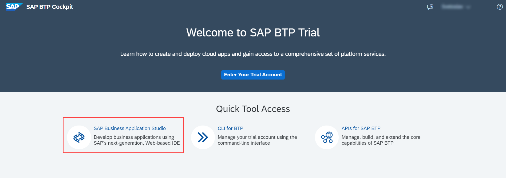
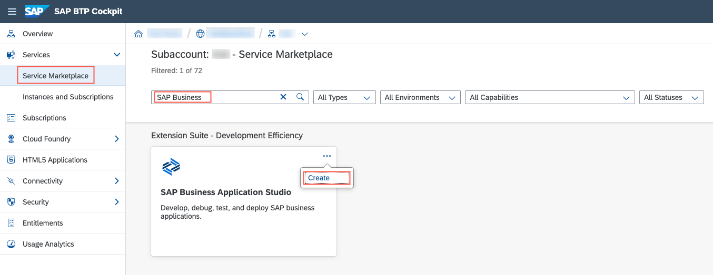
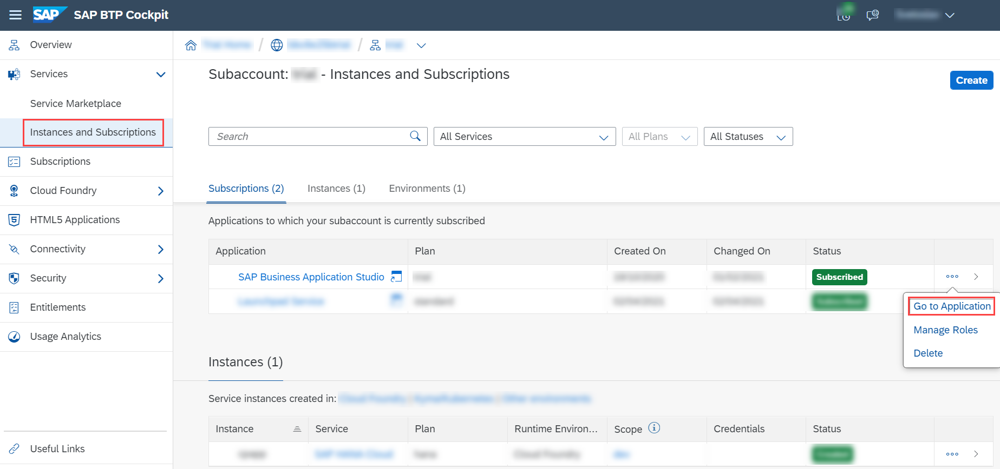
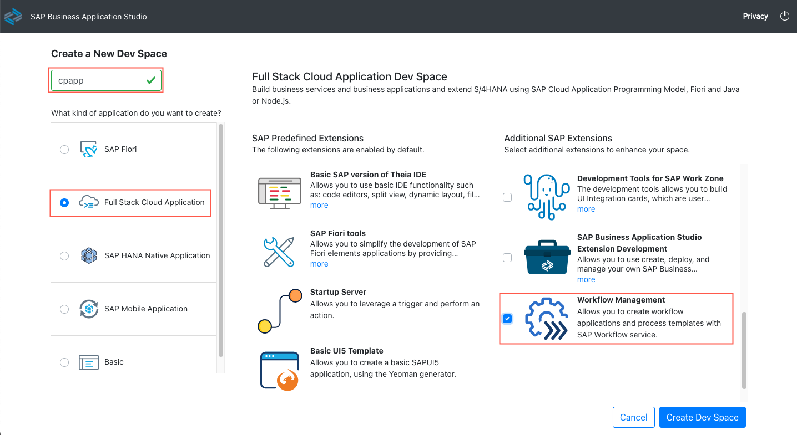
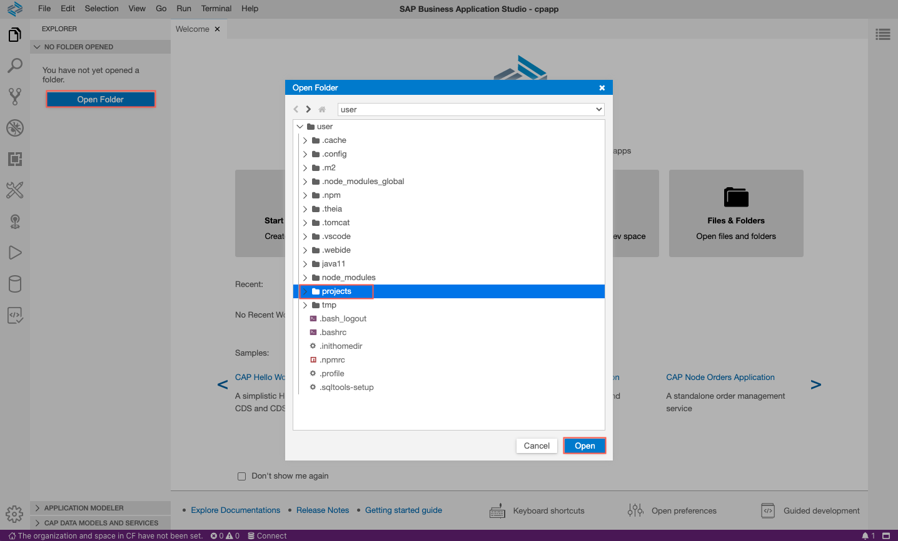

## Using SAP Business Application Studio

As mentioned in section [Editors](../Set-Up-Local-Development#editors), you can also use SAP Business Application Studio instead of VS Code. [SAP Business Application Studio](https://help.sap.com/viewer/9d1db9835307451daa8c930fbd9ab264/Cloud/en-US) is the successor of the SAP Web IDE. Like the SAP Web IDE, it’s mostly an online IDE but a local version is also available. Many of the so-called extensions that are available for [VS Code](../Set-Up-Local-Development#using-visual-studio-code-vs-code) are also available for SAP Business Application Studio and vice versa.

If you decide to use SAP Business Application Studio, your benefits are:

- You don't have to install or update any of the packages yourself. They all come with your SAP Business Application Studio instance.
- In some cases, you have additional productivity features that are available only in SAP Business Application Studio but not in VS Code.

If you go for SAP Business Application Studio, you first have to get access to SAP BTP, it can only be used with a user there. At a later stage of the tutorial, this is required anyway.

??? tip "You can still perform the following steps locally and without any access the SAP BTP"

    - Create a CAP application with its own persistency and access to a remote SAP S/4HANA system
    - Create an SAP Fiori elements and a SAPUI5 application on top of the application

If you’re looking for a deployment to SAP BTP (obviously), want to use the SAP Fiori launchpad, develop a multi tenant app, and use workflow, you will need SAP BTP access later anyway.


### Set Up Business Application Studio in your SAP BTP Account

If you don't have an SAP BTP account already, see tutorial [Prepare for SAP BTP Development](Prepare-BTP.md) for the choices and how to set it up. Afterwards you either have a Trial or Live account.

=== "Trial"
	1. Go to [SAP BTP Cockpit Trial](https://cockpit.hanatrial.ondemand.com/).
    2. Choose **SAP Business Application Studio** under **Quick Tool Access**.

        

        !!! tip "SAP BTP trial accounts get a subscription to SAP Business Application Studio out of the box. Please note that you are using the trial version of SAP Business Application Studio. See section [Restrictions](https://help.sap.com/viewer/9d1db9835307451daa8c930fbd9ab264/Cloud/en-US/a45742a719704bdea179b4c4f9afa07f.html) in the SAP Business Application Studio documentation for more details on how your development environment can be affected."
=== "Canary"
	1. Go to [SAP BTP Cockpit](https://account.int.sap.eu2.hana.ondemand.com/cockpit#/home/allaccounts) and choose the **Global Account** that you’ve created.
    2. Choose your subaccount.

    !!! tip "Don't forget to create an ```entitlement``` for SAP Business Application Studio as well, as shown for other ```entitlements``` in [Prepare for SAP BTP Development](../Prepare-BTP#required-service-entitlements)."

    First, subscribe to SAP Business Application Studio:

    1. In your subaccount, choose **Service Marketplace** in the left-hand navigation.
    2. Search for **SAP Business Application Studio**.
    3. Choose **Create**.

        

    4. Choose `standard` as **Plan**.

    5. Choose **Create**.

    Then, assign role collections:

    6. Navigate back to your subaccount overview with the breadcrumbs.
    7. On the left-hand pane, expand **Security** and then choose **Trust Configuration**.
    8. Choose `SAP ID Service`.

    9. Enter your E-Mail address with which you’re registered for SAP BTP.
    10. Choose **Assign Role Collection** and then add the following role collections one by one, by choosing **Assign Role Collection**.
        - `Business_Application_Studio_Administrator`
        - `Business_Application_Studio_Developer`
        - `Business_Application_Studio_Extension_Deployer`
=== "Live"
    1. Go to [SAP BTP Cockpit](https://account.hana.ondemand.com/) and choose the **Global Account** that you’ve created.
    2. Choose your subaccount.

    !!! tip "Don't forget to create an `entitlement` for SAP Business Application Studio as well, as shown for other `entitlements` in [Prepare for SAP BTP Development](../Prepare-BTP#required-service-entitlements)."

    First, subscribe to SAP Business Application Studio:

    1. In your subaccount, choose **Service Marketplace** in the left-hand navigation.
    2. Search for **SAP Business Application Studio**.
    3. Choose **Create**.

        

    4. Choose `standard` as **Plan**.

    5. Choose **Create**.

    Then, assign role collections:

    6. Navigate back to your subaccount overview with the breadcrumbs.
    7. On the left-hand pane, expand **Security** and then choose **Trust Configuration**.
    8. Choose `SAP ID Service`.

    9. Enter your E-Mail address with which you’re registered for SAP BTP.
    10. Choose **Assign Role Collection** and then add the following role collections one by one, by choosing **Assign Role Collection**.
        - `Business_Application_Studio_Administrator`
        - `Business_Application_Studio_Developer`
        - `Business_Application_Studio_Extension_Deployer`

### Create a Dev Space

!!! info "If you have already accessed SAP Business Application Studio, continue with step 5 here."

11. Navigate back to your subaccount overview with the breadcrumbs.

12. On the left-hand pane, choose **Instances and Subscriptions**.

13. Choose **Go to Application** in the **Subscriptions** category for **SAP Business Application Studio** application or choose the  icon.

    

14. Log in with your SAP BTP account user and password.

    !!! tip "Save the URL in your favorite link list. You will need this URL again."

16. On the Dev Spaces selection UI, choose **Create Dev Space**.

17. Enter `cpapp` as the Dev Space name.

18. Choose **Full Stack Cloud Application** as the application kind.

19. Choose **Workflow Management** as additional SAP Extensions you want to install.

20. Choose **Create Dev Space**.




Wait until the Dev Space has been created. This can take some time.

<!-- [VALIDATE_1] -->
### Open the Dev Space in SAP Business Application Studio

1. Open the Dev Space by choosing its name.

2. In the opened editor, choose **Open Folder**.

3. Select the `projects` folder in the **Open Folder** dialog.

4. Choose **Open**.



SAP Business Application Studio will refresh and select the `projects` folder as the workspace root.