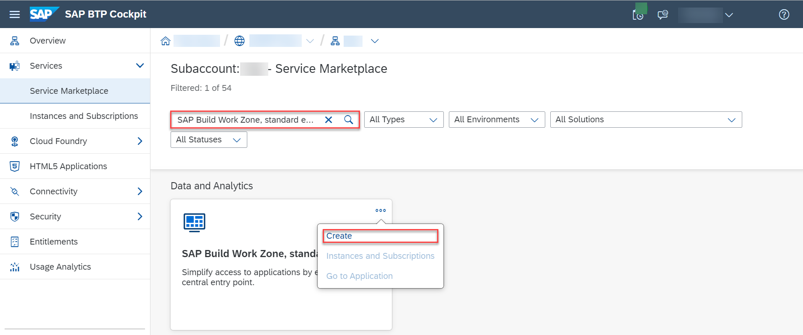
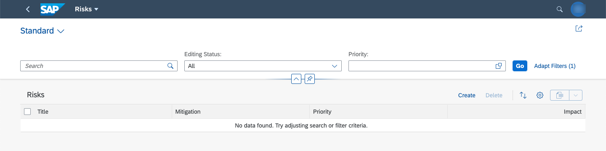

## Subscribe to SAP Build Work Zone, standard edition

1. Enter your **Global Account**. If you are using a trial account, choose **Go To Your Trial Account**.

2. Choose **Account Explorer**.

3. In the **Subaccounts** tab, choose the subaccount where you have deployed your service and application.

    

2. Choose **Services** &rarr; **Service Marketplace** on the left.

3. Search for the **SAP Build Work Zone, standard edition** tile and choose **Create**.

    

4. Keep the default setting for **Service** and choose `standard - Subscription` for **Plan**.

    

    !!! info "SAP Build Work Zone, standard edition offers two types of `standard` plans. The `standard - Subscription` plan is an application plan that lets you access your applications from a central entry point. This is the plan you need for the purposes of this tutorial. The `standard - Instance` plan is a service plan that will let you integrate with other services using APIs. You do not need this plan for the scope of this tutorial."

5. Choose **Create**.

    

You have now subscribed to the SAP Build Work Zone, standard edition.

## Assign SAP Build Work Zone, standard edition role collection

You need to assign your user to the `Launchpad_Admin` role collection, so you don't get an error accessing the **SAP Build Work Zone, standard edition** site later on.

1. Choose **Security** &rarr; **Users** on the left.

2. Choose your user.

4. Under **Role Collections** on the right, choose **Assign Role Collection** and assign the `Launchpad_Admin` role collection to your user.

    

5. Open another browser or clear your browser's cache.

!!! info "See section [Initial Setup](https://help.sap.com/viewer/8c8e1958338140699bd4811b37b82ece/Cloud/en-US/fd79b232967545569d1ae4d8f691016b.html) in the SAP Build Work Zone, standard edition's documentation for more details."

## Create your SAP Build Work Zone, standard edition site

1. Choose **Services** &rarr; **Instances and Subscriptions** on the left.

2. Locate the **SAP Build Work Zone, standard edition** under **Subscriptions** and choose **Go to Application**.

    

3. Choose **Channel Manager** on the left and refresh the `HTML5 Apps` entry there.

    

    !!! info "Content providers aren't reloaded automatically when you push an app, so it's important to manually refresh."

4. Choose **Content Manager** **&rarr;** **Content Explorer** and open the content provider `HTML5 Apps`.

    

5. Add the `Risks` and `Mitigations` to **My Content**.

    

6. Choose **Content Manager** &rarr; **My Content**.

7. In the item list, choose the item `Everyone`.

    

    !!! info "`Everyone` is a role that has to be assigned to the `Risks` and `Mitigations` apps so all users can access them."

8. Choose **Edit**, click on the search field, assign the `Risks` and `Mitigations` apps to the role, and choose **Save**.

    

9. Navigate back to **My Content**.

10. Choose **New** &rarr; **Group**.

    

11. Type in `Risk Management` as the title of the group and assign the `Risks` and `Mitigations` apps to it.

    

    !!! info "This way, you are telling the SAP Build Work Zone, standard edition to display the `Risks` and `Mitigations` apps in a group called `Risk Management`."

12. Choose **Site Directory** &rarr; **Create Site**.

    

13. Type in `Risk Management Site` for the site name and choose **Create**.

    !!! info "The new site gets the `Everyone` role by default, so you don't have to assign it explicitly. The default site properties are sufficient for the purposes of this tutorial."

## Test your SAP Build Work Zone, standard edition site

1. Choose **Go to site**.

    

    You can see the `Risk Management` group that includes the `Mitigations` and `Risks` apps.

2. Open the `Risks` app.

    

You have launched your `Risks` app through the SAP Build Work Zone, standard edition.

  

!!! tip "If you choose **Go**, you will get an error because you haven't assigned a role collection to your user yet. We'll do it in the next tutorial."

!!! tip "Do you want to change your Risk Management Site's default theme? Under your avatar, in the User Actions menu, select the Theme Manager."
        