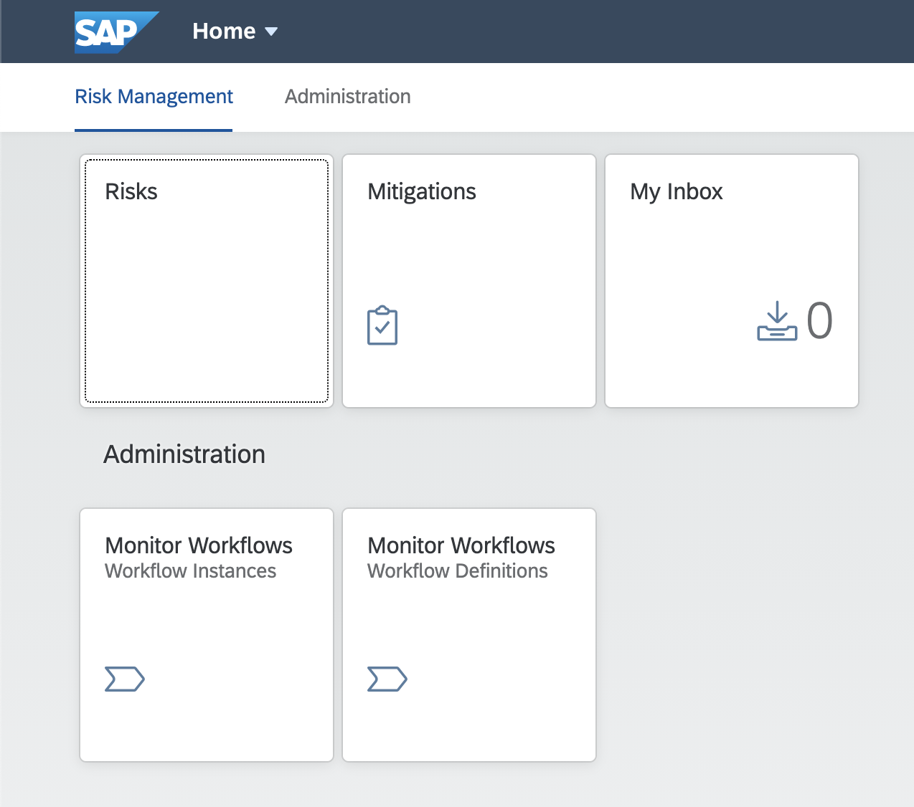
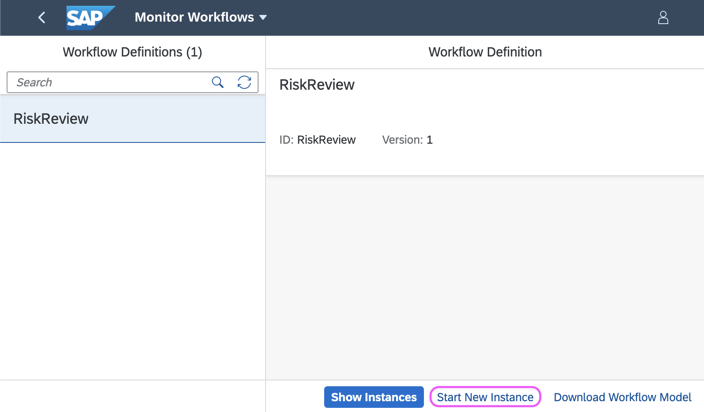
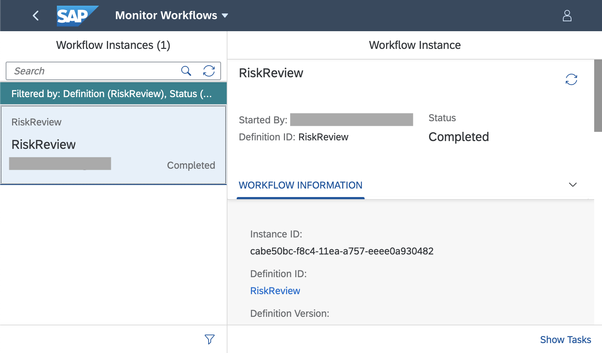
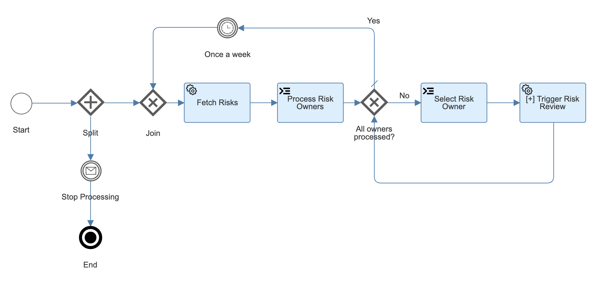
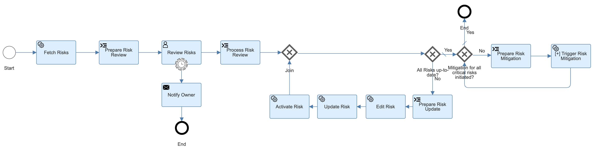
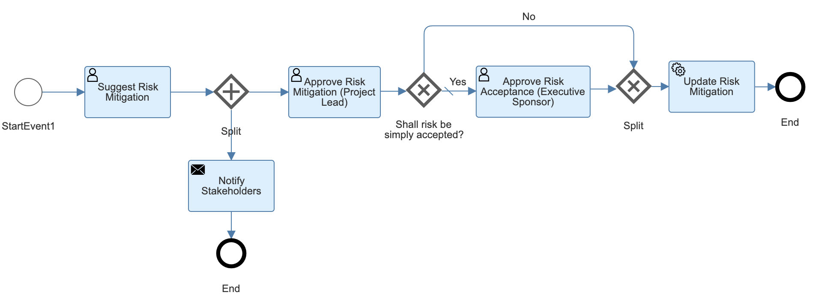
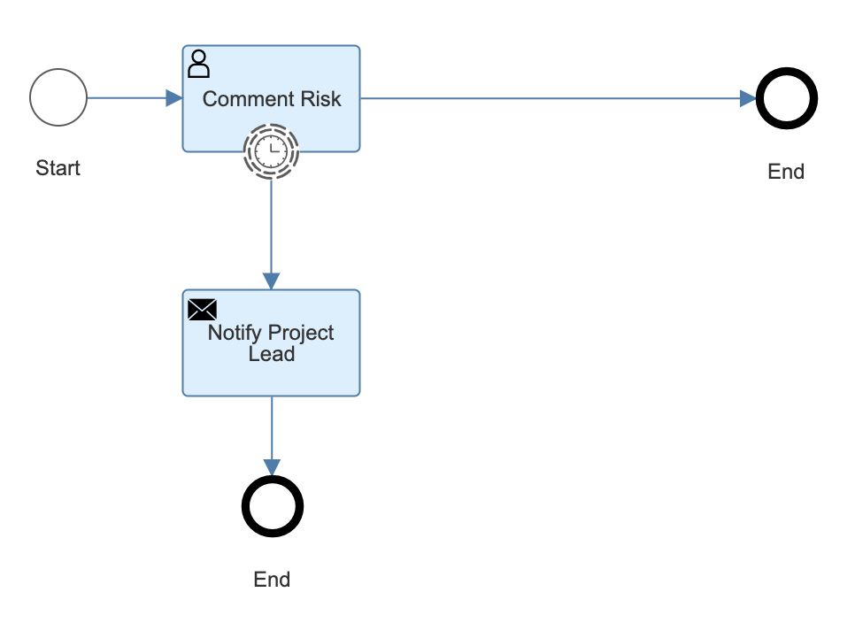

# Enhance Your Application With SAP Workflow Service

## Scenario Overview

In this scenario, we want to enhance the Risk Management Application with workflows to increase the quality of risks captured, i.e. to ensure that they are up-to-date, that proper mitigations are in place if needed, etc. Also, a common problem with manually captured risks -- and at this point it doesn't make a real difference whether they are captured in a spreadsheet or in a CAP backend -- is that risks tend to become stale very quickly. To this end, we will be building the following workflows:

* A Risk Management Loop workflow for periodically scheduling risk reviews for all existing risks
* A Risk Review Workflow for reviewing risks assigned to a particular risk owner
* A Risk Mitigation Workflow for reviewing mitigations proposed for individual risks
* A Risk Feedback Workflow for enquiring feedback about newly created risks

## Subscribe and Set Up SAP Business Application Studio

Workflows can only be modeled in SAP Business Application Studio (BAS) currenty.

So if you haven't done so already, subscribe to the SAP Business Application Studio and import your Git repository to it:

1. [Installation > Business Application Studio](../installation/#using-sap-business-application-studio)
2. [Get Started > Import Git Repository in SAP Business Application Studio](../Sources/#import-git-repository-in-sap-business-application-studio)

## Add Workflow MTA Module

To start building your workflows, you want to add a Workflow module to your MTA using the yo CLI:

```bash
yo @workflow/workflow-module
```

1. Enter `workflow-content` as the module name and hit `Enter`.
2. Enter `RiskReview` as the workflow name and hit `Enter`.
3. Enter `Review risks owned by a risk owner` as the workflow description and hit `Enter`.
4. When asked whether you want to overwrite, enter `y` (yes).

This will generate a basic workflow module folder structure with a no-op workflow and add the workflow module to the `mta.yml` MTA descriptor.

### Add Additional Workflow Module Configuration

Open `mta.yml` and for consistency's sake, rename the newly added workflow module from `workflow-content` to `cpapp-workflow-content`. In the requires section of the module rename `workflow_mta` to `cpapp-workflow`.

The workflow module should look like:

```yaml hl_lines="4 8"
...
modules:
  ...
  - name: cpapp-workflow-content
    type: com.sap.application.content
    path: workflow-content
    requires:
      - name: cpapp-workflow
        parameters:
          content-target: true
```

Locate the service `workflow_mta` in the resources section of the `mta.yaml` file and change it to `cpapp-workflow`.

Lastly, add the following configuration to the service:

```yaml hl_lines="4 8-11"
...
requires:
 ...
 - name: cpapp-workflow
   parameters:
     service-plan: standard
     service: workflow
     config:
        authorities:
          - WORKFLOW_INSTANCE_GET
          - WORKFLOW_INSTANCE_START
   type: org.cloudfoundry.managed-service
```

## Add Workflow Role Collections

Open `mta.yml` and add the following role collections to your UAA configuration:

<!-- cpes-file mta.yaml:$.resources[?(@.name=="cpapp-uaa")] -->
```yaml hl_lines="1-1 23-38"
_schema-version: '3.2'
...
resources:
  ...
  - name: cpapp-uaa
    type: org.cloudfoundry.managed-service
    parameters:
      service: xsuaa
      service-plan: application
      path: ./xs-security.json
      config:
        xsappname: 'cpapp-${space}'
        tenant-mode: dedicated
        role-collections:
          - name: 'RiskManager-${space}'
            description: Manage Risks
            role-template-references:
              - $XSAPPNAME.RiskManager
          - name: 'RiskViewer-${space}'
            description: View Risks
            role-template-references:
              - $XSAPPNAME.RiskViewer
          - name: 'RiskAdminWorkflow-${space}'
            description: Risk Admin
            role-template-references:
              - $XSSERVICENAME(cpapp-workflow).WorkflowAdmin
              - $XSSERVICENAME(cpapp-workflow).WorkflowContextAdmin
          - name: 'RiskManagerWorkflow-${space}'
            description: Risk Manager
            role-template-references:
              - $XSAPPNAME.RiskManager
              - $XSSERVICENAME(cpapp-workflow).WorkflowParticipant
              - $XSSERVICENAME(cpapp-workflow).WorkflowInitiator
          - name: 'RiskViewerWorkflow-${space}'
            description: Risk Viewer
            role-template-references:
              - $XSAPPNAME.RiskViewer
              - $XSSERVICENAME(cpapp-workflow).WorkflowParticipant
```

## Add FLP Content for Workflow Standard UIs

To see the standard workflow Fiori apps *Inbox*, *Workflow Definitions* and *Workflow Instances* in your launchpad, open the portal site descriptor `portal-content/portal-site/CommonDataModel.json` and add the following site configuration to it:

<!-- cpes-file portal-content/portal-site/CommonDataModel.json:$.payload.groups -->
```json hl_lines="26-30 34-56"
{
  "_version": "3.0.0",
  ...
  "payload": {
    "catalogs": "...",
    "groups": [
      {
        "_version": "3.0.0",
        "identification": {
          "id": "defaultGroupId",
          "title": "{{title}}",
          "entityType": "group",
          "i18n": "i18n/defaultGroupId.properties"
        },
        "payload": {
          "viz": [
            {
              "id": "ns.risks.display",
              "appId": "ns.risks",
              "vizId": "Risks-display"
            },
            {
              "id": "ns.mitigations.display",
              "appId": "ns.mitigations",
              "vizId": "Mitigations-display"
            },
            {
              "id": "cross.fnd.fiori.inbox-1-1591167264251",
              "appId": "cross.fnd.fiori.inbox",
              "vizId": "WorkflowTask-DisplayMyInbox"
            }
          ]
        }
      },
      {
        "_version": "3.0.0",
        "identification": {
          "id": "administration",
          "title": "{{title}}",
          "entityType": "group",
          "i18n": "i18n/administration.properties"
        },
        "payload": {
          "viz": [
            {
              "id": "com.sap.bpm.monitorworkflow-0-1591167264252",
              "appId": "com.sap.bpm.monitorworkflow",
              "vizId": "bpmworkflowmonitor-DisplayInstances"
            },
            {
              "id": "com.sap.bpm.monitorworkflow-1-1591167264252",
              "appId": "com.sap.bpm.monitorworkflow",
              "vizId": "bpmworkflowmonitor-DisplayDefinitions"
            }
          ]
        }
      }
    ]
  }
}
```

Add the new group `administration` to the `groupsOrder` property:

<!-- cpes-file portal-content/portal-site/CommonDataModel.json:$.payload.sites[0].payload.groupsOrder -->
```json hl_lines="14-15"
{
  "_version": "3.0.0",
  ...
  "payload": {
    "catalogs": "...",
    ...
    "sites": [
      {
        "_version": "3.0.0",
        ...
        "payload": {
          "config": "...",
          "groupsOrder": [
            "defaultGroupId",
            "administration"
          ]
        }
      }
    ]
  }
}
```

Add a i18n properties file `administration.properties` file to the `portal-content/portal-site/i18n` folder and add the following content:

<!-- cpes-file portal-content/portal-site/i18n/administration.properties -->
```text
#XTIT
title = Administration
```

Open `mta.yml` and add dependencies for `cpapp-workflow` to the `cpapp-approuter`, `cpapp-portal-content-deployer`, and `cpapp-srv` modules.

<!-- cpes-file mta.yaml:$.modules[?(@.name=="cpapp-approuter")].requires -->
```yaml hl_lines="1-1 19-19"
_schema-version: '3.2'
...
modules:
  ...
  - name: cpapp-approuter
    ...
    requires:
      - name: cpapp-uaa
      - name: cpapp-logs
      - name: cpapp-portal
      - name: cpapp-html5-repo-runtime
      - name: srv-api
        group: destinations
        properties:
          forwardAuthToken: true
          strictSSL: true
          name: srv-api
          url: '~{srv-url}'
      - name: cpapp-workflow
```

<!-- cpes-file mta.yaml:$.modules[?(@.name=="cpapp-portal-content-deployer")].requires -->
```yaml hl_lines="1-1 18-18"
_schema-version: '3.2'
...
modules:
  ...
  - name: cpapp-portal-content-deployer
    ...
    requires:
      - name: cpapp-portal
        parameters:
          content-target: true
          service-key:
            name: cpapp-portal-deploy-key
            config:
              content-endpoint: developer
      - name: cpapp-uaa
      - name: cpapp-html5-repo-host
      - name: cpapp-ui-resources
      - name: cpapp-workflow
```

<!-- cpes-file mta.yaml:$.modules[?(@.name=="cpapp-srv")].requires -->
```yaml hl_lines="1-1 11-11"
_schema-version: '3.2'
...
modules:
  ...
  - name: cpapp-srv
    ...
    requires:
      - name: cpapp-db
      - name: cpapp-uaa
      - name: cpapp-logs
      - name: cpapp-workflow
```

## Build and Deploy

Before you start modeling, you want to test if your workflow module and launchpad are configured properly. Right-click on the `mta.yaml` file and choose `Build MTA`.

A new panel will appear indicating the progress of the MTA build.

Once completed, locate the MTA archive `cpapp_1.0.0.mtar`in the `mta_archives` folder.

Please follow these [instructions](../Prepare_BTP/#log-on-to-cloud-foundry-in-bas) if your not already logged into Cloud Foundry.

Right-click on it and choose `Deploy MTA Archive`.

This may take a while. Grab a coffee.

## Assign Role Collections

You now want to assign yourself the necessary roles to dry-run the dummy workflow.

1. Open the SAP Cloud Platform Cockpit.
2. Navigate to your Subaccount.
3. Choose *Security > Trust Configuration*.
4. Choose *Default Identity Provider*.
5. Enter you e-mail address and choose **Assign Role Collection**. A popup appears.
6. Assign the following two role collections to your user where ${space} is the name of the Cloud Foundry space you deployed your application to:

      * `RiskAdminWorkflow-<space>`
      * `RiskManagerWorkflow-<space>`

       (Where `<space>` is your Cloud Foundry space)

## Start the Application

1. Choose your Subaccount name in the navigation bread crumb on the top.
2. Navigate to *Cloud Foundry > Spaces*.
3. Choose your space.
4. Choose *Applications*.
5. Choose `cpapp-approuter`.
6. Choose the link in the group *Application Routes*.
7. Login with your SAP Cloud Platform email and password.
8. You should see the SAP Fiori lauchpage looking like this:

    

## Dry-run the Workflow

1. Choose on *Monitor Workflows (Workflow Definitions)*.
2. Make sure that *RiskReview* is selected.
3. Choose the button **Start Workflow Instance**.
4. Choose **Start Workflow Instance** on the popup (the JSON content doesn't matter at the moment).

    

5. Choose **Show Instances**.
6. Choose the filter button.
7. Choose *Filter By > Status*.
8. Check *Completed*.
9. Choose **OK**.
10. You will see an already completed workflow instance:

    

## Extend CAP Model

Open the CDS schema `db/schema.cds`, change the prio property, and add an owner property to the Risks entity like so:

<!-- cpes-file db/schema.cds -->
```text hl_lines="6-12"
namespace sap.ui.riskmanagement;
using { managed } from '@sap/cds/common';
  entity Risks : managed {
    key ID      : UUID  @(Core.Computed : true);
    title       : String(100);
    owner       : String;
    prio        : String(10) enum {
      LOW;
      MEDIUM;
      HIGH;
      VERY_HIGH;
    };
    descr       : String;
    miti        : Association to Mitigations;
    impact      : Integer;
    criticality : Integer;
  }
  entity Mitigations : managed {
    key ID       : UUID  @(Core.Computed : true);
    description  : String;
    owner        : String;
    timeline     : String;
    risks        : Association to many Risks on risks.miti = $self;
  }
```

## Extend Fiori Elements UI

Add the following annotations to add the `owner` field to the UI of the *Risks* application.

<!-- cpes-file srv/risks-service-ui.cds -->
```text hl_lines="4-4 31-31 48-48"
using RiskService from './risk-service';
annotate RiskService.Risks with {
	title       @title: 'Title';
	owner       @title: 'Owner';
	prio        @title: 'Priority';
	descr       @title: 'Description';
	miti        @title: 'Mitigation';
	impact      @title: 'Impact';
}
annotate RiskService.Mitigations with {
	ID @(
		UI.Hidden,
		Common: {
		Text: description
		}
	);
	description  @title: 'Description';
	owner        @title: 'Owner';
	timeline     @title: 'Timeline';
	risks        @title: 'Risks';
}
annotate RiskService.Risks with @(
	UI: {
		HeaderInfo: {
			TypeName: 'Risk',
			TypeNamePlural: 'Risks'
		},
		SelectionFields: [prio],
		LineItem: [
			{Value: title},
			{Value: owner},
			{Value: miti_ID},
			{
				Value: prio,
				Criticality: criticality
			},
			{
				Value: impact,
				Criticality: criticality
			}
		],
		Facets: [
			{$Type: 'UI.ReferenceFacet', Label: 'Main', Target: '@UI.FieldGroup#Main'}
		],
		FieldGroup#Main: {
			Data: [
				{Value: title},
				{Value: owner},
				{Value: miti_ID},
				{Value: descr},
				{
					Value: prio,
					Criticality: criticality
				},
				{
					Value: impact,
					Criticality: criticality
				}
			]
		}
	},
) {
};
annotate RiskService.Risks with {
	miti @(
		Common: {
			//show text, not id for mitigation in the context of risks
			Text: miti.description  , TextArrangement: #TextOnly,
			ValueList: {
				Label: 'Mitigations',
				CollectionPath: 'Mitigations',
				Parameters: [
					{ $Type: 'Common.ValueListParameterInOut',
						LocalDataProperty: miti_ID,
						ValueListProperty: 'ID'
					},
					{ $Type: 'Common.ValueListParameterDisplayOnly',
						ValueListProperty: 'description'
					}
				]
			}
		},
		UI.MultiLineText: IsActiveEntity
	);
}
```

Build and deploy and ensure you can still create Risks via the Fiori Elements application accessible through your launchpad.

## Copy Risk Management Template Files

The following files will serve as the foundation for the workflow you are about to model.

Copy the following folders and their contents from `templates/workflow/workflow-content` to the `workflow-content` folder of your app:

- `forms`
- `webcontent`
- `scripts`
- `workflow`

## Create Destinations to Workflow and CAP

Workflow and CAP need to be integrated via destinations so they can call one another at runtime. At present, they need to be created manually.

1. Open your Subaccount in the SAP Cloud Platform Cockpit
2. Choose *Connectivity > Destinations*

Create the following destinations with the instructions provided below:

1. `cpapp-srv` - This destination to the CAP service is used in the Workflows to read and write data from/to the CAP service.
2. `bpmworkflowruntime` - This destination to the Workflow Service Instance is used to start "sub-workflows" from the Workflows.
3. `bpmworkflowruntimeoauth` - This destination to the Workflow Service Instance is used internally by the workflow engine for realizing principal propagation.
4. `bpmworkflowruntime_mail` - This destination to an e-mail server is used by the workflow engine to send e-mails through your preferred e-mail server.

The destinations `cpapp-srv` and `bpmworkflowruntime` are used by the Workflow definitions, while the destinations `bpmworkflowruntimeoauth` and `bpmworkflowruntime_mail` are used internally by the workflow engine and have to have exactly the specified name.

### Create Destination `cpapp-srv`

1. Create a service key by executing:

    ```bash
    cf create-service-key cpapp-uaa cpapp-uaa-dest-key
    ```

2. Display the service key to see the credentials:

    ```bash
    cf service-key cpapp-uaa cpapp-uaa-dest-key
    ```

3. On the *Destinations* page in the *SAP Cloud Platform Cockpit*, choose *New Destination*
4. Enter the following details for the new destination:

   1. *Name*: `cpapp-srv`
   2. *Type*: `HTTP`
   3. *Description*: `CAP backend`
   4. *URL*: The application route of the `cpapp-srv` application

    !!! tip "Execute the following command to get the route:"

      ```bash
      cf app cpapp-srv
      ```

   5. *Proxy Type*: `Internet`
   6. *Authentication*: `OAuth2UserTokenExchange`
   7. *Client ID*: `clientid` property in XSUAA service key
   8.  *Client Secret*: `clientsecret` property in XSUAA service key
   9.  *Token Service URL*: `url` property in XSUAA service key + `/oauth/token` suffix
   10. *Token Service URL Type*: `Dedicated`

5. Choose *Save*

### Create Destination `bpmworkflowruntime`

First you create the credentials for accessing the workflow service using a service key, then you create the destination using these credentials.

1. Create a service key by executing:

    ```bash
    cf create-service-key cpapp-workflow cpapp-workflow-dest-key
    ```

2. Display the service key to see the credentials:

    ```bash
    cf service-key cpapp-workflow cpapp-workflow-dest-key
    ```

    You will need the values to create the destination in the next step.

3. On the *Destinations* page in the *SAP Cloud Platform Cockpit*, choose *New Destination*
4. Enter the following details for the new destination:

   1. *Name*: `bpmworkflowruntime`
   2. *Type*: `HTTP`
   3. *Description*: `Workflow service`
   4. *URL*: `endpoints.workflow_rest_url` property in workflow service key
   5. *Proxy Type*: `Internet`
   6. *Authentication*: `OAuth2UserTokenExchange`
   7. *Client ID*: `uaa.clientid` property in workflow service key
   8. *Client Secret*: `uaa.clientsecret` property in workflow service key
   9. *Token Service URL*: `uaa.url` property in workflow service key + `/oauth/token` suffix
   10. *Token Service URL Type*: `Dedicated`

5. Choose *Save*

### Create Destination `bpmworkflowruntimeoauth`

Follow the instruction in [SAP Help](
https://help.sap.com/viewer/e157c391253b4ecd93647bf232d18a83/Cloud/en-US/e8b9b990bf69416d910ed7d26512b207.html?q=bpmworkflowruntimeoauth).

### Create Destination `bpmworkflowruntime_mail`

Follow the instruction in [SAP Help](
https://help.sap.com/viewer/e157c391253b4ecd93647bf232d18a83/Cloud/en-US/45220d841c704a4c8ac78618207ee103.html).

## Inspect Risk Management Workflows

Locate the workflow files at `workflow-content/workflows` and look at how they are defined. Select the flow elements in the diagram and inspect their properties in the property sheet to the right.

### Risk Management Loop Workflow

The Risk Management Loop workflow periodically schedules risk reviews for all existing risks.

This workflow features simple service tasks to call REST endpoints and script tasks for executing JavaScript in the context of a workflow.



Select the service task `Fetch Risks` and open the `Details` tab in the properties. Inspect the properties that can be set to call a REST endpoint. Note the reference to the `cpapp-srv` destination you configured before.

Select the script task `Process Risk Owners` and press on the `processRiskOwners.js` link to open the JavaScript file attached to this script task.

### Risk Review Workflow

The Risk Review workflow is for reviewing risks assigned to a particular risk owner.

This workflow additionally contains user tasks for users to interact with a workflow (data input, approvals, etc.) and mail tasks to send e-mails.



Select the user task `Review Risks` and open the `User Interface` tab in the properties. Press on the `ReviewRisks.form` link to open the form attached to this user task. You could also reference a UI5 component instead.

Select the user task `Notify Owner` and open the `Details` tab in the properties. Press on the `notifyOwner.html` link to open the e-mail template attached to this mail task.

### (Optional) Risk Mitigation Workflow 

The Risk Mitigation workflow serves the purpose of reviewing mitigations proposed for individual risks.

The workflow is incomplete and left for you to implement (optionally).



Complete its implementation, considering the following:

* Complete the `Notify Stakeholders` mail task and define a new HTML e-mail template
* Complete the `Approve Risk Mitigation (Project Lead)` user task and define a new approval form
* Complete the `Approve Risk Mitigation (Executive Sponsor)` user task and define a new approval form
* Define the condition based on which the executive approval is skipped (tip: select the outgoing sequence flows of the exclusive split gateway)
* Store the risk mitigation in the CAP backend

### Initial Risk Feedback Workflow

The Risk Feedback workflow enquires feedback about newly created risks.

This workflow stub will be called by a CAP Event Handler (see below). You can extend it to your liking.



## Call Workflow from CAP Event Handler

When creating a risk, you want to start an instance of the `Initial Risk Feedback` workflow.

Open a command line window as before and type the following commands:

```bash
npm install axios
npm install @sap/xsenv
```

Open the `srv/risk-service.js` file and add the following handler:

!!! warning "@todo: The code can be improved by using CloudSDK"

<!-- cpes-file srv/risk-service.js -->
```js hl_lines="1-7 13-23 25-55"
const axios = require('axios');
const xsenv = require('@sap/xsenv');
//const cds = require('@sap/cds');
const workflow_service = xsenv.getServices({'workflow': 'cpapp-workflow'}).workflow;
const workflow_token_url = workflow_service.uaa.url + '/oauth/token?grant_type=client_credentials';
const workflow_credentials = workflow_service.uaa.clientid + ':' + workflow_service.uaa.clientsecret;
const workflow_rest_url = workflow_service.endpoints.workflow_rest_url;
/**
 * Implementation for Risk Management service defined in ./risk-service.cds
 */
module.exports = async (srv) => {

    // const db = await cds.connect.to('db');
    // const { Risks } = db.entities;
    srv.before(['CREATE', 'UPDATE'], 'Risks', req => {
        const risk = req.data;
        risk.impact = risk.impact || 100;
        risk.prio = risk.prio || "MEDIUM";
        if (risk.impact >= 100000) {
            risk.criticality = 1;
        } else {
            risk.criticality = 2;
        }
    });

    srv.after('CREATE', 'Risks', async (risk) => {
        try {
            const accessResponse = await axios({
                method: 'post',
                url: workflow_token_url,
                headers: {
                    'Authorization': 'Basic ' + Buffer.from(workflow_credentials).toString('base64')
                }
            });
            const access_token = accessResponse.data.access_token;
            const workflowResponse = await axios({
                method: 'post',
                url: workflow_rest_url + '/v1/workflow-instances',
                headers: {
                    'Authorization': 'Bearer ' + access_token,
                    'Content-Type': 'application/json'
                },
                data: {
                    'definitionId': 'RiskInitialFeedback',
                    'context': {
                        'risk': risk
                    }
                }
            });
            console.info('Risk Initial Feedback workflow with ID "' + workflowResponse.data.id + '" for risk "' + risk.title + '" successfully started.');
        } catch (error) {
            console.error('Error while starting Risk Initial Feedback workflow: ' + JSON.stringify(error));
        }
    });
}
```

Build the MTA and deploy it as before.

## End-to-End Playthrough

Access your launchpad as described above and do the following for an end-to-end playthrough of the scenario:

1. Create Risks
    1. Open the `Risks` Fiori Elements app and create a few risks
    2. Ensure you enter your e-mail as the risk owner
2. Initial Risk Feedback
    1. Open the `Monitor Workflows / Workflow Instances` app; for each risk created, you will find a new workflow instance `RiskInitialFeedback`
    2. Open the `My Inbox` app; for each risk created, you will find a task `Comment on new risk "XYZ"` for you to provide feedback; you will also find an e-mail notification in your mail client
    3. Press the `Submit` button to complete a task
3. Risk Management Loop
    1. Open the `Monitor Workflows / Workflow Definitions` app, select the workflow `Risk Management Loop` and press `Start Workflow Instance` and in the dialog presented to you, replace the input context JSON structure with `{}`, then press `Start Workflow Instance`
    2. A risk review workflow instance will be started for each risk owner (if you created tasks on your name only, you will see only one instance)
    3. Open the `Monitor Workflows / Workflow Instances` app to see the newly started instances
    4. Open the `My Inbox` app; you will find a task `Review your N risks` in your inbox; you will also find an e-mail notification in your mail client
    5. Change the impact of one of the risks to `100000` and press `Submit`
    6. This will start the RiskReview workflow. If the risk is VERY_HIGH or HIGH with impact >10000 then it will trigger a RiskMitigation
    7. Open the `Monitor Workflows / Workflow Instances` app; you will find a `Risk Mitigation` workflow instance has been started
    8. Open the `My Inbox` app; you will find a task `Suggest Risk Mitigation` to provide a mitigation for the risk you changed before
    9. Subsequent steps depend on how you changed the risk mitigation workflow

## Improvement Notes

* @todo Value Help for CAP Services (Workflow BAS)
* @todo Create Destination in MTA (Uwe)
* @todo Context Help in Script Editor and Expressions (Workflow BAS)
* @todo Update OData v4 without Draft --> JIRA
* @todo Owner via SAP Graph from ODM, UI should be also re-used (future idea)
* @todo: yo @workflow/workflow-module --> Can this be done outside of workflow (Joachim Maier)

