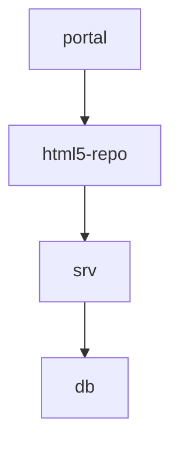
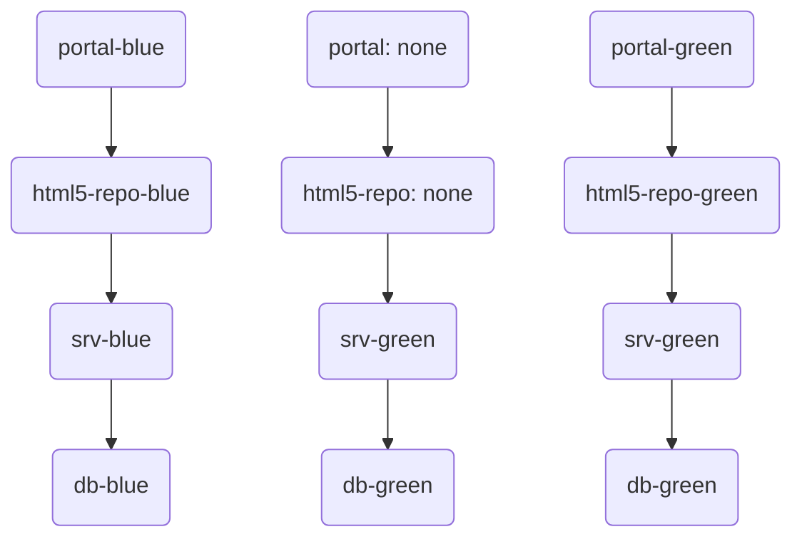

# Upgrade applications without downtime (Zero Downtime Maintenance)

## Blue-Green-Deployment (`cf bg-deploy`) with application content.

The MTA uses the application content (`com.sap.application.content` `content-target: true`) feature to deploy the content instead of using a deploy er application.

### Initial Deployment

The content gets deployed.

### Successive Deployments

Content gets deployt in the *deployment phase*.

## Blue-Green-Deployment (`cf bg-deploy`) with content deployer application.

### Initial Deployment

### Successive Deployments

Content deployt via deployer apps is already deployed in the *deployment phase* and deployt a 2nd time when the application gets restaged in the *commit phase*.

