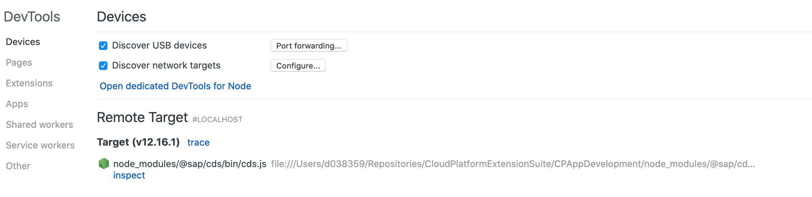

# Debugging CAP Applications

## Debug Locally in Visual Studio Code

1. Switch to *Run* (play with bug icon) side panel.
1. Choose *Open launch.json* (chain wheel icon).
1. Add the following launch configuration to the `configurations` object:

```json hl_lines="7 14"
{
  "configurations": [
    {
      "name": "cds run",
      "type": "node",
      "request": "launch",
      "program": "/usr/local/bin/cds",
      "args": [ "run", "--with-mocks", "--in-memory?" ],
      "skipFiles": [ "<node_internals>/**" ],
      "internalConsoleOptions": "openOnSessionStart",
      "console": "internalConsole",
      "autoAttachChildProcesses": true,
      "env": {
        "NODE_PATH": "/usr/local/lib/node_modules/sqlite3"
      }
    }
  ]
}
```

This configuration should work out-of-the-box for MacOS and Linux. For Windows the values for `program` and `NODE_PATH` values need to be changed:
* `programm` - The full path to the `cds` JavaScript program is required: Use the value from `where cds`, but remove the `.exe`.
* `NODE_PATH` - Find the path where the sqlite3 module is globally installed. Look for the first line of `npm list` as starting point.

The `NODE_PATH` is added to make the globally installed `sqlite3` library accessible. By this we avoid adding it to our project. Adding it to the project will make the `xMake` build fail.

## Debug on SAP BTP Cloud Foundry

It's possible to debug a running application on Cloud Foundry. The debugging works by connecting the local machine to the remote application using an SSH tunnel.

### Preconditions

* Never debug productive system, because debugging halts the complete node process.
* SSH must be allowed for the landscape and enabled for space and application.
* Application must be started with debugging (`--inspect`) option.

### Enable SSH

In order to SSH to the application, SSH must be enabled for the space and the application. This needs to be done before deploying or redeploying the application:

```
cf allow-space-ssh <spaceName>
cf enable-ssh <appName>
```

For the current Cloud Foundry space and the application `cpapp-srv`, run:

```
cf allow-space-ssh "$(cf t | perl -pe 's/space:\s+(.*)/\1/i || s/.*//s')"
cf enable-ssh cpapp-srv
```

### Deploy Application with `--inspect` option

The `node` command line option `--inspect` enables debugging for Node.js applications. There's an alternative option `--inspect-brk` that stops the application on the first line of the code.

Since debugging should not be enabled in a productive deployment, a way is required to get in the `--inspect` parameter for a specific development deployment.

For MultiApps (`mta.yaml`) based deployment, the command to execute the can be altered by adding an `MTAEXT` file.

Create a file `debug.mtaext` with the following content:

```yaml hl_lines="9"
_schema-version: '3.1'
ID: cpapp-debug
extends: cpapp
version: 1.0.0

modules:
 - name: cpapp-srv
   parameters:
      command: "node --inspect ./node_modules/@sap/cds/bin/cds.js run"
```

Normally, the application is started with the command `npx cds run`. This mechanism can't be used to add the `--inspect` parameter. The `node` command needs to be used and the convenience of `npx` gets lost.

There's no need to rebuild the `MTAR` file, since we just override the settings using the `MTAEXT` file.

Redeploy the application with this command:

```bash
cf deploy cpapp_1.0.0.mtar -e debug.mtaext -m cpapp-srv
```

### Connect to Application

After the application is started, connect to the application:

```bash
cf ssh -N -T -L 9229:127.0.0.1:9229 cpapp-srv
```

Keep the process running. It needs to run through the whole debugging session. When finished, just quit using <kbd>Ctrl</kbd> + <kbd>C</kbd>.

If the command fails, either SSH isn't active for the application or the application doesn't run.

### Open Debugger in Chrome

When the SSH tunnels runs on port `9229`, the debugger can be accessed from the DevTools (F12) of any Chrome browser window.

1. Open Chrome brwoser.
1. Go to URL `chrome://inspect`.
1. Choose inspect for the *Remote Target*.



If the *Remote Target* isn't listed, then most likely the application wasn't started in debugging mode.

For your convenience, you can connect to your app and get the devtools URL using this command:

```bash
cpes-node-debug cpapp-srv
```

This requires to install this project as an NPM module. You can do this, for example, by calling the `npm link` folder from the `master` branch of this cloned repository.

### Debugging Using Visual Studio Code

As a precondition, the SSH connection to the application needs to be established.

1. Switch to *Run* (play with bug icon) side panel.
1. Choose *Open launch.json* (chain wheel icon).
1. Choose *Add Configuration*.
1. Select *Node.js: Attach*.
1. Save.
1. Select your new launch configuration in the *Run* side panel.
1. Choose **Start Debugging** (play icon).

### Automated SSH Connection

To automatically start and stop the SSH connection, the `cpes-node-debug` command can be used. Add the following two scripts to the `package.json`:

```json hl_lines="3-4"
  "scripts": {
    ...
    "debug-srv": "cpes-node-debug cpapp-srv --background",
    "stop-debug-srv": "cpes-node-debug cpapp-srv --stop"
  }
```

Add or change the existing `Attach` launch configuration:

```json
{
  "version": "0.2.0",
  "configurations": [
    {
      "type": "node",
      "request": "attach",
      "name": "Attach",
      "port": 9229,
      "skipFiles": [
        "<node_internals>/**"
      ],
      "preLaunchTask": {
        "script": "debug-srv",
        "type": "npm"
      },
      "postDebugTask": {
        "script": "stop-debug-srv",
        "type": "npm"
      }
    }
  ]
}
```

This will automatically start and stop the SSH connection to the `cpapp-srv` application. The script can be customized by replacing the application name in the `package.json`.

If the port is used because the SSH connection is still open, look out for open SSH connections:

```bash
ps ax | grep ssh
```

Use `kill <pid>` to get rid of it.
