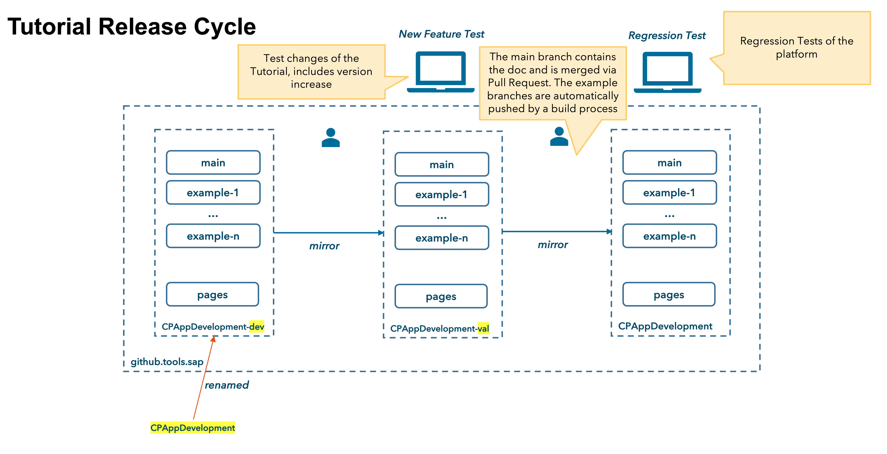

# Tutorial Release Cycle

## Tutorial Repositories

Since the tutorial consists of multiple branches, the `master` branch for the documentation and one branch per example, it gets complicated when there should be separated states for "in development", "in validation" and "released". Therefore, three separate repositories exists for this purpose.

| Phase          | Repository                                                                 | Tutorial (SAP internal)                                                                 | Tutorial (external)                                                                                       |
| -------------- | -------------------------------------------------------------------------- | --------------------------------------------------------------------------------------- | --------------------------------------------------------------------------------------------------------- |
| In development | [CPAppDevelopment-dev](https://github.tools.sap/CPES/CPAppDevelopment-dev) | [pages:CPAppDevelopment-dev](https://pages.github.tools.sap/CPES/CPAppDevelopment-dev/) | [pages:CPAppDevelopment-dev-external](https://pages.github.tools.sap/CPES/CPAppDevelopment-dev-external/) |
| In validation  | [CPAppDevelopment-val](https://github.tools.sap/CPES/CPAppDevelopment-val) | [pages:CPAppDevelopment-val](https://pages.github.tools.sap/CPES/CPAppDevelopment-val/) | [pages:CPAppDevelopment-val-external](https://pages.github.tools.sap/CPES/CPAppDevelopment-val-external/) |
| Released       | [CPAppDevelopment](https://github.tools.sap/CPES/CPAppDevelopment)         | [pages:CPAppDevelopment](https://pages.github.tools.sap/CPES/CPAppDevelopment/)         | [pages:CPAppDevelopment-external](https://pages.github.tools.sap/CPES/CPAppDevelopment-dev-external/)     |

(Source: [Tutorial Management.pptx](https://sap.sharepoint.com/:p:/t/TutorialRiskManagement/EaXPEXiUZmVDvXqTNG6SwLEBrU6K9IBFq86dPB2h9RM7dA?e=bbW369))

## Release Process

| What                      | Who                        | When                                                                   | Where                        | Details                                                                                                                    |
| ------------------------- | -------------------------- | ---------------------------------------------------------------------- | ---------------------------- | -------------------------------------------------------------------------------------------------------------------------- |
| Dev Close / End-of-Sprint | All Contributors           | (e.g. 1st Oct) Every two weeks   Thursday/Friday                       | Dev Repository               |                                                                                                                            |
| Example Consolidation     | Uwe/?                      |                                                                        | Dev Repository               | Merge changes through example branches.   Make sure that the required changes are there.                                   |
| End of Sprint Meeting     | All Contributors           | (e.g. 2st Oct) Every-two-weeks   Friday / or in case a fix is required | Dev Repository               |                                                                                                                            |
| Release to Validation     | Uwe/Lakshmi                | (e.g. 2st Oct) Every-two-weeks   Friday / or in case a fix is required | Dev -> Val Repository        | Run job [CPAppDevelopment-mirror-dev-to-val](https://cpes.jaas-gcp.cloud.sap.corp/job/CPAppDevelopment-mirror-dev-to-val/) |
| Validation                | End-to-End Validation Team | Monday/Tuesday every Week                                              | Val Repository               |                                                                                                                            |
| Release Decision          | Stephen/Tim/Uwe/Dominik    | Every-two-weeks Thursday meeting                                       | Val Repository               | Based on Validation Results                                                                                                |
| Release                   | Uwe/Lakshmi                |                                                                        | Val -> Rel Repository        | Run job [CPAppDevelopment-mirror-val-to-rel](https://cpes.jaas-gcp.cloud.sap.corp/job/CPAppDevelopment-mirror-val-to-rel/) |
| Publish to SAP-samples    | Uwe/Lakshmi                |                                                                        | Rel -> GitHub.com Repository |                                                                                                                            |
