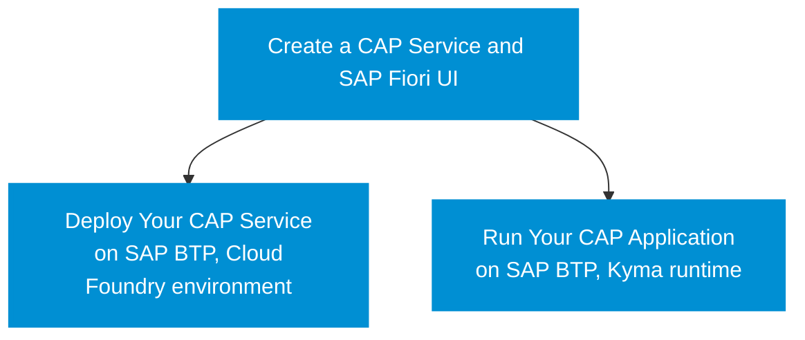

# Tutorial Overview

<!-- external version -->

The diagram shows the order and dependency of the different modules of this tutorial. Most modules are based on each other and you need to work through them in the given sequence.

!!! info "Click on the boxes to go directly to the first step of the module."

